# ForgeLM Yol Haritası

> **Configuration-driven, kurumsal-grade LLM ince ayar platformu** — üç ilke üzerine kurulu: özelliklerden önce güvenilirlik, özellik sayısı yerine kurumsal farklılaşma, her yetenek config-driven ve test edilebilir.

## Bir bakışta durum

| Tür | Faz | Durum |
|-----|-----|-------|
| ✅ Tamam | [Faz 1-9](roadmap/completed-phases.md) | SOTA iyileştirmeleri, değerlendirme, güvenilirlik, kurumsal entegrasyon, ekosistem, hizalama stack'i, güvenlik, EU AI Act uyumluluğu (Madde 9-17 + Ek IV), gelişmiş güvenlik zekası |
| ✅ Tamam | [Faz 10 — Post-Training Tamamlama](roadmap/completed-phases.md) | `inference.py`, `chat`, `export` (GGUF), `--fit-check`, `deploy` — `v0.4.0` |
| ✅ Tamam | [Faz 10.5 — Quickstart Katmanı ve Onboarding](roadmap/completed-phases.md) | `forgelm quickstart <template>`, 5 hazır template, seed veri setleri — `v0.4.5` |
| ✅ Tamam | [Faz 11 + 11.5 + 12 + 12.5 — Doküman Yutma ve Veri Curation Pipeline'ı](roadmap/releases.md#v050--document-ingestion--data-curation-pipeline) | `forgelm ingest`, `forgelm audit`, PII regex + simhash dedup, LSH banding, streaming reader, PII şiddet katmanları, wizard ingest+audit, MinHash LSH dedup, markdown splitter, code/secrets tarama, kalite heuristic'leri, DOCX tablo koruması, `--all-mask`, Croissant 1.0, Presidio NER — `v0.5.0` (PyPI 2026-04-30) |
| ✅ Tamam | [Faz 12.6 — Kapanış Döngüsü (5 wave boyunca 37 içerik fazı + 1 sürüm etiketi = 38 kayıt)](roadmap/completed-phases.md) | Library API, GDPR purge + reverse-pii, ISO 27001 / SOC 2 alignment, doctor + cache subcommand'leri, compliance verification toolbelt, bilingual mirror sweep + 4 CI guard, supply-chain security, cross-OS release matrix — `v0.5.5` ile paketlendi (PyPI 2026-05-10) |
| ✅ Tamam | Faz 22 — CLI sihirbazı tarayıcı yüzeyiyle eşdeğerlik | `forgelm --wizard` artık tarayıcı sihirbazıyla aynı 9-adımlı akışı çalıştırıyor (welcome → use-case → model → strategy → trainer → dataset → training-params → compliance → evaluation), `--wizard-start-from <yaml>` ile idempotent yeniden çalıştırma, şema-güdümlü varsayılanlar SOT, ayrı `EXIT_WIZARD_CANCELLED = 5` exit kodu, `$XDG_CACHE_HOME` altında durum kalıcılığı ve çıkışta validate — `v0.5.5` ile paketlendi (PyPI 2026-05-10) |
| ✅ Tamam | Site dokümantasyon düzeltme taraması | `site/*.html` üzerindeki tüm görünür YAML / artefakt-yolu / CLI / şema iddiaları artık live `forgelm/` yüzeyine karşı doğrulanıyor. Hero YAML demo'su gerçek Pydantic alan adlarıyla yeniden yazıldı, compliance artefakt ağacı disk düzenine göre yeniden çizildi, hayalet YAML anahtarları + CLI flag'leri kaldırıldı, ifadeler live davranışa hizalandı. Altı dilde i18n (en / tr / de / fr / es / zh) tam paritede (her biri 731 anahtar) — `v0.5.5` ile paketlendi (PyPI 2026-05-10) |
| ✅ Tamam | [Faz 14 — Çok Aşamalı Pipeline Zincirleri](roadmap/completed-phases.md#phase-14--multi-stage-pipeline-chains-v070) | SFT → DPO → GRPO config zinciri, pipeline kaynak izleri, 7 yeni pipeline-kapsamlı audit olayı, `forgelm verify-annex-iv --pipeline` modu — `v0.7.0` ile yayınlandı (PyPI 2026-05-15; v0.6.0'dan yeniden planlandı, 2026-05-11 yutma pilotunun ardından Faz 15 önceliği aldı) |
| 🚧 İncelemede | [Faz 14.5 — Pipeline Sertleştirme](roadmap/phase-14-5-pipeline-hardening.md) | v0.7.0 review'ında ertelenen 4 öğenin tamamı teslim edildi, publish bekliyor: canonical pipeline manifest hash + chain-dışı alan tamper tespiti, aşama bazında kanıt deep-parse doğrulaması, kanonik webhook sözlüğü referansı (`docs/reference/webhook_schema.md`), `WebhookNotifier._send(**extra)` explicit allowlist → `v0.9.x` patch döngüsü. Dosyaya sonradan eklenen Task 5 (SonarCloud S3776 cognitive-complexity refactor) bu teslimatın parçası **değildir** ve açık kalır |
| ✅ Tamam | [Faz 15 — Yutma Pipeline'ı Güvenilirliği](roadmap/completed-phases.md#phase-15--ingestion-pipeline-reliability-v060) | Wave 1 + Wave 2 + 5 review-absorption turu: window tabanlı çok satırlı PDF dedup'ı, Türkçe glyph normalizasyon profili (language-hint'e bağlı default), dil-farkında Unicode block sağlamlık kontrolü, ingest-time kalite ön-sinyali, default-on audit `--quality-filter`, DOCX explicit header/footer çıkarımı, EPUB spine + whole-token nav/cover skip, TXT UTF-8 BOM + MD YAML frontmatter strip, notebook playground hizalama, ek olarak Wave 2 `--strip-pattern` (ReDoS-korumalı), `--page-range`, front-matter heuristic, `--strip-urls`, multi-column uyarı — `v0.6.0` ile yayınlandı (PyPI 2026-05-11) |
| 📋 Planlandı | [Faz 13 — Pro CLI ve Gözlemlenebilirlik Dashboard](roadmap/phase-13-pro-cli.md) | Lisans korumalı dashboard, HPO, zamanlanmış görevler, takım config store → `v0.6.0-pro` — Pro katmanı sürümleri OSS çekirdeğinden bağımsız ilerler, yani `v0.6.0-pro` kendi v0.6.0'ıdır, OSS `v0.6.0` ile eş değildir (adoption + v0.5.5'te yayınlanan ISO/SOC 2 baseline'a bağlı) |

> **Durum lejantı:** ✅ Yayınlandı (PyPI) · 🟡 main'e indi, publish bekliyor · 🚧 İncelemede (PR açık) · 📋 / ⏳ Planlandı

**Yayınlandı:** `v0.9.0` — "transformers 5.x Geçişi ve CVE-2026-4372 Düzeltmesi" — PyPI 2026-07-05.  `transformers` alt sınırını `>=5.3.0,<6.0.0`'a yükseltir — kritik bir `from_pretrained` remote-code-execution açığı olan **CVE-2026-4372**'yi düzeltir — ve transformers 5.x'in gerektirdiği bağımlı paket alt sınırlarını (`torch`, `huggingface_hub`, `peft`, `accelerate`, `datasets`, `trl`, `requests`) buna göre yükseltir.  Intel Mac (x86_64) desteğini kaldırır — PyPI bu platform için `torch>=2.4` wheel'i yayınlamıyor; Apple Silicon, Linux ve Windows etkilenmez.  Bir bağımlılık-göçü sürümü — yeni bir roadmap fazı eklemez.  Bkz. [releases.md](roadmap/releases.md#v090--transformers-5x-migration--cve-2026-4372-fix-2026-07-05).

**`v0.8.0`** — "Model Bütünlüğü Doğrulaması ve Deprecation Temizliği" — PyPI 2026-06-16.  `forgelm verify-integrity`'i ekler (eğitilmiş bir model dizinini Madde 15 `model_integrity.json` manifestine karşı yeniden hash'ler) ve config-driven merge (`merge.ties_trim_fraction` / `dare_drop_rate` / `dare_seed`) ile synthetic-sanity (`synthetic.sanity_failure_rate`) ayarlarını ekler; `distributed.strategy` / `data.mix_ratio` doğrulamasını sertleştirir; `evaluation.staging_ttl_days` (v0.5.5'te deprecated edildi) ve `--data-audit` CLI flag'inin (v0.5.0'da deprecated edildi) deprecation cadence'ini tamamlayarak ikisini de kaldırır.  Bir bakım sürümü — yeni bir roadmap fazı eklemez.  Bkz. [releases.md](roadmap/releases.md#v080--model-integrity-verification--deprecation-cleanup-2026-06-16).

**`v0.7.0`** — "Faz 14 Çok Aşamalı Pipeline Zincirleri" — PyPI 2026-05-15.  2 veya daha fazla eğitim aşamasını (SFT → DPO → GRPO vb.) otomatik zincirlenen model yolları, aşama bazında kapılar, crash-safe resume ve chain-seviyesinde bir Annex IV manifestiyle tek bir config-driven run'da zincirler.  Ayrıca kritik bir DNS-rebinding TOCTOU SSRF sertleştirmesi (issue #14) içerir.  Bkz. [completed-phases.md](roadmap/completed-phases.md#phase-14--multi-stage-pipeline-chains-v070).

**`v0.6.0`** — "Faz 15 Yutma Pipeline'ı Güvenilirliği" (2026-05-11).  2026-05-11 pilotunun PDF / DOCX / EPUB / TXT / Markdown yutma ile playground notebook'unda açığa çıkardığı sessiz-başarısızlık boşluklarını kapatır — Wave 1 + Wave 2 + 5 review-absorption turu tek sürümde.  Tüm ingest-time koruma listesi için [completed-phases.md](roadmap/completed-phases.md#phase-15--ingestion-pipeline-reliability-v060)'e bakın.

**`v0.5.0`** — "Doküman Yutma + Veri Curation Pipeline'ı" — PyPI 2026-04-30 (Faz 11 + 11.5 + 12 + 12.5 birleştirildi).

- **Faz 11** — `forgelm ingest` (PDF / DOCX / EPUB / TXT / Markdown → SFT'ye uygun JSONL) + `forgelm audit` (uzunluk / dil / near-duplicate / cross-split sızıntı / Luhn + TC Kimlik validatörlü PII regex) + EU AI Act Madde 10 governance entegrasyonu.
- **Faz 11.5** — operasyonel cila: LSH bantlı near-duplicate tespiti, streaming JSONL okuyucu, token-aware `--chunk-tokens`, PDF sayfa-seviyesi header/footer dedup, `forgelm audit` subcommand'i, PII şiddet katmanları, atomic audit yazımı, wizard "ingest first" girişi.
- **Faz 12** — veri curation olgunlaşması: MinHash LSH dedup opsiyonu (`--dedup-method minhash`, `[ingestion-scale]` extra), markdown-aware splitter (`--strategy markdown`), code/secrets leakage tagger (`--secrets-mask`, `secrets_summary` her zaman açık), heuristic kalite filtresi (`--quality-filter`), DOCX/Markdown tablo yapısı koruması.
- **Faz 12.5** — küçük additive cila: birleşik PII + secrets temizliği için `--all-mask` kısayolu, `forgelm audit --croissant` Google Croissant 1.0 dataset card emit ediyor, opsiyonel Presidio ML-NER PII adaptörü (`--pii-ml`, `[ingestion-pii-ml]` extra), wizard "audit first" entry point.

Başlangıçta dört ardışık PyPI tag'i (`v0.5.0` / `v0.5.1` / `v0.5.2` / `v0.5.3`) olarak planlandı, dört faz tek tutarlı yüzey (yut → cila → olgunlaş → cila) oluşturduğu için tek kapsamlı `v0.5.0` release'inde birleştirildi.

**Daha öncesi:** `v0.4.5` — Quickstart Katmanı (2026-04-26); `v0.4.0` — Post-Training Tamamlama (2026-04-26).

**Güncel durum:** `v0.9.0`, PyPI'daki en güncel sürümdür. 21 faz (1, 2, 2.5, 3, 4, 5, 5.5, 6, 7, 8, 9, 10, 10.5, 11, 11.5, 12, 12.5, 12.6, 14, 15, 22) `v0.7.0` üzerinden yayınlandı; `v0.8.0` ve `v0.9.0` yeni bir roadmap fazı eklemeyen sonraki bakım / bağımlılık-göçü sürümleridir — kapsamlarının tamamı için [releases.md](roadmap/releases.md)'e bakın.  Faz 13, adoption gate'leri karşılandığında ayrıca `v0.6.0-pro` olarak yayınlanır (Pro katmanı sürümleri OSS çekirdeğinden bağımsız ilerler).

> **Faz 12.6 görev / alt-görev iki eksenli not:** Faz 12.6 kendi içinde 38 görevlik bir kapanış döngüsüdür (Görev 1-38) ve [`roadmap/completed-phases.md`](roadmap/completed-phases.md) dosyasında izlenir; her wave'in PR açıklaması o wave'in kapsadığı görev delta'sını taşır.

## Planlanan işlerin özeti

> **Not:** Oklar yayınlama sırasını gösterir, faz numaralarını değil (Faz 15 v0.6.0 ile yayınlandı; Faz 14 v0.7.0 ile yayınlandı (Faz 15 önceliği aldıktan sonra); v0.8.0 ve v0.9.0 yeni faz eklemeyen bakım / bağımlılık-göçü sürümleridir, aşağıda faz çıktısı olarak değil kendi bakım-sürümü hattında gösterilir; Faz 13 Pro katmanında ayrıca daha sonra yayınlanır).

```mermaid
graph LR
    P10[Faz 10<br/>Post-Training<br/>Completion] --> P105[Faz 10.5<br/>Quickstart<br/>Katmanı]
    P10 --> P11[Faz 11<br/>Veri<br/>Yutma]
    P105 --> P11
    P11 --> P115[Faz 11.5<br/>Yutma<br/>Cilası]
    P115 --> P12[Faz 12<br/>Veri Curation<br/>Olgunlaşması]
    P12 --> P125[Faz 12.5<br/>Veri Curation<br/>Follow-up]
    P125 --> P126[Faz 12.6<br/>Kapanış<br/>Döngüsü]
    P126 --> P15[Faz 15<br/>Yutma<br/>Güvenilirliği]
    P15 --> P14[Faz 14<br/>Pipeline<br/>Zincirleri]
    P14 --> P145[Faz 14.5<br/>Pipeline<br/>Sertleştirme]
    P14 --> P13[Faz 13<br/>Pro CLI<br/>+ Dashboard]
    P15 --> P13

    P10 -.-> V1[v0.4.0]
    P105 -.-> V15[v0.4.5]
    P11 -.-> V2[v0.5.0 ✅ Yayınlandı]
    P115 -.-> V2
    P12 -.-> V2
    P125 -.-> V2
    P126 -.-> V25[v0.5.5]
    P15 -.-> V23[v0.6.0 ✅ Yayınlandı]
    P14 -.-> V27[v0.7.0 ✅ Yayınlandı]
    P145 -.-> V275[v0.9.x]
    P13 -.-> V3[v0.6.0-pro]

    subgraph MAINT["Bakım sürümleri (yeni faz yok)"]
        V28[v0.8.0 ✅ Yayınlandı]
        V29[v0.9.0 ✅ Yayınlandı]
    end

    V27 ==>|bakım| V28
    V28 ==>|bakım| V29

    style P10 fill:#003300,stroke:#00ff88
    style P105 fill:#003300,stroke:#00ff88
    style P11 fill:#004400,stroke:#88ff88
    style P115 fill:#004400,stroke:#88ff88
    style P12 fill:#004400,stroke:#88ff88
    style P125 fill:#004400,stroke:#88ff88
    style P15 fill:#004400,stroke:#88ff88
    style P14 fill:#002244,stroke:#00aaff
    style P13 fill:#442200,stroke:#ffaa00
    style MAINT fill:#222222,stroke:#888888
```



## Yol gösterici ilkeler

1. **Özelliklerden önce güvenilirlik.** Her yeni yetenek testler, dokümantasyon ve CI kapsamıyla birlikte yayınlanır.
2. **Özellik sayısı yerine kurumsal farklılaşma.** ForgeLM'in avantajı safety + compliance, feature count değil. Unsloth (hız), LLaMA-Factory (GUI), Axolotl (sequence parallelism) alanlarında rekabet etme.
3. **Config-driven, test edilebilir, opsiyonel.** Her yeni yetenek bir YAML flag'i. Global state yok, sihir yok, zorunlu entegrasyon yok.
4. **Hype kriterleri yerine kill kriterleri.** Her fazın ölçülebilir çeyreklik geçit kriteri var. Geçit kaçırılırsa: yeniden düşün, daha fazla itme.

## Dokümantasyon haritası

```
docs/
├── roadmap.md                                  # İngilizce özet index
├── roadmap-tr.md                               # Bu dosya — Türkçe mirror
└── roadmap/
    ├── completed-phases.md                     # Faz 1-12.6 + 15 + 14 arşivi (detaylı, İngilizce) — Faz 10 / 10.5 / 11 / 11.5 / 12 / 12.5 / 12.6 / 15 / 14 inline gömüldü (sırasıyla v0.4.0 / v0.4.5 / v0.5.0 / v0.5.5 / v0.6.0 / v0.7.0; dosyada 15, 14'ten önce gelir — yayınlanma sırasıyla eşleşir)
    ├── phase-13-pro-cli.md                     # Planlandı — v0.6.0-pro (gated)
    ├── phase-14-5-pipeline-hardening.md        # 4 review-deferred öğe teslim, publish bekliyor; Task 5 (S3776) hâlâ açık
    ├── releases.md                             # v0.3.0 → v0.9.0 sürüm notları
    └── risks-and-decisions.md                  # Risk matrisi, fırsatlar, rekabet analizi, karar günlüğü
```

## Bu roadmap nasıl güncellenir?

- **Haftalık** — Aktif fazın görevlerine karşı ilerleme kontrolü.
- **Aylık** — Scope değişirse karar günlüğü güncellenir (`roadmap/risks-and-decisions.md`).
- **Çeyreklik** — Tam gözden geçirme: tamamlanan fazları kapat, planlananları önceliklendir, rekabet analizini güncelle. Kill criteria dürüst değerlendirilir.
- **Yıllık** — Tamamlanan fazları `completed-phases.md`'ye arşivle, eskimiş planlama dosyalarını emekliye ayır.

## İlgili dokümanlar

- [Ürün Stratejisi](product_strategy-tr.md) — Pazar konumu, hedef kullanıcılar, stratejik kararlar
- [Mimari](reference/architecture-tr.md) — Sistem tasarımı referansı
- [Konfigürasyon Rehberi](reference/configuration-tr.md) — Tüm fazlar için YAML referansı
- [Kullanım Rehberi](reference/usage-tr.md) — ForgeLM nasıl çalıştırılır
- **Sadece iç kullanım:** `docs/marketing/` içindeki pazarlama + strateji planlaması (gitignored)

---

**Tek tek faz detayları için:** Yukarıdaki durum tablosundaki linkleri takip edin.
**Büyük resim için:** [Ürün Stratejisi](product_strategy-tr.md) → bir faz seç → o fazın detay dosyasını oku.
