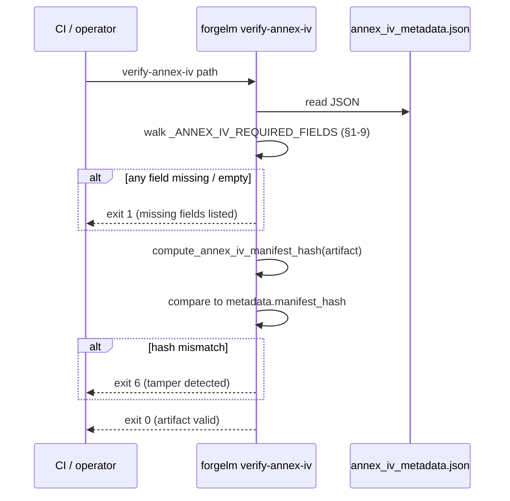

# Verify Annex IV

`forgelm verify-annex-iv` is the read-only verifier paired with the Annex IV technical-documentation artifact (`compliance/annex_iv_metadata.json`). It walks the nine top-level fields the EU AI Act requires for high-risk systems (§1-9), checks that every required category is populated, and recomputes the manifest hash to detect any tampering since the artifact was generated. The producer side — the auto-population of Annex IV from your `compliance:` YAML block — is documented in the [Compliance Overview](#/compliance/overview).

## When to use it

- **Before treating an Annex IV bundle as "audit-ready".** A clean exit is the minimum schema-completeness signal you should give to a regulator or notified body.
- **In the post-training CI gate.** Run after every pipeline that emits Annex IV; fail the release on any non-zero exit — `6` (the artifact was read and its manifest hash doesn't match: tampering) and `1` (required fields never populated, or the file couldn't be parsed at all) are both release-blocking. See [Exit Codes](#/reference/exit-codes) for the full contract.
- **When receiving an Annex IV from a third-party trainer.** The embedded manifest hash does **not** help here — it travels with the file and whoever sent it can recompute it. Establish provenance out of band: a detached signature over the artefact, a signed transport channel, or a trusted registry. Use the verifier to confirm structural completeness, not authorship.
- **Periodically across archived bundles.** A nightly sweep of historical Annex IV files surfaces silent post-archive edits.

## How it works



The verifier shares the canonicalisation routine `forgelm.compliance.compute_annex_iv_manifest_hash` with the writer in `forgelm.compliance.build_annex_iv_artifact` — so a legitimate artefact can never fail its own verifier on a writer/verifier byte drift.

## Quick start

```shell
$ forgelm verify-annex-iv checkpoints/run/compliance/annex_iv_metadata.json
OK: checkpoints/run/compliance/annex_iv_metadata.json
  All Annex IV §1-9 fields populated; manifest hash matches.
```

## Detailed usage

### JSON output for CI consumers

```shell
$ forgelm verify-annex-iv --output-format json \
    checkpoints/run/compliance/annex_iv_metadata.json
{
  "success": true,
  "valid": true,
  "reason": "All Annex IV §1-9 fields populated; manifest hash matches.",
  "missing_fields": [],
  "manifest_hash_actual": "e06b780a91150b1c56e9094a43f273ddd1f308acac13e896ed26747d9085220d",
  "manifest_hash_expected": "e06b780a91150b1c56e9094a43f273ddd1f308acac13e896ed26747d9085220d",
  "path": "/abs/path/checkpoints/run/compliance/annex_iv_metadata.json"
}
```

Pipe to `jq` to filter on the `valid` flag without parsing the human-readable text format. Both hash fields are **bare hex digests** with no `sha256:` prefix, and are the empty string `""` — not `null` — when the artefact carries no hash.

### What "missing field" means

A field is considered missing when the key is absent OR the value is `None`, an empty string, an empty list, or an empty dict. The bar is "operator clearly populated this", not "the key technically exists" — operators forgetting to fill in a placeholder from the auto-generation template is the failure mode the verifier targets.

`system_identification` is additionally validated **at sub-field depth**: `provider_name`, `system_name` and `intended_purpose` must each be non-empty, otherwise a populated-looking container of blank placeholders would pass. When one of those is empty, `missing_fields` carries a **dotted path** rather than a bare key — e.g. `["system_identification.provider_name", "system_identification.system_name"]`. Tooling that assumes `missing_fields` entries are always top-level keys will mis-handle these.

The nine required keys map onto Annex IV §1-9:

| Top-level key | Annex IV section |
|---|---|
| `system_identification` | §1 — `provider_name`, `system_name`, `intended_purpose` (each validated non-empty), plus `provider_contact`, `system_version`, `risk_classification`. |
| `intended_purpose` | §1 — intended purpose statement. |
| `system_components` | §2 — software / hardware components + supplier list. |
| `computational_resources` | §2(g) — compute resources used during training. |
| `data_governance` | §2(d) — data sources, governance, validation methodology. |
| `technical_documentation` | §3-5 — design + development methodology. |
| `monitoring_and_logging` | §6 — post-market monitoring + audit-log presence. |
| `performance_metrics` | §7 — accuracy / robustness / cybersecurity metrics. |
| `risk_management` | §9 — risk management system reference (Article 9 alignment). |

### What "manifest hash mismatch" means

When the artifact carries a `metadata.manifest_hash` field, the verifier recomputes the SHA-256 of the canonical-JSON representation of the artifact (excluding the metadata block itself) and compares. A mismatch means the file no longer matches its own stamp — it was edited after generation without the stamp being refreshed.

:::warn
**This is a self-consistency checksum, not a signature.** `metadata.manifest_hash` is an **unkeyed** SHA-256 produced by the public function `forgelm.compliance.compute_annex_iv_manifest_hash`. Anyone who can write the file can rewrite `intended_purpose` or `risk_management`, call that same public function, and re-stamp the artefact — after which `verify-annex-iv` reports `OK: All Annex IV §1-9 fields populated; manifest hash matches.` and exits `0`.

What a matching hash proves: the file has not been *casually* edited or corrupted in transit. What it does **not** prove: who produced it, or that a motivated party did not rewrite it. For regulator-facing assurance you need a detached signature over the artefact, a signed transport channel, or a write-once store. The only keyed artefact ForgeLM produces is the audit log under `FORGELM_AUDIT_SECRET` — and `verify-annex-iv --pipeline` (below) is what cross-checks the manifest against it.
:::

Artifacts without `metadata.manifest_hash` pass the field-completeness check but the verifier flags this in the reason text:

```text
OK: …/annex_iv_metadata.json
  All Annex IV §1-9 fields populated; no manifest_hash present so tampering detection skipped.
```

### Exit-code summary

| Code | Meaning |
|---|---|
| `0` | All §1-9 fields populated AND manifest hash matches (when present). |
| `1` | Nothing was ever compared: a required §1-9 field is missing / empty, the root is not a JSON object, the JSON is malformed or not valid UTF-8, or the path does not exist / is not a regular file. Operator-actionable — the artifact is not Annex IV complete as-is. |
| `2` | Genuine runtime I/O failure on an existing, reachable file (permission denied mid-read, read error). Retryable. |
| `6` | Integrity failure: every §1-9 field is populated, the artifact carries a `metadata.manifest_hash`, and the recomputed hash disagrees with it. The document was edited after generation — treat it as a security event, not a config fix. |

## Pipeline mode: `--pipeline`

For a multi-stage run, `forgelm verify-annex-iv --pipeline <run_dir>` reads `<run_dir>/compliance/pipeline_manifest.json` instead of a single artefact. It checks chain integrity, stage-index ordering and `stopped_at` coherence, deep-parses each completed stage's Annex IV evidence, and — the part the single-artefact mode does not do — cross-checks the manifest's stage census against the audit log.

```shell
$ forgelm verify-annex-iv checkpoints/pipeline_run --pipeline --output-format json
{
  "success": false,
  "mode": "pipeline",
  "path": "/abs/path/checkpoints/pipeline_run",
  "violations": ["[audit-log corroboration] unattested (audit_log_absent): …"],
  "stages_total": 2,
  "stages_examined": 2,
  "evidence_verified": 2,
  "evidence_unverified": 0,
  "hash_state": "verified",
  "status_census": {"completed": 2},
  "stage_dispositions": [
    {"index": 0, "name": "sft_stage", "status": "completed", "disposition": "examined"},
    {"index": 1, "name": "dpo_stage", "status": "completed", "disposition": "examined"}
  ],
  "audit_corroboration": {
    "outcome": "unattested",
    "reason": "audit_log_absent",
    "events_examined": 0,
    "stages_asserted": 0
  }
}
```

| Key | Type | Notes |
|---|---|---|
| `mode` | str | Always `"pipeline"` on this path. |
| `violations` | list[str] | Findings. Empty on a fully clean run. |
| `stages_total` | int | Rows in the manifest. Compare against `stages_examined` — a stage cannot be made to disappear from the report by flipping its status without the census showing it. |
| `stages_examined` | int | Stages whose evidence was actually parsed. |
| `evidence_verified` / `evidence_unverified` | int | Stage artefacts whose hash was checked vs. reached-but-unattested. |
| `hash_state` | str | `"verified"` when the manifest matched its own stamp, `"absent"` when it carries no `manifest_hash` (pre-v0.8.0 archives — nothing attested to it). |
| `status_census` | object | `{status: count}` across every manifest row. |
| `stage_dispositions` | list[object] | One row per stage: `index`, `name`, `status`, and the `disposition` explaining why it was or was not examined. |
| `audit_corroboration` | object \| null | `outcome`, `reason`, `events_examined`, `stages_asserted`. `null` on pre-flight paths where no manifest was parsed. |

### `audit_corroboration.outcome` is three-valued

`corroborated`, `contradicted`, or **`unattested`** — and `unattested` is **never** a clean result. It means no keyed record backed the manifest's claims, so nothing was actually verified.

:::warn
**With no `FORGELM_AUDIT_SECRET` set, the outcome is `unattested`.** So is the case where the audit log is simply absent. The manifest's own `manifest_hash` is unkeyed (see above), so the audit log's HMAC is the only thing that can independently attest to what the pipeline did — without it, `hash_state: "verified"` means only "the file agrees with its own stamp". Export a 16+ character `FORGELM_AUDIT_SECRET` before the run, and treat `unattested` in CI as a failure, not a pass.
:::

### Exit codes in pipeline mode

Integrity is evaluated first, so a weaker finding can never mask a stronger one.

| Code | Meaning |
|---|---|
| `0` | No violations. |
| `6` | A structural, chain-integrity or per-stage-evidence check failed — something rewrote the run's record. |
| `2` | The manifest or a stage artefact exists but could not be read (locked file, mid-read I/O failure). Retryable. |
| `1` | The manifest is absent or unparseable, **or** the verifier reached the evidence and nothing attested to it (including `unattested` corroboration). Not a pass and not tampering — no comparison happened. |

## Common pitfalls

:::warn
**Treating ForgeLM's output as a certification.** The toolkit produces evidence; certification is a notified-body activity. The verifier confirms the artifact is structurally complete and untampered — not that it is *correct* for your specific deployment context.
:::

:::warn
**Expecting a declaration of conformity in the bundle.** ForgeLM does not generate one — §7 in this artefact is `performance_metrics` (accuracy / robustness), not a conformity declaration. Article 16 conformity is the deployer's signed deliverable and must be authored and signed outside the toolkit, regardless of what `verify-annex-iv` reports.
:::

:::warn
**Ignoring "no manifest_hash present" in the OK output.** Without the manifest hash, the verifier cannot even detect casual post-generation editing. Re-export the artifact through a recent `forgelm` build so the writer attaches the hash — and remember that the hash is unkeyed, so a write-once store or a detached signature is what actually gives you tamper-evidence.
:::

:::tip
**Pin the verifier in CI as a hard gate.** Wire `forgelm verify-annex-iv --output-format json` after every pipeline that produces Annex IV; pipe to `jq -e '.valid'` so exit-on-false fails the release without parsing text. If you gate on the process exit code instead, branch on non-zero — gating on `== 1` alone lets a tampered artifact (exit `6`) through.
:::

## See also

- [Compliance Overview](#/compliance/overview) — context for the rest of the bundle (manifest, audit log, model card).
- [Audit Log](#/compliance/audit-log) — append-only event log; `compliance.artifacts_exported` (Article 11 + Annex IV) is the production-side counterpart to this verifier.
- [Verify Audit](#/compliance/verify-audit) — companion verifier for the audit log.
- [Verify GGUF](#/deployment/verify-gguf) — companion verifier on the deployment-integrity surface.
- [Exit Codes](#/reference/exit-codes) — the `0/1/2/3/4/5/6` public contract, including the `1` vs. `6` split shared by all four `verify-*` subcommands.
- [`verify_annex_iv_subcommand.md`](https://github.com/HodeTech/ForgeLM/blob/main/docs/reference/verify_annex_iv_subcommand.md) — the reference doc with full flag table and library-symbol citations (GitHub source).
