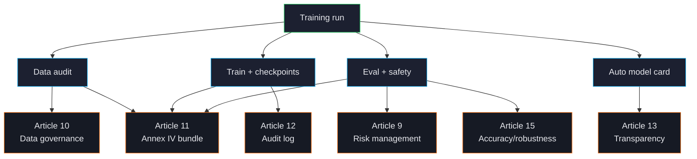

# Compliance Overview

ForgeLM was built for teams that have to defend their training pipeline to a regulator, not just a CTO. Every successful (or failed) run produces a structured evidence bundle that maps cleanly onto EU AI Act Articles 9-17, GDPR Article 5, and ISO 27001 control objectives.



## What gets produced

Any run with a populated `compliance:` block (specifically `compliance.risk_classification` plus `compliance.provider_name` / `compliance.intended_purpose`) emits the Article 11 technical documentation alongside the standard top-level audit log:

```text
checkpoints/run/
├── audit_log.jsonl                  ← Article 12 — append-only event log (top-level)
├── audit_log.jsonl.manifest.json    ← genesis-pin sidecar (truncate-evidence)
├── safety_results.json              ← Article 9 + 15 — safety eval (when `evaluation.safety.enabled`)
├── benchmark_results.json           ← Article 15 — accuracy (when `evaluation.benchmark.enabled`)
├── final_model/
│   ├── README.md                    ← Article 13 — HuggingFace-compatible model card
│   └── model_integrity.json         ← Article 15 — SHA-256 artefact manifest (`forgelm verify-integrity`)
└── compliance/
    ├── compliance_report.json       ← Article 11 — full machine-readable manifest
    ├── training_manifest.yaml       ← Article 11 — operator-readable summary
    ├── data_provenance.json         ← Article 10 — provenance subset
    ├── risk_assessment.json         ← Article 9 — written when a top-level `risk_assessment:` block exists
    ├── annex_iv_metadata.json       ← Article 11 — Annex IV index (paired with `forgelm verify-annex-iv`)
    └── data_governance_report.json  ← Article 10 — per-split governance evidence
```

Two files that auditors commonly look for in `compliance/` are **not** there:

- **`data_audit_report.json`** is written by `forgelm audit --output DIR` (default `./audit/`), not by the trainer. The trainer *reads* it from `training.output_dir` and inlines it into `data_governance_report.json`. If the paths do not line up, the run still succeeds but emits a `compliance.governance_section_missing` audit event — so point `forgelm audit --output` at `training.output_dir` to get the Article 10 data-quality section populated.
- **The model card (`README.md`)** is written into the model directory (`final_model/`), not the compliance bundle, because it ships with the model to the Hub.

There is **no** `compliance.annex_iv: true` knob — Annex IV emission is driven by the presence of `compliance.risk_classification` and a populated `compliance.provider_*` / `compliance.intended_purpose`. Likewise, ForgeLM does **not** generate a `conformity_declaration.md` — Article 16 conformity is the deployer's signed deliverable, not a code artefact.

:::warn
**`forgelm verify-annex-iv <path>/annex_iv_metadata.json` does not touch the audit log.** The single-artefact mode checks the nine §1-9 fields and recomputes the manifest hash — nothing else. It returns exit `0` in a directory that contains no audit log at all. Audit-log corroboration lives exclusively in `forgelm verify-annex-iv --pipeline <run_dir>`; see [Verify Annex IV](#/compliance/annex-iv).
:::

## Articles ForgeLM addresses

| Article | Topic | How ForgeLM addresses it |
|---|---|---|
| **9** | Risk management | Auto-revert + threshold gates + trend tracking. |
| **10** | Data governance | `forgelm audit` produces governance evidence per dataset. |
| **11** | Technical documentation | `annex_iv_metadata.json` is a populated Annex IV. |
| **12** | Record-keeping | Append-only `audit_log.jsonl` covering training start, eval gates, revert decisions. |
| **13** | Transparency | Auto-generated model card listing capabilities, limitations, training summary. |
| **14** | Human oversight | Optional `evaluation.require_human_approval: true` blocks promotion until a human signs off. |
| **15** | Accuracy & robustness | Benchmark gates + safety eval + cybersecurity (PII / secrets at ingest). |
| **16-17** | Conformity & QMS | QMS SOPs shipped alongside the toolkit (`docs/qms/`). ForgeLM does not author the declaration of conformity. |

For the full mapping with code references, see the [Compliance summary on GitHub](https://github.com/HodeTech/ForgeLM/blob/main/docs/reference/compliance_summary.md).

## What ForgeLM doesn't claim

:::warn
ForgeLM **generates** Annex IV-style technical documentation. It does **not** certify your system as a high-risk AI system under the AI Act — that's a notified-body or self-assessment activity, outside any toolkit's scope.

The audit log is append-only by convention and SHA-256-anchored. Real tamper-evidence requires shipping the log to a separate write-once store (S3 Object Lock, ledger DB). The toolkit produces the artefact; chain-of-custody is your operational responsibility.

**The manifest hashes are not signatures.** `metadata.manifest_hash` (Annex IV, pipeline manifest) and `model_integrity.json` are **unkeyed** SHA-256 digests computed by a public function. Anyone who can write the file can edit the content and re-stamp the digest, and the verifier will report `OK`. They detect accidental corruption, bit-rot and transit damage — not an adversary with write access. The one keyed artefact in the system is the audit log: set `FORGELM_AUDIT_SECRET` (16+ characters) and each line carries an HMAC tag that an editor without the key cannot forge. Everything else needs a detached signature or a write-once store to carry real tamper-evidence.

The PII/secrets regex sets are conservative by design — they prefer false-negatives over false-positives. For high-stakes corpora, pair with manual review before training.
:::

## Enabling compliance artifacts

Set in your YAML:

```yaml
compliance:
  provider_name: "Acme Corp"
  provider_contact: "compliance@acme.example"
  system_name: "TR Telecom Support Assistant"
  intended_purpose: "Customer-support assistant for Turkish telecom"
  known_limitations: "Not for medical, legal, or financial advice."
  system_version: "v1.0.0"
  risk_classification: "high-risk"    # one of: unknown | minimal-risk | limited-risk | high-risk | unacceptable

evaluation:
  require_human_approval: true        # optional Article 14 gate (NOT compliance.human_approval)
  auto_revert: true                   # required by the high-risk tier (warning when absent)
  safety:
    enabled: true                     # required by the high-risk tier (hard error when absent)
```

:::warn
**The `high-risk` tier is not metadata-only — it constrains the rest of the config.** Without `evaluation.safety.enabled: true` the run fails `--dry-run` with exit `1`: *"Risk classification 'high-risk' requires evaluation.safety.enabled: true (EU AI Act Article 9 risk-management evidence cannot be derived from a disabled safety eval)."* A missing `evaluation.auto_revert: true` is a WARNING rather than an error, but the Article 9 evidence is weaker without it. Drop to a non-strict tier if you do not intend to run safety evaluation.
:::

There is no `compliance.annex_iv`, `compliance.data_audit_artifact`, `compliance.human_approval`, `compliance.deployment_geographies`, or `compliance.responsible_party` field — those are phantom keys earlier drafts of this page invented. The canonical schema is `ComplianceMetadataConfig` in `forgelm/config.py`, which has exactly seven fields: `provider_name`, `provider_contact`, `system_name`, `system_version`, `intended_purpose`, `known_limitations`, `risk_classification`. To pin data-audit evidence, run `forgelm audit <corpus> --output <training.output_dir>` so the trainer finds `data_audit_report.json` and inlines it.

Every field from `compliance:` flows into `annex_iv_metadata.json`. Required fields are validated at config load — a missing `intended_purpose` fails `--dry-run`.

## What goes into Annex IV

The artifact carries **nine** top-level keys mapped onto Annex IV §1-9, populated from the training manifest and your `compliance:` block:

| Top-level key | Annex IV section |
|---|---|
| `system_identification` | §1 — provider_name, system_name, system_version, provider_contact, intended_purpose, risk_classification. |
| `intended_purpose` | §1 — intended purpose statement. |
| `system_components` | §2 — model lineage + training parameters. |
| `computational_resources` | §2(g) — compute used during training. |
| `data_governance` | §2(d) — data provenance and validation methodology. |
| `technical_documentation` | §3-5 — ForgeLM version, generation timestamp, known limitations. |
| `monitoring_and_logging` | §6 — post-market monitoring + audit-log reference. |
| `performance_metrics` | §7 — accuracy / robustness metrics from the evaluation results. |
| `risk_management` | §9 — the top-level `risk_assessment:` block, or an explicit "no risk_assessment block configured" marker. |

There is no deployment-geography, lifecycle, standards-list, declaration-of-conformity or post-market-monitoring-plan section — earlier drafts of this page listed those, and none is emitted. [Annex IV](#/compliance/annex-iv) is the single source of truth for this table.

## Operational responsibilities (you, not ForgeLM)

The toolkit produces evidence; the people produce certification. Your team is responsible for:

- Reviewing the audit bundle after every run that's bound for production.
- Shipping the audit log to a write-once store for tamper-evidence.
- Conducting the conformity assessment with a notified body where required.
- Maintaining post-market monitoring once the model is deployed.
- Handling data subject requests (GDPR Articles 15-22).

ForgeLM's QMS SOPs in `docs/qms/` cover the operational side — release process, incident response, data-source onboarding.

## See also

- [Annex IV](#/compliance/annex-iv) — full Article 11 artifact spec.
- [Audit Log](#/compliance/audit-log) — Article 12 event log.
- [Human Oversight](#/compliance/human-oversight) — Article 14 gate.
- [Model Card](#/compliance/model-card) — Article 13 transparency.
- [GDPR / KVKK](#/compliance/gdpr) — data protection.
