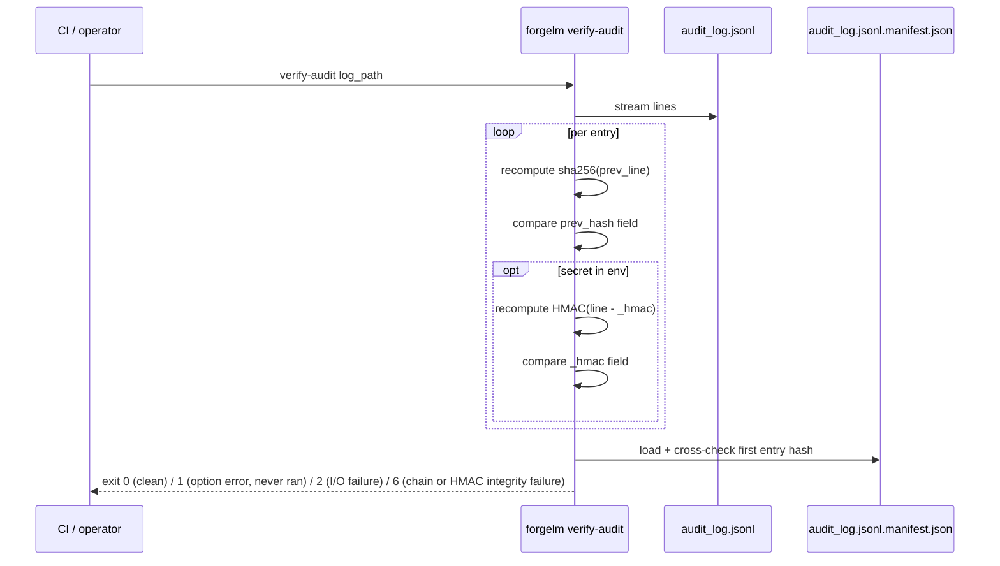

# Verify Audit Log

`forgelm verify-audit` is the read-only verifier paired with the Article 12 record-keeping log. It checks that the `audit_log.jsonl` your training run produced is structurally intact: the SHA-256 hash chain advances correctly line-by-line, the genesis manifest sidecar (when present) cross-checks the first entry, and — when an operator secret is in the environment — the per-line HMAC tags authenticate. CI pipelines wire it into the post-training step that decides whether to treat the audit log as evidence.

## When to use it

- **Before submitting an audit bundle to a regulator or auditor.** A clean `verify-audit` exit is the minimum proof-of-integrity you should send.
- **In CI/CD release gates.** Run after every training pipeline; fail the release on exit `6` (chain/HMAC tamper — the log was read and it doesn't verify) or `1` (option/usage error — the verifier never ran).
- **After moving the log between machines.** Any byte-level corruption in transit shows up as a chain break.
- **As part of a periodic compliance sweep.** A nightly cron over historical logs surfaces silent tampering early.

## How it works



## Quick start

```shell
$ forgelm verify-audit checkpoints/run/audit_log.jsonl
OK: 87 entries verified
```

For HMAC-authenticated logs, set the operator secret first:

```shell
$ FORGELM_AUDIT_SECRET="$(cat /run/secrets/audit-secret)" \
    forgelm verify-audit checkpoints/run/audit_log.jsonl
OK: 87 entries verified (HMAC validated)
```

## Detailed usage

### Strict mode for regulated CI

When every entry must be HMAC-authenticated (an enterprise audit profile), pass `--require-hmac`:

```shell
$ FORGELM_AUDIT_SECRET="$(cat /run/secrets/audit-secret)" \
    forgelm verify-audit --require-hmac \
        checkpoints/run/audit_log.jsonl
```

Strict mode flips two safety nets:

- If the configured env var is unset, exit `1` (operator-actionable pre-flight error — the verifier never ran). Catches the operator who forgot to load the secret before running the pipeline.
- If any line lacks an `_hmac` field, exit `6` (the log was read and failed strict-mode chain verification). Catches mixed-mode logs where HMAC was disabled mid-run.

### Naming a non-default secret variable

For multi-tenant CI, each tenant carries its own secret env name:

```shell
$ TENANT_ACME_AUDIT_KEY="$(cat /run/secrets/acme-audit)" \
    forgelm verify-audit --hmac-secret-env TENANT_ACME_AUDIT_KEY \
        artifacts/acme/audit_log.jsonl
```

The variable name is configurable; the default is `FORGELM_AUDIT_SECRET`.

### Reading the failure output

A chain break prints the 1-based line number:

```text
FAIL at line 53: prev_hash mismatch — chain break suggests entry was inserted, removed, or reordered
```

A bare reason without a line number means the failure happened before the chain walk (e.g. missing genesis manifest, JSON decode error on line 1):

```text
FAIL: manifest present but unreadable at 'checkpoints/run/audit_log.jsonl.manifest.json': …
```

Either way, the log file itself was found and read — so this is an integrity verdict, and the exit code is `6`, not `1`. Investigate before treating the log as evidence. `1` is reserved for the case where the verifier never got as far as reading the log at all (missing path, `--require-hmac` without a secret).

### Exit-code summary

| Code | Meaning |
|---|---|
| `0` | Chain (and HMAC tags, when verified) intact end-to-end. |
| `1` | Option/usage error, or the log could not be located: `--require-hmac` without a secret, or the log path is missing / a directory. The verifier never ran, so there is no integrity verdict. |
| `2` | Genuine runtime I/O failure on a reachable log (permission denied, mid-read error). Retryable. |
| `6` | Tamper / corruption detected: chain break, HMAC mismatch, genesis-manifest mismatch, undecodable line, or non-UTF-8 bytes — the log was read and it doesn't verify. |

## Common pitfalls

:::warn
**Skipping HMAC verification because "the chain hash is enough".** A chain hash defends against single-line edits and reordering, but a determined attacker who controls write access can rewrite the entire chain end-to-end. HMAC tags raise the bar to "must also forge the operator secret", which is meaningful when the secret lives in an HSM.
:::

:::warn
**Running `verify-audit` on the same host that wrote the log without secret-host separation.** If the attacker has write access AND the HMAC secret, HMAC adds no defence. Ship the log to a separate verifier host that holds the secret in a KMS or HSM the writer host cannot read.
:::

:::warn
**Treating a missing `<log>.manifest.json` as benign.** The genesis manifest is the truncate-and-resume detector. If it's missing on a long-running deployment, an attacker may have rolled the log back to "just genesis" with no chain break visible. Verify the manifest is present in your post-training artifact bundle.
:::

:::tip
**Pin the verifier in CI before any submission step.** Wire `forgelm verify-audit --require-hmac` as a hard gate after every training run. Exit `6` (tamper) or `1` (the pre-flight case where the operator secret is missing) should both fail the release.
:::

## See also

- [Audit Log](#/compliance/audit-log) — operator-facing primer on the log this command verifies.
- [Annex IV](#/compliance/annex-iv) — the technical-documentation artifact whose verifier (`forgelm verify-annex-iv`) shares this verifier's design pattern.
- [Verify GGUF](#/deployment/verify-gguf) — companion verifier on the deployment-integrity surface.
- [Verify Model Integrity](#/compliance/verify-integrity) — companion verifier for the Article 15 model-integrity manifest.
- [`audit_event_catalog.md`](https://github.com/HodeTech/ForgeLM/blob/main/docs/reference/audit_event_catalog.md) — events that appear *inside* the verified log (GitHub source).
