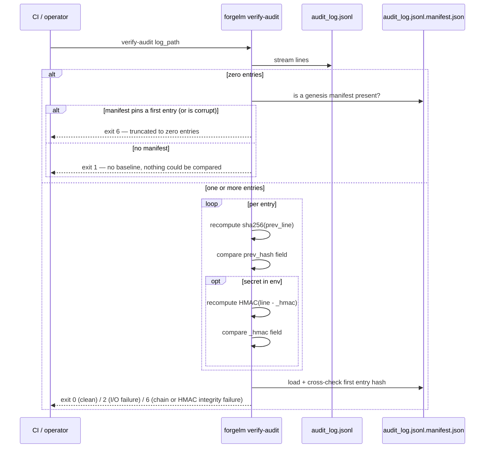

# Verify Audit Log

`forgelm verify-audit` is the read-only verifier paired with the Article 12 record-keeping log. It checks that the `audit_log.jsonl` your training run produced is structurally intact: the SHA-256 hash chain advances correctly line-by-line, the genesis manifest sidecar (when present) cross-checks the first entry, and — when an operator secret is in the environment — the per-line HMAC tags authenticate. CI pipelines wire it into the post-training step that decides whether to treat the audit log as evidence.

## When to use it

- **Before submitting an audit bundle to a regulator or auditor.** A clean `verify-audit` exit is the minimum proof-of-integrity you should send.
- **In CI/CD release gates.** Run after every training pipeline; fail the release on exit `6` (chain/HMAC tamper, or a manifest-pinned log truncated to zero entries — the verifier compared something and it doesn't verify) or `1` (nothing could be compared — option/usage error, missing path, or an empty log with no manifest).
- **After moving the log between machines.** Any byte-level corruption in transit shows up as a chain break.
- **As part of a periodic compliance sweep.** A nightly cron over historical logs surfaces silent tampering early.

## How it works



A log that exists but holds **zero entries** never exits `0`. It is not a legitimate fresh-run state: `AuditLogger` creates its output directory but not the log file, and the file and its genesis manifest are both written by the first event — so a never-used log is *absent* (exit `1`, `audit log not found`), not empty.

## Quick start

```shell
$ forgelm verify-audit checkpoints/run/audit_log.jsonl
OK: 87 entries verified
```

For HMAC-authenticated logs, set the operator secret first:

```shell
$ FORGELM_AUDIT_SECRET="$(cat /run/secrets/audit-secret)" \
    forgelm verify-audit checkpoints/run/audit_log.jsonl
OK: 87 entries verified (HMAC validated)
```

## Detailed usage

### Strict mode for regulated CI

When every entry must be HMAC-authenticated (an enterprise audit profile), pass `--require-hmac`:

```shell
$ FORGELM_AUDIT_SECRET="$(cat /run/secrets/audit-secret)" \
    forgelm verify-audit --require-hmac \
        checkpoints/run/audit_log.jsonl
```

Strict mode flips two safety nets:

- If the configured env var is unset, exit `1` (operator-actionable pre-flight error — the verifier never ran). Catches the operator who forgot to load the secret before running the pipeline.
- If any line lacks an `_hmac` field, exit `6` (the log was read and failed strict-mode chain verification). Catches mixed-mode logs where HMAC was disabled mid-run.

### Naming a non-default secret variable

For multi-tenant CI, each tenant carries its own secret env name:

```shell
$ TENANT_ACME_AUDIT_KEY="$(cat /run/secrets/acme-audit)" \
    forgelm verify-audit --hmac-secret-env TENANT_ACME_AUDIT_KEY \
        artifacts/acme/audit_log.jsonl
```

The variable name is configurable; the default is `FORGELM_AUDIT_SECRET`.

### Reading the failure output

A chain break prints the 1-based line number:

```text
FAIL at line 4: chain broken at line 4: prev_hash='7429a5c8393163e6f50a4c4b50bb73221023754705f3db341e64175ddc4c20b7' expected='3aad1795cd0e0e1a4b79534e2f1d0b7e783525246f0176931c98196063c0afeb'
```

The same `chain broken at line N` form covers an entry that was edited, inserted, removed, or reordered. When `FORGELM_AUDIT_SECRET` is set, an edit that leaves the chain intact is still caught by the per-line HMAC and reports `FAIL at line N: line N: HMAC mismatch`.

Genesis-manifest failures are attributed to line 1 — the entry the manifest pins — so they also carry a line number:

```text
FAIL at line 1: manifest present but unreadable at 'checkpoints/run/audit_log.jsonl.manifest.json': …
```

(On a log with at least one entry, a manifest that is *absent* is not a failure: the verifier logs a warning that truncate-and-resume detection is limited to in-chain hash continuity, and continues. On a log with **zero** entries the absent manifest is decisive — there is no baseline at all, so the command exits `1`; see the empty-log rows in the summary below.)

A bare reason without any line number means the failure is a property of the file as a whole rather than of one entry — through the CLI the reachable case is a log containing non-UTF-8 bytes:

```text
FAIL: audit log is not valid UTF-8: 'utf-8' codec can't decode byte 0xff in position 0: invalid start byte
```

In every case above the log file itself was found and read — so this is an integrity verdict, and the exit code is `6`, not `1`. Investigate before treating the log as evidence. `1` is reserved for the case where the verifier never got as far as reading the log at all (missing path, `--require-hmac` without a secret).

### Exit-code summary

| Code | Meaning |
|---|---|
| `0` | At least one entry was read and the chain (plus HMAC tags, when verified) is intact end-to-end. |
| `1` | Nothing could be compared: `--require-hmac` without a secret; the log path is missing / a directory; or the log exists, holds **zero entries**, and no genesis manifest says what it should have held. No integrity verdict. |
| `2` | Genuine runtime I/O failure on a reachable log (permission denied, mid-read error). Retryable. |
| `6` | Tamper / corruption detected: chain break, HMAC mismatch, genesis-manifest mismatch, undecodable line, non-UTF-8 bytes, or a **zero-entry log whose genesis manifest pins a first entry** (truncated to empty) — the verifier compared something and it did not match. |

The empty-log split is worth reading twice, because both halves are `FAIL` and only one is a security page-out. A zero-entry log with a surviving manifest is a **truncation** (`6`): the manifest is the write-once baseline an attacker cannot forge, it says line 1 existed, and it is gone. A zero-entry log with **no** manifest is an **input error** (`1`): with the baseline itself missing, the verifier genuinely cannot tell a wiped log from a mistyped path, and reporting tampering on a file someone `touch`ed would cry wolf. Either way, the log is not evidence — investigate before submitting it.

## Common pitfalls

:::warn
**Skipping HMAC verification because "the chain hash is enough".** A chain hash defends against single-line edits and reordering, but a determined attacker who controls write access can rewrite the entire chain end-to-end. HMAC tags raise the bar to "must also forge the operator secret", which is meaningful when the secret lives in an HSM.
:::

:::warn
**Running `verify-audit` on the same host that wrote the log without secret-host separation.** If the attacker has write access AND the HMAC secret, HMAC adds no defence. Ship the log to a separate verifier host that holds the secret in a KMS or HSM the writer host cannot read.
:::

:::warn
**Treating a missing `<log>.manifest.json` as benign.** The genesis manifest is the truncate-and-resume detector. If it's missing on a long-running deployment, an attacker may have rolled the log back to "just genesis" with no chain break visible. Verify the manifest is present in your post-training artifact bundle — and note that losing it *downgrades* the empty-log verdict from `6` to `1`, because the verifier loses the only baseline that could prove truncation. An attacker who deletes both the log and its manifest lands on `1`, indistinguishable from a typo. Bundle and back up the two together.
:::

:::tip
**Pin the verifier in CI before any submission step.** Wire `forgelm verify-audit --require-hmac` as a hard gate after every training run. Exit `6` (tamper) or `1` (the pre-flight case where the operator secret is missing) should both fail the release.
:::

## See also

- [Audit Log](#/compliance/audit-log) — operator-facing primer on the log this command verifies.
- [Annex IV](#/compliance/annex-iv) — the technical-documentation artifact whose verifier (`forgelm verify-annex-iv`) shares this verifier's design pattern.
- [Verify GGUF](#/deployment/verify-gguf) — companion verifier on the deployment-integrity surface.
- [Verify Model Integrity](#/compliance/verify-integrity) — companion verifier for the Article 15 model-integrity manifest.
- [`audit_event_catalog.md`](https://github.com/HodeTech/ForgeLM/blob/main/docs/reference/audit_event_catalog.md) — events that appear *inside* the verified log (GitHub source).
