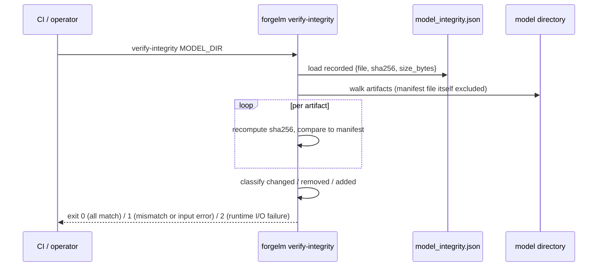

# Verify Model Integrity

`forgelm verify-integrity` is the read-only verifier paired with the Article 15 model-integrity manifest. The compliance export writes `model_integrity.json` next to the final model at training time, recording the SHA-256 and byte size of every artifact. `verify-integrity` re-walks the directory, re-computes each hash, and reports any file that was **changed**, **removed**, or **added** since the manifest was generated. It is the model-artifact counterpart to [`verify-audit`](#/compliance/verify-audit), which verifies the audit *log* rather than the model *weights*.

## When to use it

- **Before deploying or shipping a trained model.** A clean `verify-integrity` exit proves the bytes you are about to serve are the bytes you trained and recorded.
- **After moving a model between machines or storage tiers.** Any silent corruption in transit surfaces as a changed/removed artifact.
- **In CI/CD release gates.** Run after the compliance export; fail the release on a non-zero exit.
- **As part of a periodic compliance sweep.** A scheduled re-verification of archived models surfaces tampering or bit-rot early.

## How it works



## Quick start

```shell
$ forgelm verify-integrity ./checkpoints/final_model
OK: all 12 recorded artifact(s) present and unchanged.
```

Machine-readable output for CI:

```shell
$ forgelm verify-integrity ./checkpoints/final_model --output-format json
```

```json
{
  "success": true,
  "valid": true,
  "reason": "All 12 recorded artifact(s) present and unchanged.",
  "changed": [],
  "removed": [],
  "added": [],
  "verified_count": 12,
  "path": "/work/checkpoints/final_model"
}
```

## Detailed usage

### Reading a mismatch

When an artifact no longer matches the manifest, the diff lists are populated and the command exits `1`:

```json
{
  "success": false,
  "valid": false,
  "reason": "Model artifacts do not match model_integrity.json: 1 changed, 1 removed.",
  "changed": ["adapter_model.safetensors"],
  "removed": ["tokenizer.model"],
  "added": [],
  "verified_count": 10,
  "path": "/work/checkpoints/final_model"
}
```

- `changed` — artifacts whose SHA-256 no longer matches the manifest.
- `removed` — artifacts recorded in the manifest but absent on disk.
- `added` — on-disk files not recorded in the manifest (the manifest file itself is always excluded from the walk).

### Exit-code summary

| Code | Meaning |
|---|---|
| `0` | Every recorded artifact is present and unchanged, and no extra files exist. |
| `1` | Integrity mismatch (changed / removed / added file) **or** operator / input error — missing path, path is a file not a directory, manifest not found, malformed JSON, non-list `artifacts`, or a manifest entry path that escapes the model directory. |
| `2` | Genuine runtime I/O failure on a reachable path (read error, permission denied mid-walk). |

The runtime-error envelope (exit `2`) emits only `{"success": false, "error": "…"}` — branch on `success` first, then inspect `valid` and the diff lists.

## Common pitfalls

:::warn
**Treating a missing `model_integrity.json` as benign.** Without the manifest there is nothing to verify against — `verify-integrity` exits `1`, not `0`. Confirm the compliance export wrote the manifest before relying on this gate.
:::

:::warn
**Verifying after a re-quantisation or re-export.** Producing a GGUF or merged variant changes the bytes; that model needs its own freshly-generated manifest. Do not verify a converted artifact against the original training manifest.
:::

:::tip
**Pin the verifier in CI before any deploy step.** Wire `forgelm verify-integrity --output-format json` as a hard gate after the compliance export. A non-zero exit should fail the release pipeline.
:::

## See also

- [Verify Audit Chain](#/compliance/verify-audit) — companion verifier for the Article 12 audit *log* (this one covers the model *weights*).
- [Annex IV](#/compliance/annex-iv) — the technical-documentation artifact exported alongside the integrity manifest.
- [Verify GGUF](#/deployment/verify-gguf) — integrity verifier for an exported GGUF model file.
- [`verify_integrity_subcommand.md`](https://github.com/HodeTech/ForgeLM/blob/main/docs/reference/verify_integrity_subcommand.md) — full flag-level reference (GitHub source).
