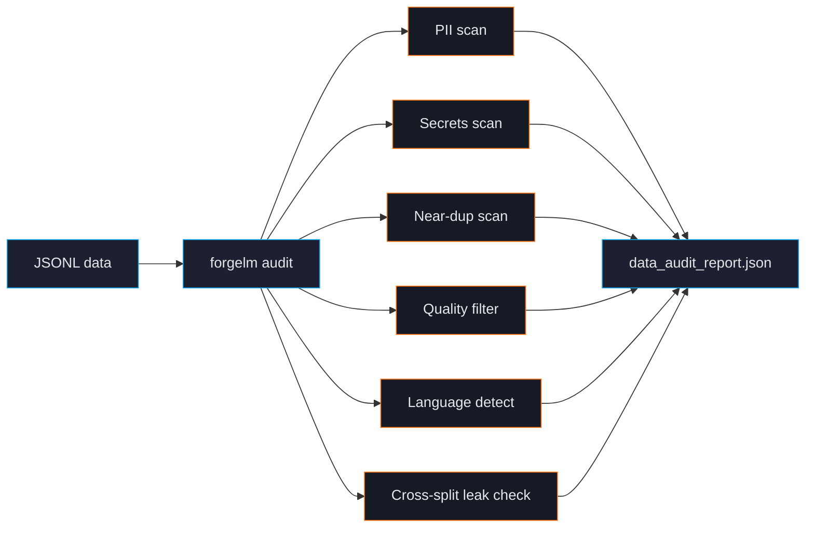

# Dataset Audit

`forgelm audit` is a CPU-only, streaming pre-flight check for your training data. It catches the bugs that make models fail safety review, leak secrets in production, or memorise the test set. Run it before every training job.



## Quick example

```shell
$ forgelm audit data/ --output ./audit/ --verbose
Data audit summary
  Source        : /srv/corpora/support/data
  Total samples : 360
  Splits        : train, validation
  └─ train: n=300
     length  min=71 max=117 mean=110.2 p95=117
     near-duplicate pairs: 84
     languages (top-3): tr=280, en=20
     PII             : email=18
  └─ validation: n=60
     length  min=76 max=117 mean=110.1 p95=117
     near-duplicate pairs: 3
     languages (top-3): tr=57, en=3
     PII             : email=4
  PII severity   : worst tier = medium
     by tier      : medium=22
  Cross-split leakage (simhash):
    train__validation: leaked=284/57 rate=94.67%/95.00%

Report written to: audit/data_audit_report.json
```

Without `--verbose`, splits with no findings collapse to a single line (`└─ (2 clean split(s): train, validation — pass verbose=True to expand)`). Aggregate `Secrets` and `Quality` lines print only when those checks flag something.

Exit codes from `forgelm audit`:

| Exit | Meaning |
|---|---|
| `0` | Audit completed and no critical finding gated it. |
| `1` | IO error (the input path does not exist or cannot be read) — the audit never ran. |
| `2` | Import error (a required optional extra is missing). |
| `3` | The audit ran, wrote its report, and the **secrets gate failed** — at least one credential was detected. |

**Secrets are the only finding that gates.** A detected credential exits `3` because a credential in training data is memorised by the model and re-emitted at inference time. Everything else — PII, cross-split leakage, near-duplicates, quality flags — is reported at exit `0`, however severe. Verified: a corpus carrying an AWS key exits `3`; a corpus with 95 % train/validation leakage and no credentials exits `0`.

Pass `--allow-secrets` to record credential findings without failing the pipeline (exit `0` with a `SUPPRESSED` warning). Use it for the legitimate exceptions — auditing a corpus *before* scrubbing it with `forgelm ingest --secrets-mask`, or a fixture set carrying known dummy credentials.

To gate CI on any of the non-gating findings, pipe the JSON report through `jq` (see [What's in the report](#whats-in-the-report) below).

## What audit checks

### PII (personally identifiable information)

Detects emails, phone numbers, credit card numbers (Luhn-validated), IBAN, and national IDs (TR, DE, FR, US-SSN). Tags rows by severity. See [PII Masking](#/data/pii-masking).

### Secrets

Detects AWS keys, GitHub Personal Access Tokens, Slack tokens, OpenAI keys, Google API keys, JWTs, full PEM private-key blocks, Azure storage strings. See [Secrets Scrubbing](#/data/secrets).

### Near-duplicate detection

Two algorithms:
- **LSH-banded simhash** (default) — exact recall, fast, good for <50K rows.
- **MinHash LSH** — approximate, scales to millions of rows.

See [Deduplication](#/data/deduplication) for the trade-offs.

### Quality filter

Heuristics borrowed from Gopher, C4, RefinedWeb research. Flags rows with low alpha ratio, abnormal word lengths, repeated lines, or short paragraphs. Conservative — never silently drops rows. See [Quality Filter](#/data/quality-filter).

### Language detection

Uses `langdetect` to identify the dominant language per row. Reports top-3 across the dataset. Catches the "supposed to be Turkish but 12% slipped in as English" class of bugs. See [Language Detection](#/data/language-detection).

### Cross-split leakage

Compares train vs validation vs test rows for exact and near-duplicate matches. The single most expensive evaluation bug — leakage means your reported metrics are inflated. Audit *reports* leakage; it does not block on it (see the exit-code table above). See [Cross-Split Leakage](#/data/leakage).

### Schema and null checks

Audit records each split's `columns` and counts rows whose text payload is null or empty (`null_or_empty_count` / `null_or_empty_rate`).

:::warn
**There are no format-specific checks.** Earlier drafts of this page claimed audit flags `chosen == rejected` rows, `chosen`/`rejected` length skew, KTO class imbalance, and non-boolean labels. None of these exist — `grep -rn 'chosen' forgelm/data_audit/` returns nothing. Audit is format-agnostic: it concatenates each row's text fields and runs the PII, secrets, near-duplicate, quality, language and leakage scans over the result. Format *detection* happens separately at train time in `forgelm/data.py`, and the audit's text summary prints no `format:` line.
:::

## CLI flags

Authoritative source: `forgelm/cli/_parser.py::_add_audit_subcommand`.

| Flag | Description |
|---|---|
| `input_path` (positional) | JSONL file or directory of split JSONL files (`train.jsonl`, `validation.jsonl`, `test.jsonl`). |
| `--output DIR` | Output directory for `data_audit_report.json` (default `./audit/`). |
| `--verbose` | Show every split in the text summary, including zero-finding splits. JSON output is unaffected. |
| `--near-dup-threshold N` | Hamming-distance cutoff for simhash near-duplicate detection (default 3 ≈ 95% similarity). Ignored under `--dedup-method=minhash`. |
| `--dedup-method {simhash,minhash}` | Near-duplicate algorithm. `simhash` is the default (Phase 11.5 path); `minhash` opts into LSH-banded MinHash via the optional `forgelm[ingestion-scale]` extra (datasketch). |
| `--jaccard-threshold X` | Jaccard threshold for `--dedup-method=minhash` (default 0.85). Ignored when `--dedup-method=simhash`. |
| `--quality-filter` / `--no-quality-filter` | Heuristic quality checks (mean word length, alphabetic-character ratio, end-of-line punctuation ratio, repeated-line ratio, short-paragraph ratio). **Default ON from v0.6.0** (Phase 15 Task 5); pre-v0.6.0 the flag was opt-in. Pass `--no-quality-filter` to skip. Populates `quality_summary` in the report. See [Quality Filter](#/data/quality-filter). |
| `--croissant` | Emit a [Google Croissant 1.0](https://mlcommons.org/croissant/) dataset card under the report's `croissant` key. See [Croissant 1.0 Dataset Card](#/data/croissant-card). |
| `--pii-ml` | Layer Presidio's ML-NER PII detection on top of the regex detector. Requires the optional `forgelm[ingestion-pii-ml]` extra **and** a spaCy NER model (e.g. `python -m spacy download en_core_web_lg`). See [ML-NER PII (Presidio)](#/data/pii-ml). |
| `--pii-ml-language LANG` | spaCy NLP language code for `--pii-ml` (default `en`). Set to e.g. `tr` on a Turkish corpus AND make sure the matching spaCy model is installed. |
| `--workers N` | Worker processes for the split-level pipeline (default 1, sequential). Set to 2-4 on multi-split corpora for near-linear speedup. The audit JSON is byte-identical across worker counts (determinism contract). |
| `--output-format {text,json}` | Stdout renderer. The `json` mode prints a machine-readable summary; `text` is the default human-readable form. |

> **Removed flags (never shipped).** Earlier drafts of this page documented `--strict`, `--dedup-algo`, `--dedup-threshold`, `--skip-pii`, `--skip-secrets`, `--skip-quality`, `--skip-leakage`, `--sample-rate`, `--remove-duplicates`, `--remove-cross-split-overlap`, `--output-clean`, `--show-leakage`, `--minhash-jaccard`, `--minhash-num-perm`, and `--add-row-ids`. None of these exist in the parser. Use the canonical names above; if you need an audit-as-gate behaviour ("warnings → exit non-zero"), wrap the `--output-format json` envelope with your own `jq`-based gate in CI.

## What's in the report

`data_audit_report.json` is structured for both human reading and CI integration:

```json
{
  "generated_at": "2026-07-20T19:13:50.101922+00:00",
  "source_path": "/srv/corpora/support/data",
  "source_input": "data/",
  "total_samples": 360,
  "splits": {
    "train": {
      "sample_count": 300,
      "columns": ["instruction", "output"],
      "text_length": {"min": 71, "max": 117, "mean": 110.2, "p95": 117},
      "languages_top3": {"tr": 280, "en": 20},
      "pii_counts": {"email": 18},
      "secrets_counts": {},
      "near_duplicate_pairs": 84,
      "simhash_distinct": 216,
      "null_or_empty_count": 0,
      "null_or_empty_rate": 0.0,
      "quality_samples_evaluated": 300,
      "quality_samples_flagged": 4
    }
  },
  "pii_summary": {"email": 22},
  "pii_severity": {
    "total": 22,
    "by_tier": {"critical": 0, "high": 0, "medium": 22, "low": 0},
    "by_type": {"email": {"count": 22, "tier": "medium"}},
    "worst_tier": "medium"
  },
  "secrets_summary": {},
  "near_duplicate_summary": {
    "method": "simhash",
    "pairs_per_split": {"train": 84, "validation": 3},
    "hamming_threshold": 3
  },
  "cross_split_overlap": {
    "method": "simhash",
    "hamming_threshold": 3,
    "pairs": {
      "train__validation": {
        "leaked_rows_in_train": 284,
        "leak_rate_train": 0.9467,
        "leaked_rows_in_validation": 57,
        "leak_rate_validation": 0.95
      }
    }
  },
  "quality_summary": {
    "samples_flagged": 5,
    "samples_evaluated": 360,
    "by_check": {"low_punct_endings": 3, "short_paragraphs": 2},
    "overall_quality_score": 0.9861
  },
  "croissant": null,
  "notes": []
}
```

:::warn
**The on-disk report and the `--output-format json` stdout envelope are not the same shape.** They overlap but differ in both key names and membership — pin your CI against whichever one you actually read, and do not copy field names between them.

| On-disk `data_audit_report.json` | stdout `--output-format json` |
|---|---|
| `cross_split_overlap` (object with `method` / `hamming_threshold` / `pairs`) | `cross_split_leakage_pairs` (list) |
| `source_path` **and** `source_input` | `source_input` only |
| — | `success`, `report_path`, `near_duplicate_pairs_per_split` |

Both carry `total_samples`, `splits`, `pii_summary`, `pii_severity`, `secrets_summary`, `near_duplicate_summary`, `quality_summary`, `croissant`, `notes` and `generated_at`.
:::

`pii_summary` and `secrets_summary` are flat `{kind: count}` maps — there is no `total`, no `by_kind` and no `severity` key inside them. Severity lives in the separate `pii_severity` object, and `worst_tier` is the field a gate usually wants.

CI integrations parse individual counts to gate merges. There is no `--strict` flag (see "Removed flags" above) and no `verdict` field in the report — wrap the JSON envelope with `jq`. Note the stdout key names:

```yaml
# .github/workflows/data.yml
- name: Audit data
  run: |
    forgelm audit data/ --output-format json > audit.json
    jq -e '(.cross_split_leakage_pairs | length) == 0
           and (.secrets_summary | length) == 0
           and (.pii_severity.worst_tier // "none") != "high"' audit.json
```

Verified against a real envelope: on a clean corpus this gate passes, and it fails on a corpus carrying a leaked AWS key or a high-tier PII type. The earlier form published here (`.cross_split_overlap == 0 and .pii_summary.severity != "high"`) referenced two keys that do not exist in the stdout envelope, so it evaluated `false` on *clean* input and could never go green.

Note that the `secrets_summary` clause above is belt-and-braces: `forgelm audit` already exits `3` on a credential finding, so the step fails before `jq` runs unless you passed `--allow-secrets`. The clause that earns its keep is the leakage and PII pair, which the command itself does not gate on.

## Common pitfalls

:::warn
**Skipping audit on "trusted" data.** Even data from your own production logs can have surprises — a recent rotation of API keys leaks into telemetry, a GDPR-deletion request creates dangling IDs. Audit defends against your own future mistakes.
:::

:::warn
**Trying to use `--sample-rate`.** This flag never shipped (see "Removed flags" above). The audit always runs over the entire corpus; for million-row corpora, parallelise with `--workers N` instead. For <10K rows, the full audit takes seconds — no sampling needed.
:::

:::tip
**Save audit reports per-version.** Commit `data_audit_report.json` to git alongside your dataset version. Future audits can diff against the historical report and tell you "we had 12 PII flags last time, now we have 47 — what changed in the data pipeline?"
:::

## See also

- [PII Masking](#/data/pii-masking), [Secrets Scrubbing](#/data/secrets), [Deduplication](#/data/deduplication) — individual checks in detail.
- [Annex IV](#/compliance/annex-iv) — how audit reports flow into compliance artifacts.
- [Configuration Reference](#/reference/configuration) — `compliance.data_audit_artifact` field.
