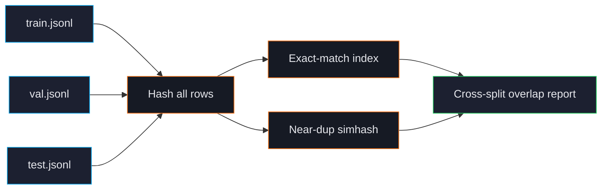

# Cross-Split Leakage

Train rows that also appear in validation or test inflate your evaluation metrics in misleading ways. The model "knows" the test answer because it saw it during training. Reported scores look good; production performance disappoints.

ForgeLM's cross-split leakage check is the single most important audit step. It runs every time you call `forgelm audit` and refuses to certify a leaky split.

## How leakage happens

The usual culprits:

1. **Random shuffling without grouping.** Splitting by row randomly puts duplicate rows on both sides.
2. **Augmentation before splitting.** Generating paraphrases of existing rows, then splitting — the original and paraphrase end up on different sides.
3. **Multiple sources of the same content.** A FAQ in your training corpus and the same FAQ in your eval set, ingested separately.
4. **Web crawls overlapping with benchmarks.** Training data crawled the web; the benchmark publisher also published their test set on the web.

## What the check does



For every train row, ForgeLM checks:
- **Exact match** in val/test (any field that matters: `prompt`, `chosen`, `response`, etc.).
- **Near-duplicate** (Hamming threshold 3 simhash) in val/test.

Any match is reported. `forgelm audit` still exits `0` on a leaky corpus — it does **not** gate on a leakage rate. (The findings that gate are a detected credential and critical-tier PII — `credit_card` / `iban` — both of which exit `3`; input/config and I/O errors exit `1` and `2`.) To fail CI when cross-split leakage is found, branch on the JSON report with `jq` (see [Dataset Audit](#/data/audit)).

## Quick example

```shell
$ forgelm audit data/      # audits train.jsonl + validation.jsonl + test.jsonl
Data audit summary
  Source        : /srv/corpora/support/data
  Total samples : 360
  Splits        : train, validation
  └─ (2 clean split(s): train, validation — pass verbose=True to expand)
  Cross-split leakage (simhash):
    train__validation: leaked=284/57 rate=94.67%/95.00%

Report written to: audit/data_audit_report.json
```

The exit code is `0` — leakage is reported, not gated. Inspect the aggregates with `jq`:

```shell
$ jq '.cross_split_overlap.pairs' audit/data_audit_report.json
{
  "train__validation": {
    "leaked_rows_in_train": 284,
    "leak_rate_train": 0.9467,
    "leaked_rows_in_validation": 57,
    "leak_rate_validation": 0.95
  }
}
```

:::warn
**Per-row leak identification is not emitted.** `cross_split_overlap.pairs` is keyed by split-pair (`train__validation`) and its values are aggregate counts and rates only. There are no row indices, no matched text, no `type` and no `hamming` field — earlier versions of this page showed a per-row listing (`{"train": 1240, "val": 312, "type": "exact", "text": "How do I cancel..."}`) that the audit has never produced. To find the specific offending rows you currently have to re-derive them yourself, e.g. by hashing the text field of each split and intersecting.
:::

## How to fix it

1. **Re-split the data**, this time grouping at the source level (don't split paraphrases, group documents). Use the `--group-by` flag in your splitter.
2. **Re-extract** if leakage came from duplicate ingestion (the same FAQ ingested twice).
3. **Remove** the leaked rows from the smaller split manually. The audit report tells you *how many* rows leaked per split-pair and at what rate, but not *which* ones — you will need to identify them yourself (hash each split's text field and intersect, or re-run your splitter with grouping). Re-run `forgelm audit` afterwards to confirm `leaked_rows_*` drops to zero. There is no auto-remove CLI flag.

## Configuration

> **Note:** There is no `audit:` top-level block in the YAML config (`ForgeConfig` rejects unknown keys). Leakage detection is always-on when `forgelm audit` is run on a multi-split dataset. The near-duplicate Hamming threshold is controlled via the `--near-dup-threshold` flag on `forgelm audit` (default 3).

## Why "near-dup" matters here

Exact-match leakage is rare in modern pipelines because everyone deduplicates. But near-dup leakage is the silent killer:

```text
Train: "How do I cancel my subscription?"
Test:  "How do I cancel my subscription"
```

Different by one character — exact-match misses it; the model treats them as identical at training time anyway. Near-dup catches this.

## Common pitfalls

:::warn
**Splitting after augmentation.** If you generate paraphrases of training data, then random-split, the paraphrase ends up on the other side. Always split *before* augmenting.
:::

:::warn
**Trusting upstream splits.** If your dataset was published with predefined train/val/test splits, audit them. Public datasets sometimes have known leakage that has propagated for years.
:::

:::danger
**Bypassing the leakage check to "ship something today".** The price of a leaky run is reporting good benchmark numbers, deploying, and discovering production performance is much worse. The loss of trust costs more than the delay would have.
:::

## See also

- [Dataset Audit](#/data/audit) — runs leakage check by default.
- [Deduplication](#/data/deduplication) — same simhash backend.
- [Annex IV](#/compliance/annex-iv) — leakage report is part of the compliance bundle.
