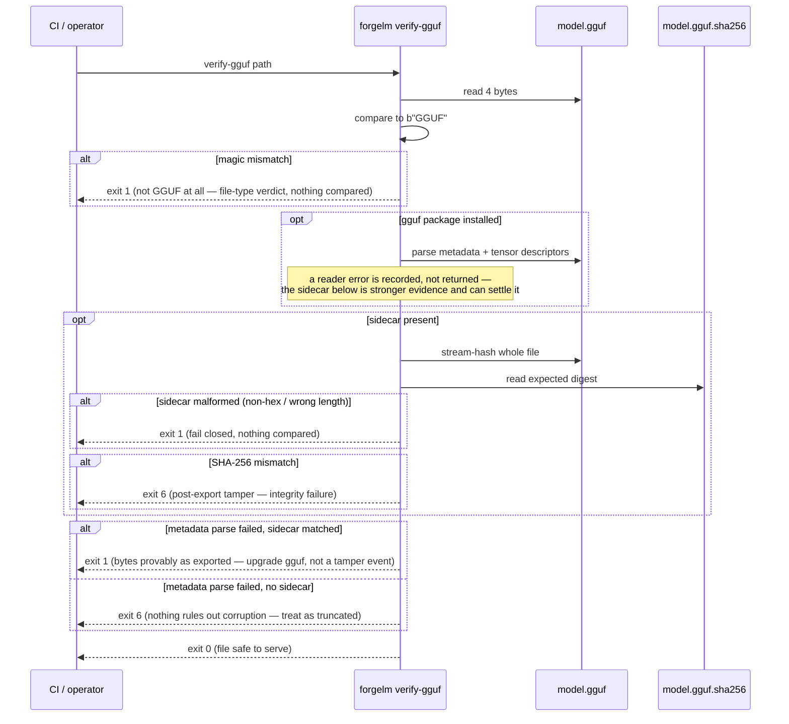

# Verify GGUF

`forgelm verify-gguf` is the read-only verifier paired with the GGUF export step. It runs a three-layer integrity check on a GGUF model file: the 4-byte `GGUF` magic header, the metadata block (when the optional `gguf` Python package is installed), and a SHA-256 comparison against the `<path>.sha256` sidecar (when present). Use it as the final pre-serve gate so a corrupted or tampered GGUF never reaches `llama.cpp`, Ollama, vLLM, or LM Studio.

## When to use it

- **Before loading a GGUF into a serving runtime.** A clean `verify-gguf` exit is the minimum signal the file is what the exporter wrote.
- **In CI/CD release gates after GGUF export.** Run after every `forgelm export` step and **fail the release on any non-zero exit code** (the public contract is the `0/1/2/3/4/5/6` set; see the in-manual [Exit Codes](#/reference/exit-codes) reference. `1` is the most common gate trip for a bad path or malformed sidecar — nothing was compared, or what was compared came out clean — while `6` means the file *is* a GGUF and a comparison genuinely disagreed; `2` covers genuine I/O failures on existing files, and other non-zero codes propagate from upstream pipelines).
- **When receiving a GGUF from a third-party trainer or model hub.** Recompute the magic + metadata + SHA-256 layers to detect drift between what they sent and what they signed.
- **After moving a GGUF between machines.** Any byte-level corruption in transit shows up as a SHA-256 mismatch.

## How it works



## Quick start

```shell
$ forgelm verify-gguf checkpoints/run/exports/model-q4_k_m.gguf
OK: checkpoints/run/exports/model-q4_k_m.gguf
  GGUF magic OK, metadata parsed, SHA-256 sidecar match
    magic_ok: True
    metadata_parsed: True
    sidecar_present: True
    sidecar_match: True
    tensor_count: 291
    sha256_actual: a4c1f2…
    sha256_expected: a4c1f2…
```

## Detailed usage

### JSON output for CI consumers

```shell
$ forgelm verify-gguf --output-format json \
    checkpoints/run/exports/model-q4_k_m.gguf
{
  "success": true,
  "valid": true,
  "reason": "GGUF magic OK, metadata parsed, SHA-256 sidecar match",
  "checks": {
    "magic_ok": true,
    "metadata_parsed": true,
    "sidecar_present": true,
    "sidecar_match": true,
    "tensor_count": 291,
    "sha256_actual": "a4c1f2…",
    "sha256_expected": "a4c1f2…"
  },
  "path": "/abs/path/checkpoints/run/exports/model-q4_k_m.gguf"
}
```

Pipe to `jq` to filter on the `valid` flag without parsing the human-readable text format.

### The three layers

| Layer | When it runs | Failure means | Exit code |
|---|---|---|---|
| **Magic header** | Always. | The file is not a GGUF (operator passed the wrong path, or the download is corrupted at byte 0) — a file-type verdict, not a tamper verdict, so it stays on the input-error code. | `1` |
| **Metadata block** | When the optional `gguf` Python package is installed. | The reader raised mid-parse. That alone cannot tell a truncated file apart from a `gguf` package too old for this file's format revision, so the verdict is decided by what the sidecar can prove — see [the three metadata outcomes](#metadata-parse-failure-depends-on-the-sidecar) below. | `6` (no sidecar) / `1` (matching sidecar) / `6` (mismatching sidecar) |
| **SHA-256 sidecar** | When `<path>.sha256` exists alongside the file. | Either the file was modified after export (a well-formed digest that disagrees — integrity failure), OR the sidecar itself is malformed (non-hex / wrong length / `TODO` placeholder — nothing was compared). The verifier fails closed on a malformed sidecar so a corrupted manifest can never silently masquerade as "verified". | `6` (modified) / `1` (malformed sidecar) |

The exporter writes the sidecar by default. When you receive a GGUF from a third party, request the sidecar alongside it; without one, only the magic + metadata layers run.

### Metadata parse failure depends on the sidecar

A metadata parse error is ambiguous on its own: it means either the file is genuinely truncated or corrupted, **or** the installed `gguf` package is too old to read this file's format revision. The verifier therefore does not stop at the parse error — it still runs the sidecar comparison, because the checksum is the stronger evidence and can settle which of the two you are in. Three distinct outcomes:

| Sidecar beside the file | Verdict | Exit code |
|---|---|---|
| **Absent** | Nothing can rule out corruption, so the artifact must be treated as truncated or damaged. | `6` |
| **Present and matching** | The bytes are provably byte-identical to what the exporter wrote, so nothing was tampered with. Upgrade `gguf` and re-run. | `1` |
| **Present and mismatching** | The file changed after export. Reported as the sidecar mismatch, not as a parse failure — the checksum dominates. | `6` |

The middle row is the one to internalise in CI: exit `6` means "page whoever owns the artifact", and a `gguf` library-version mismatch must never trigger that. Ship the sidecar with every GGUF and this ambiguity resolves itself automatically.

### Optional dependency: the `gguf` package

The metadata parse uses the upstream `gguf` Python package. When the package is not installed, the layer is skipped silently — the magic + sidecar checks remain load-bearing:

```shell
$ pip uninstall -y gguf
$ forgelm verify-gguf checkpoints/run/exports/model-q4_k_m.gguf
OK: checkpoints/run/exports/model-q4_k_m.gguf
  GGUF magic OK, SHA-256 sidecar match
    magic_ok: True
    metadata_parsed: False
    sidecar_present: True
    sidecar_match: True
```

Install with `pip install gguf` to add the metadata layer back. This matches the project's optional-dependency policy: `gguf` is not a core ForgeLM dependency.

### Reading failure output

| Failure | Cause | Exit code |
|---|---|---|
| `Magic header mismatch: expected b'GGUF', got b'PK\x03\x04'` | The file is a ZIP, not a GGUF. | `1` |
| `GGUF metadata block could not be parsed: … No SHA-256 sidecar was available to rule out corruption` | The file is truncated or the writer crashed mid-export, and no sidecar exists to prove otherwise. | `6` |
| `GGUF metadata block could not be parsed: … The SHA-256 sidecar matches, so the file is byte-identical to what was exported` | Your installed `gguf` package cannot read this file's format revision. Not a tamper event — upgrade `gguf` and re-run. | `1` |
| `SHA-256 sidecar mismatch — file modified after export` | Someone edited the file after the exporter wrote the sidecar. | `6` |
| `Malformed SHA-256 sidecar: expected a 64-character hex digest, got …` | The sidecar contains a non-hex placeholder, was truncated, or used a different algorithm. | `1` |

### Exit-code summary

| Code | Meaning |
|---|---|
| `0` | Magic OK AND (when `gguf` is installed) metadata parses AND (when sidecar present) SHA-256 matches. |
| `1` | Magic mismatch (not a GGUF at all), malformed sidecar, OR a path that is not a regular file (operator passed the wrong argument) — nothing was compared. Also a metadata block that could not be parsed on a file whose sidecar **matches**: what was compared came out clean, so this is a `gguf` version problem, not tampering. |
| `2` | I/O error reading a real file (permission denied, mid-read disk error). |
| `6` | Integrity failure: the file *is* a GGUF (magic OK) and either its SHA-256 sidecar disagrees, or its metadata block could not be parsed with no matching sidecar to rule out corruption. |

## Common pitfalls

:::warn
**Treating "no sidecar" as benign.** Without a SHA-256 sidecar the verifier cannot detect post-export modifications. Always export with a sidecar (the default) and ship the sidecar alongside the GGUF when transferring it.
:::

:::warn
**Re-using a sidecar from a different file.** The sidecar is bound to the GGUF by name (`<path>.sha256`), not by content. Copying a sidecar from another model into the wrong directory will cause a confusing SHA-256 mismatch on a perfectly good file. Regenerate with `sha256sum model.gguf > model.gguf.sha256` if in doubt.
:::

:::warn
**Skipping the metadata layer in CI by not installing `gguf`.** A SHA-256 sidecar generated from the original, full GGUF file CANNOT validate a later truncated copy — any byte-level change (including truncation) alters the digest, so the sidecar correctly fails. The actual bypass shape is an attacker who removes or regenerates the `.sha256` sidecar after tampering: with the sidecar gone or re-signed, only the magic-header check remains, and the magic header alone won't catch truncation. Install `gguf` in your CI image so the metadata reader rejects malformed/truncated files independently of any sidecar manipulation — defence in depth, not a sidecar-replacement.
:::

:::tip
**Pin the verifier in CI as a hard gate.** Wire `forgelm verify-gguf --output-format json` after every `forgelm export`; pipe to `jq -e '.valid'` so exit-on-false fails the release without parsing text.
:::

## See also

- [GGUF Export](#/deployment/gguf-export) — the production side that writes the sidecar this verifier consumes.
- [Verify Audit](#/compliance/verify-audit) — companion verifier on the compliance surface.
- [Verify Annex IV](#/compliance/annex-iv) — companion verifier for the technical-documentation artifact.
- [`verify_gguf_subcommand.md`](https://github.com/HodeTech/ForgeLM/blob/main/docs/reference/verify_gguf_subcommand.md) — the reference doc with full flag table and library-symbol citations (GitHub source).
