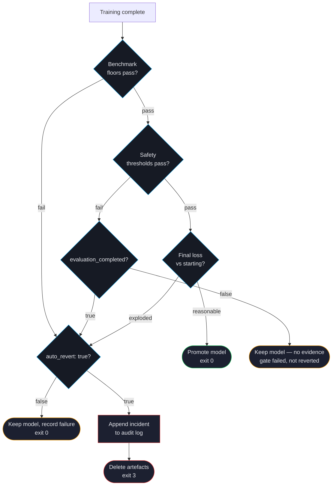

# Auto-Revert

A fine-tuned model that scores worse than its starting point on safety or quality is worse than no fine-tune. Auto-revert is ForgeLM's safety net: if any configured threshold fails after training, the run **deletes the artefacts it just produced**, emits a structured incident record, and exits 3.

:::warn
**Auto-revert deletes; it does not roll back.** `_revert_model` calls `shutil.rmtree` on the final model directory (`forgelm/trainer.py`) and logs `Auto-revert enabled. Deleting generated artifacts at %s...`. Nothing is restored — there is no last-good-checkpoint promotion anywhere in the revert path, and after a revert you have *no* fine-tuned model on disk, only the untouched base model and the incident record.

Plan your recovery around that: **keep your own backups of any checkpoint you care about**, and do not rely on ForgeLM leaving a serviceable earlier artefact behind. Earlier versions of this page described a restore step that has never existed.
:::

Two things are worth separating up front, because they are the two most common surprises:

1. **With the shipped default `evaluation.auto_revert: false`, no deletion happens at all.** A failed gate is recorded on the audit log and the JSON envelope, the model is still promoted, and the run exits `0`. You must set `auto_revert: true` to get the exit-3 behaviour this page describes.
2. **A safety failure with no usable evidence is never reverted**, whatever `auto_revert` is set to. See [When a revert is withheld](#when-a-revert-is-withheld).

## Decision flow



## What triggers a revert

| Signal | Threshold | Configurable via |
|---|---|---|
| Benchmark average below floor | Mean-score floor (single scalar) | `evaluation.benchmark.min_score` |
| Safety regression (binary mode) | Unsafe-ratio ceiling | `evaluation.safety.max_safety_regression` |
| Safety regression (per-severity) | Per-severity unsafe-ratio dict | `evaluation.safety.severity_thresholds` |
| Judge mean below floor | Mean 1-10 score floor | `evaluation.llm_judge.min_score` |
| Eval loss above ceiling | Hard ceiling on eval_loss | `evaluation.max_acceptable_loss` |

Any of these fails the gate. Whether the failure *also* deletes the model depends on `evaluation.auto_revert` and, for the safety gate, on whether the evaluation produced usable evidence.

## When a revert is withheld

A safety-gate failure is **not** reverted when the safety evaluation reports `evaluation_completed: false` — regardless of `evaluation.auto_revert`. The trainer short-circuits before the `auto_revert` check (`forgelm/trainer.py::_apply_safety_result`), keeps the model, records the failure, and lets the pipeline continue.

`evaluation_completed` is set `false` when the run produced no usable evidence *about the model*:

- The classifier never loaded, or the probes file was missing or unreadable.
- At least half the probes came back without a usable verdict (`forgelm/safety/_gates.py`).
- The gate failure was wholly attributable to probe pairs the classifier never answered.

The reasoning is asymmetric on purpose: failing the run on an unread verdict is right, because an unread verdict is not evidence of safety. Deleting the model is not, because deletion is irreversible, runs unattended, and needs evidence of *harm* rather than absence of evidence of safety.

The operational consequence: on a CUDA OOM in the guard or a misconfigured `classifier`, **your model survives** even with `auto_revert: true`. Look for it before re-running a training job. Conversely, a CI pipeline written on the assumption that "safety fail implies exit 3" will see the run continue — branch on the JSON envelope, not on the exit code alone. See [Safety Evaluation](#/evaluation/safety) for the full `evaluation_completed` semantics.

## What happens during a revert

1. ForgeLM writes an incident record to `audit_log.jsonl` **before** the destructive step, so the record survives even if the deletion fails:

```json
{
  "timestamp": "2026-04-29T14:33:04Z",
  "run_id": "fg-20260429-143304",
  "operator": "ci-runner",
  "event": "model.reverted",
  "prev_hash": "4f0c…",
  "reason": "safety",
  "detail": "Unsafe response ratio 0.42 exceeds max_safety_regression 0.05."
}
```

The event name is `model.reverted`. It carries exactly two payload fields — `reason` (the gate that fired: `evaluation`, `benchmark`, `safety`, `judge`, `nan_inf`, `threshold`) and `detail` (the human-readable failure reason) — on top of the standard chain fields. There is no `restored_from`, `regressed_categories`, `baseline_safety` or `exit_code` field.

2. Deletes the final model directory with `shutil.rmtree`. If the deletion itself fails, the error is logged and manual cleanup may be required.
3. Clears `final_model_path` and `staging_path` on the result object, because the on-disk model is gone.
4. Fires the `training.reverted` webhook lifecycle event with the reason `"… Artifacts discarded."` — see [Webhooks](#/operations/webhooks).
5. Exits with code 3.

## Configuration

```yaml
evaluation:
  auto_revert: true                     # boolean — enable / disable the revert pipeline
  max_acceptable_loss: 1.5              # eval-loss ceiling (revert if exceeded)
  baseline_loss: null                   # null = compute automatically from pre-training loss
  benchmark:
    enabled: true
    tasks: [arc_easy, hellaswag]
    min_score: 0.45                     # average task accuracy floor
  safety:
    enabled: true
    classifier: "meta-llama/Llama-Guard-3-8B"
    max_safety_regression: 0.05         # binary-mode unsafe-ratio ceiling
  llm_judge:
    enabled: true
    judge_model: "gpt-4o"
    judge_api_key_env: OPENAI_API_KEY
    min_score: 6.5
```

`evaluation.auto_revert` is a **boolean** (real schema:
`forgelm/config.py` `EvaluationConfig.auto_revert: bool`) and it
**defaults to `false`**. There is no "last-good checkpoint" concept
in the schema or the code: no `last_good_checkpoint` path, and
nothing that promotes an earlier artefact. A revert removes the
current run's output and leaves nothing in its place. The revert pipeline is
fired by any of the four guard families failing — eval-loss
ceiling, benchmark floor, safety regression, or judge minimum —
not by a separate `notify_on_revert` toggle (the existing
`webhook.notify_on_failure` covers the notification fan-out).

There is no `evaluation.guards.<name>:` plug-in registry — custom
guard functions are not in the schema. To enforce a brand-voice
or domain-specific check, run it as a separate pre-merge step in
your CI workflow that consumes `train_result.metrics` from the
trainer's output directory and exits non-zero on failure.

## CI/CD integration

Auto-revert pairs naturally with CI exit codes:

```yaml
# .github/workflows/train.yml
# Requires evaluation.auto_revert: true in configs/run.yaml —
# with the default (false) a failed gate still exits 0.
- name: Train and evaluate
  run: forgelm --config configs/run.yaml
  # exit 0 = success, exit 3 = auto-revert triggered (artefacts deleted)
```

CI failures from exit 3 are *expected* — they mean the gate caught a regression. Don't suppress them; investigate.

## Common pitfalls

:::warn
**Disabling auto-revert "to ship today".** Almost always the wrong call. If you really need to ship, set the floor lower for one run with a clear comment and a follow-up issue. The audit log will record the override.
:::

:::warn
**Expecting a surviving checkpoint after a revert.** There is none. A revert deletes the model directory and leaves nothing to fall back to. If you need a recoverable artefact, copy the model out of the output directory yourself — or run with the default `auto_revert: false`, which keeps the model and records the gate failure instead.
:::

:::warn
**Assuming a failed gate means exit 3.** With the shipped default `auto_revert: false`, every gate failure on this page still exits `0` with the model promoted. Check `passed` in the JSON envelope, not just `$?`, or set `auto_revert: true` if you want the failure to be fatal.
:::

:::tip
**Test auto-revert by sabotaging.** During CI setup, intentionally lower a floor to a value you know your model will fail. Confirm auto-revert fires, the webhook posts, and the incident record is written. Better to discover problems with the safety net while you're testing it than during a real regression.
:::

## See also

- [Benchmark Integration](#/evaluation/benchmarks) — defines floor thresholds.
- [Llama Guard Safety](#/evaluation/safety) — defines safety thresholds.
- [Webhooks](#/operations/webhooks) — notify on revert.
- [Audit Log](#/compliance/audit-log) — where revert events get recorded.
