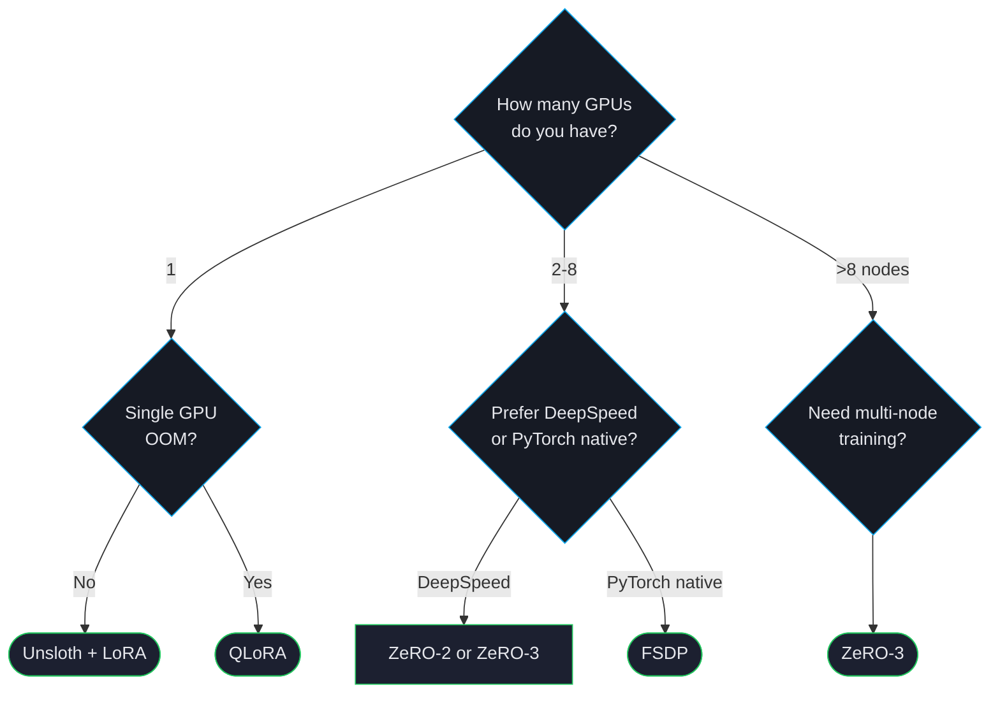

# Distributed Training

Once your model is bigger than a single GPU's memory — or you simply want to train faster — distributed training is the answer. ForgeLM supports DeepSpeed ZeRO-2/3, PyTorch FSDP, and the Unsloth single-GPU acceleration backend.

## Decision tree



## Backend cheat sheet

| Backend | Multi-GPU? | Multi-node? | Notes |
|---|---|---|---|
| **Single GPU + Unsloth** | No | No | 2-5× faster than vanilla on Llama/Qwen/Mistral. Always use this first if you're on one GPU. |
| **DeepSpeed ZeRO-2** | Yes | Yes | Shards optimiser state. Good speed, supports any model. |
| **DeepSpeed ZeRO-3** | Yes | Yes | Shards optimiser + grads + params. Required for very large models. |
| **DeepSpeed ZeRO-3 Offload** | Yes | Yes | Offloads to CPU/NVMe. Trades speed for fitting huge models. |
| **FSDP** | Yes | Yes | PyTorch native. Slightly faster than ZeRO-3 on identical configs; less mature ecosystem. |

## Unsloth (single GPU)

Unsloth is a drop-in optimisation for Llama, Qwen, Mistral, and a few others. It rewrites the attention and MLP layers in Triton for ~2-5× speedup with no quality loss.

```yaml
model:
  name_or_path: "Qwen/Qwen2.5-7B-Instruct"
  backend: "unsloth"                    # the only flag you need

training:
  trainer_type: "sft"
  # ... rest of training config unchanged
```

:::tip
Unsloth has model-specific kernels. If your architecture isn't supported, ForgeLM logs a warning and falls back to the standard backend. Supported families are listed in [Configuration Reference](#/reference/configuration).
:::

## DeepSpeed ZeRO-2

ZeRO-2 shards the optimiser state (the heaviest VRAM component for adaptive optimisers like Adam). Effective for 13B-30B models on 4-8 GPUs.

```yaml
distributed:
  strategy: "deepspeed"
  deepspeed_config: "zero2"             # preset name (or a filesystem path to a DeepSpeed JSON)

training:
  gradient_accumulation_steps: 4
```

`DistributedConfig` has no `zero_stage` or `cpu_offload` field — ZeRO's stage (and any CPU/NVMe offload) is selected through `deepspeed_config`, and `gradient_accumulation_steps` is a `training:` field, not `distributed:`.

Launch:

```shell
$ accelerate launch --num_processes 4 -m forgelm --config configs/run.yaml
# or
$ deepspeed --num_gpus 4 -m forgelm --config configs/run.yaml
```

## DeepSpeed ZeRO-3

ZeRO-3 additionally shards gradients and parameters across GPUs. Each GPU holds only `1/N` of the model. Essential for 70B+ models.

```yaml
distributed:
  strategy: "deepspeed"
  deepspeed_config: "zero3_offload"     # "zero3" (no offload) | "zero3_offload" (CPU offload) | path to a custom DeepSpeed JSON for NVMe

training:
  gradient_accumulation_steps: 8
```

The `zero3_offload` preset fits 70B on 8×24 GB by offloading optimiser state and parameters to CPU. ZeRO-Infinity's NVMe offload isn't a built-in preset — point `deepspeed_config` at a custom DeepSpeed JSON with `offload_param`/`offload_optimizer` set to `device: nvme` for that case.

| Model | GPUs | ZeRO-3 + offload? |
|---|---|---|
| 30B | 4× A100 40 GB | Optional |
| 70B | 8× A100 40 GB | CPU offload required |
| 70B | 4× A100 80 GB | No offload needed |
| 405B | 8× H100 80 GB | NVMe offload |

## FSDP (PyTorch native)

FSDP shards similarly to ZeRO-3 but uses PyTorch's native FullyShardedDataParallel. Marginally faster on identical setups; slightly less ecosystem maturity (e.g. some HF integrations expect DeepSpeed).

```yaml
distributed:
  strategy: "fsdp"
  fsdp_strategy: "full_shard"             # full_shard | shard_grad_op | no_shard | hybrid_shard
  fsdp_auto_wrap: true                    # auto-wrap transformer layers (recommended)
  fsdp_offload: false                     # offload parameters to CPU between forward/backward
  fsdp_state_dict_type: "FULL_STATE_DICT" # FULL_STATE_DICT | SHARDED_STATE_DICT
```

`DistributedConfig` has no `fsdp_auto_wrap_policy` or `fsdp_offload_params` field — auto-wrap is the plain boolean `fsdp_auto_wrap`, and CPU offload is `fsdp_offload` (no `_params` suffix).

## Gradient accumulation

Whichever backend you use, gradient accumulation lets you target an effective batch size larger than your VRAM allows:

```yaml
training:
  per_device_train_batch_size: 1        # per-device
  gradient_accumulation_steps: 32       # effective batch = 1 × 32 × num_gpus
```

8 GPUs × 1 batch × 32 accumulation = effective batch size 256, which is what most large training runs target.

## Common pitfalls

:::warn
**ZeRO-3 initialisation order.** ZeRO-3 requires special handling for parameters that aren't trained on every rank — always launch through `accelerate launch` (not a raw `python -m forgelm`) so DeepSpeed's parameter-partitioning wrapper initialises before the model loads.
:::

:::warn
**Mixing DeepSpeed and FSDP fields.** `distributed.strategy` selects exactly one backend (`deepspeed` or `fsdp`) — only the fields for the active strategy are consulted. There is no `distributed.zero_stage` field; DeepSpeed's ZeRO stage is chosen through `deepspeed_config` (a preset name or a path to a DeepSpeed JSON).
:::

:::warn
**Inconsistent batch sizes across nodes.** All nodes must agree on batch size and accumulation. ForgeLM raises an error early if mismatched, but only if you remember to validate from each node — `--dry-run` from the launching node is sufficient.
:::

:::tip
For multi-node, configure SSH access between nodes and use `accelerate config` to record the node list. ForgeLM picks up the resulting config automatically.
:::

## See also

- [GaLore](#/training/galore) — full-parameter training in less VRAM, alternative to ZeRO-3.
- [VRAM Fit-Check](#/operations/vram-fit-check) — verify before launching a multi-GPU job.
- [CI/CD Pipelines](#/operations/cicd) — multi-GPU training in automated pipelines.
