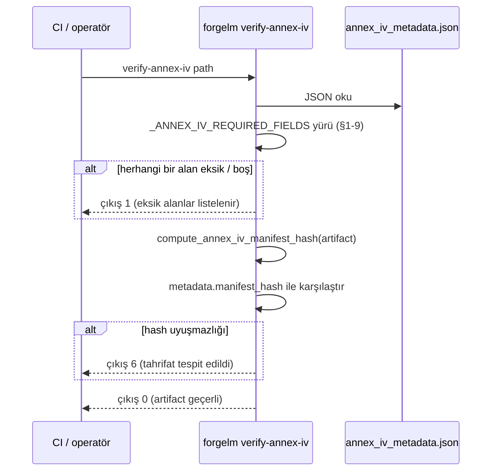

# Annex IV Doğrulama

`forgelm verify-annex-iv`, Annex IV teknik dokümantasyon artifact'ı (`compliance/annex_iv_metadata.json`) ile eşleşen salt-okunur doğrulayıcıdır. EU AI Act'in yüksek-riskli sistemler için talep ettiği dokuz üst-seviye alanı (§1-9) yürür, her gerekli kategorinin doldurulduğunu kontrol eder ve artifact üretildiğinden bu yana tahrifat olup olmadığını tespit etmek için manifest hash'ini yeniden hesaplar. Üretici taraf — `compliance:` YAML bloğunuzdan Annex IV'ün otomatik doldurulması — [Uyumluluk Genel Bakış](#/compliance/overview) sayfasında belgelenmiştir.

## Ne zaman kullanılır

- **Bir Annex IV paketini "denetlemeye hazır" saymadan önce.** Temiz bir çıkış, bir düzenleyiciye veya notified body'ye verilmesi gereken minimum şema-tamamlama sinyalidir.
- **Eğitim sonrası CI kapısında.** Annex IV emit eden her pipeline'dan sonra çalıştırın; sıfırdan farklı her çıkışta yayını başarısız sayın — `6` (artifact okundu ve manifest hash'i eşleşmiyor: tahrifat) da `1` (gerekli alanlar hiç doldurulmamış ya da dosya hiç ayrıştırılamamış) da yayını bloklamalıdır. Tam sözleşme için [Çıkış Kodları](#/reference/exit-codes) sayfasına bakın.
- **Üçüncü-taraf bir trainer'dan Annex IV alındığında.** Gömülü manifest hash'i burada **yardımcı olmaz** — dosyayla birlikte seyahat eder ve gönderen onu yeniden hesaplayabilir. Kökeni bant dışı bir kanalla kurun: artefakt üzerinde ayrık bir imza, imzalı bir aktarım kanalı ya da güvenilir bir kayıt defteri. Doğrulayıcıyı yazarlığı değil, yapısal tamlığı doğrulamak için kullanın.
- **Arşivlenmiş paketler genelinde periyodik olarak.** Geçmiş Annex IV dosyaları üzerinde gece taraması, sessiz arşiv-sonrası düzenlemeleri ortaya çıkarır.

## Nasıl çalışır



Doğrulayıcı, `forgelm.compliance.build_annex_iv_artifact` içindeki yazıcı ile aynı kanonikalleştirme rutinini (`forgelm.compliance.compute_annex_iv_manifest_hash`) kullanır — böylece geçerli bir artefakt yazıcı/doğrulayıcı bayt sapması nedeniyle kendi doğrulayıcısında asla başarısız olamaz.

## Hızlı başlangıç

```shell
$ forgelm verify-annex-iv checkpoints/run/compliance/annex_iv_metadata.json
OK: checkpoints/run/compliance/annex_iv_metadata.json
  All Annex IV §1-9 fields populated; manifest hash matches.
```

## Ayrıntılı kullanım

### CI tüketicileri için JSON çıktı

```shell
$ forgelm verify-annex-iv --output-format json \
    checkpoints/run/compliance/annex_iv_metadata.json
{
  "success": true,
  "valid": true,
  "reason": "All Annex IV §1-9 fields populated; manifest hash matches.",
  "missing_fields": [],
  "manifest_hash_actual": "e06b780a91150b1c56e9094a43f273ddd1f308acac13e896ed26747d9085220d",
  "manifest_hash_expected": "e06b780a91150b1c56e9094a43f273ddd1f308acac13e896ed26747d9085220d",
  "path": "/abs/path/checkpoints/run/compliance/annex_iv_metadata.json"
}
```

İnsan-okunur metin formatını ayrıştırmadan `valid` bayrağına filtrelemek için `jq`'ya boruyla bağlayın. Her iki hash alanı da `sha256:` öneki taşımayan **çıplak hex** özetlerdir ve artefakt hash taşımıyorken `null` değil boş string `""` olur.

### "Eksik alan" ne demek

Bir alan; anahtar yoksa VEYA değer `None`, boş string, boş liste ya da boş dict ise eksik sayılır. Çıta "operatör bunu açıkça doldurdu", "anahtar teknik olarak var" değil — otomatik üretim şablonundan placeholder doldurmayı unutan operatör, doğrulayıcının hedeflediği hata modudur.

`system_identification` ayrıca **alt-alan derinliğinde** doğrulanır: `provider_name`, `system_name` ve `intended_purpose` her biri boş olmamalıdır; aksi halde boş placeholder'lardan oluşan, dolu görünen bir kapsayıcı testi geçerdi. Bunlardan biri boş olduğunda `missing_fields` düz bir anahtar değil, **noktalı yol** taşır — örn. `["system_identification.provider_name", "system_identification.system_name"]`. `missing_fields` girdilerinin daima üst düzey anahtar olduğunu varsayan araçlar bunları yanlış işler.

Dokuz gerekli anahtar Annex IV §1-9 ile eşleşir:

| Üst-seviye anahtar | Annex IV bölümü |
|---|---|
| `system_identification` | §1 — `provider_name`, `system_name`, `intended_purpose` (her biri boş-olmama koşuluyla doğrulanır), ayrıca `provider_contact`, `system_version`, `risk_classification`. |
| `intended_purpose` | §1 — amaçlanan kullanım beyanı. |
| `system_components` | §2 — yazılım / donanım bileşenleri + tedarikçi listesi. |
| `computational_resources` | §2(g) — eğitim sırasında kullanılan hesaplama kaynakları. |
| `data_governance` | §2(d) — veri kaynakları, yönetişim, doğrulama metodolojisi. |
| `technical_documentation` | §3-5 — tasarım + geliştirme metodolojisi. |
| `monitoring_and_logging` | §6 — pazara-sonrası izleme + audit-log varlığı. |
| `performance_metrics` | §7 — doğruluk / dayanıklılık / siber güvenlik metrikleri. |
| `risk_management` | §9 — risk yönetim sistemi referansı (Madde 9 hizalaması). |

### "Manifest hash uyuşmazlığı" ne demek

Artifact bir `metadata.manifest_hash` alanı taşıdığında doğrulayıcı, artifact'ın kanonik-JSON gösteriminin (metadata bloğu hariç) SHA-256'sını yeniden hesaplar ve karşılaştırır. Uyuşmazlık, dosyanın artık kendi damgasıyla eşleşmediğini gösterir — üretimden sonra, damga tazelenmeden düzenlenmiştir.

:::warn
**Bu bir iç-tutarlılık sağlaması (checksum) olup imza değildir.** `metadata.manifest_hash`, public `forgelm.compliance.compute_annex_iv_manifest_hash` fonksiyonunun ürettiği **anahtarsız** bir SHA-256'dır. Dosyaya yazabilen herkes `intended_purpose` ya da `risk_management` alanını yeniden yazıp aynı public fonksiyonu çağırarak artefaktı yeniden damgalayabilir; ardından `verify-annex-iv` `OK: All Annex IV §1-9 fields populated; manifest hash matches.` raporlar ve `0` ile çıkar.

Eşleşen bir hash'in kanıtladığı: dosya *sıradan* bir düzenlemeye uğramamış ya da aktarımda bozulmamıştır. Kanıtlamadığı: onu kimin ürettiği ya da kararlı bir tarafın onu yeniden yazmamış olduğu. Düzenleyiciye dönük güvence için artefakt üzerinde ayrık bir imzaya, imzalı bir aktarım kanalına ya da write-once bir depoya ihtiyacınız vardır. ForgeLM'in ürettiği tek anahtarlı artefakt `FORGELM_AUDIT_SECRET` altındaki audit log'dur — ve manifesti ona karşı çapraz kontrol eden şey aşağıdaki `verify-annex-iv --pipeline`'dır.
:::

`metadata.manifest_hash` taşımayan artifact'lar alan-tamamlama kontrolünü geçer; ancak doğrulayıcı bunu neden metninde işaretler:

```text
OK: …/annex_iv_metadata.json
  All Annex IV §1-9 fields populated; no manifest_hash present so tampering detection skipped.
```

### Çıkış-kodu özeti

| Kod | Anlam |
|---|---|
| `0` | Tüm §1-9 alanları doldurulmuş VE (mevcutsa) manifest hash'i eşleşiyor. |
| `1` | Hiçbir şey karşılaştırılmadı: gerekli bir §1-9 alanı eksik / boş, kök bir JSON nesnesi değil, JSON bozuk ya da geçerli UTF-8 değil veya yol yok / normal bir dosya değil. Operatörün müdahale etmesi gerekir — artifact mevcut hâliyle Annex IV açısından tam değildir. |
| `2` | Mevcut ve erişilebilir bir dosyada gerçek çalışma-zamanı I/O hatası (okuma sırasında izin reddi, okuma hatası). Yeniden denenebilir. |
| `6` | Bütünlük hatası: tüm §1-9 alanları dolu, artifact bir `metadata.manifest_hash` taşıyor ve yeniden hesaplanan hash bununla uyuşmuyor. Belge üretimden sonra düzenlenmiştir — bunu bir yapılandırma düzeltmesi değil, güvenlik olayı olarak ele alın. |

## Pipeline modu: `--pipeline`

Çok aşamalı bir koşu için `forgelm verify-annex-iv --pipeline <run_dir>`, tek bir artefakt yerine `<run_dir>/compliance/pipeline_manifest.json` dosyasını okur. Zincir bütünlüğünü, stage-index sıralamasını ve `stopped_at` tutarlılığını kontrol eder, tamamlanmış her stage'in Annex IV kanıtını derinlemesine parse eder ve — tek-artefakt modunun yapmadığı kısım — manifest'in stage census'ünü audit log'a karşı çapraz kontrol eder.

```shell
$ forgelm verify-annex-iv checkpoints/pipeline_run --pipeline --output-format json
{
  "success": false,
  "mode": "pipeline",
  "path": "/abs/path/checkpoints/pipeline_run",
  "violations": ["[audit-log corroboration] unattested (audit_log_absent): …"],
  "stages_total": 2,
  "stages_examined": 2,
  "evidence_verified": 2,
  "evidence_unverified": 0,
  "hash_state": "verified",
  "status_census": {"completed": 2},
  "stage_dispositions": [
    {"index": 0, "name": "sft_stage", "status": "completed", "disposition": "examined"},
    {"index": 1, "name": "dpo_stage", "status": "completed", "disposition": "examined"}
  ],
  "audit_corroboration": {
    "outcome": "unattested",
    "reason": "audit_log_absent",
    "events_examined": 0,
    "stages_asserted": 0
  }
}
```

| Anahtar | Tip | Notlar |
|---|---|---|
| `mode` | str | Bu yolda her zaman `"pipeline"`. |
| `violations` | list[str] | Bulgular. Tamamen temiz bir koşuda boş. |
| `stages_total` | int | Manifest'teki satır sayısı. `stages_examined` ile karşılaştırın — bir stage'in status'ü değiştirilerek rapordan gizlenmesi mümkün değildir, census bunu gösterir. |
| `stages_examined` | int | Kanıtı fiilen parse edilen stage sayısı. |
| `evidence_verified` / `evidence_unverified` | int | Hash'i kontrol edilen stage artefact'leri ile ulaşılıp doğrulanamayanlar. |
| `hash_state` | str | Manifest kendi damgasıyla eşleştiğinde `"verified"`; `manifest_hash` taşımadığında `"absent"` (v0.8.0 öncesi arşivler — hiçbir şey onu doğrulamadı). |
| `status_census` | object | Tüm manifest satırları boyunca `{status: sayı}`. |
| `stage_dispositions` | list[object] | Stage başına bir satır: `index`, `name`, `status` ve neden incelendiğini/incelenmediğini açıklayan `disposition`. |
| `audit_corroboration` | object \| null | `outcome`, `reason`, `events_examined`, `stages_asserted`. Manifest parse edilmeyen ön-uçuş yollarında `null`. |

### `audit_corroboration.outcome` üç değerlidir

`corroborated`, `contradicted` ya da **`unattested`** — ve `unattested` **asla** temiz bir sonuç değildir. Manifest'in iddialarını destekleyen anahtarlı hiçbir kaydın bulunmadığı, dolayısıyla aslında hiçbir şeyin doğrulanmadığı anlamına gelir.

:::warn
**`FORGELM_AUDIT_SECRET` ayarlı değilken sonuç `unattested`'dır.** Audit log'un hiç bulunmadığı durum da öyle. Manifest'in kendi `manifest_hash`'i anahtarsız olduğundan (yukarıya bakın), pipeline'ın ne yaptığını bağımsız olarak doğrulayabilecek tek şey audit log'un HMAC'idir — onsuz `hash_state: "verified"` yalnızca "dosya kendi damgasıyla uyuşuyor" demektir. Koşudan önce 16+ karakterlik bir `FORGELM_AUDIT_SECRET` export edin ve CI'da `unattested`'ı geçiş değil, başarısızlık sayın.
:::

### Pipeline modunda çıkış kodları

Önce bütünlük değerlendirilir; böylece zayıf bir bulgu güçlü olanı asla maskeleyemez.

| Kod | Anlamı |
|---|---|
| `0` | İhlal yok. |
| `6` | Yapısal, zincir-bütünlüğü ya da stage-başına-kanıt kontrolü başarısız — koşunun kaydını bir şey yeniden yazmış. |
| `2` | Manifest ya da bir stage artefact'i var ama okunamadı (kilitli dosya, okuma ortasında I/O hatası). Yeniden denenebilir. |
| `1` | Manifest yok ya da parse edilemiyor, **ya da** doğrulayıcı kanıta ulaştı ve hiçbir şey onu doğrulamadı (`unattested` corroboration dahil). Ne geçiş ne tahrifat — karşılaştırma yapılmadı. |

## Sık hatalar

:::warn
**ForgeLM çıktısını sertifikasyon olarak görmek.** Toolkit kanıt üretir; sertifikasyon notified-body faaliyetidir. Doğrulayıcı, artifact'ın yapısal olarak tam ve tahrifsiz olduğunu doğrular — sizin spesifik deployment bağlamınız için *doğru* olduğunu değil.
:::

:::warn
**Pakette bir uygunluk beyanı beklemek.** ForgeLM böyle bir belge üretmez — bu artefaktta §7, uygunluk beyanı değil `performance_metrics`'tir (doğruluk / dayanıklılık). Madde 16 uygunluğu deployer'ın imzaladığı teslim edilebilirdir ve `verify-annex-iv` ne raporlarsa raporlasın toolkit dışında yazılıp imzalanmalıdır.
:::

:::warn
**OK çıktısındaki "manifest_hash present değil" uyarısını yok saymak.** Manifest hash olmadan doğrulayıcı üretim-sonrası sıradan bir düzenlemeyi bile tespit edemez. Yazıcının hash'i eklemesi için artifact'ı güncel bir `forgelm` build'i üzerinden yeniden export edin — ve hash'in anahtarsız olduğunu, dolayısıyla gerçek tamper-evidence'ı write-once bir deponun ya da ayrık bir imzanın verdiğini unutmayın.
:::

:::tip
**Doğrulayıcıyı CI'da sert bir kapı olarak sabitleyin.** Annex IV üreten her pipeline'dan sonra `forgelm verify-annex-iv --output-format json`'u bağlayın; metin ayrıştırmadan yayını başarısız etmek için `jq -e '.valid'`'e boruyla bağlayın. Bunun yerine süreç çıkış koduna göre kapı kuruyorsanız sıfırdan farklı olmasına bakın — yalnızca `== 1` kontrolü, tahrif edilmiş bir artifact'ı (çıkış `6`) geçirir.
:::

## Bkz.

- [Uyumluluk Genel Bakış](#/compliance/overview) — paketin geri kalanı için bağlam (manifest, audit log, model kart).
- [Audit Log](#/compliance/audit-log) — append-only event log; `compliance.artifacts_exported` (Madde 11 + Annex IV) bu doğrulayıcının üretici tarafındaki muadilidir.
- [Audit Log Doğrulama](#/compliance/verify-audit) — audit log için kardeş doğrulayıcı.
- [GGUF Doğrulama](#/deployment/verify-gguf) — deployment-bütünlük yüzeyindeki kardeş doğrulayıcı.
- [Çıkış Kodları](#/reference/exit-codes) — `0/1/2/3/4/5/6` kamuya açık sözleşmesi; dört `verify-*` alt komutunun paylaştığı `1` ile `6` ayrımı dâhil.
- [`verify_annex_iv_subcommand.md`](https://github.com/HodeTech/ForgeLM/blob/main/docs/reference/verify_annex_iv_subcommand.md) — tam bayrak tablosu ve kütüphane-sembol atıfları içeren referans doc (GitHub kaynağı).
