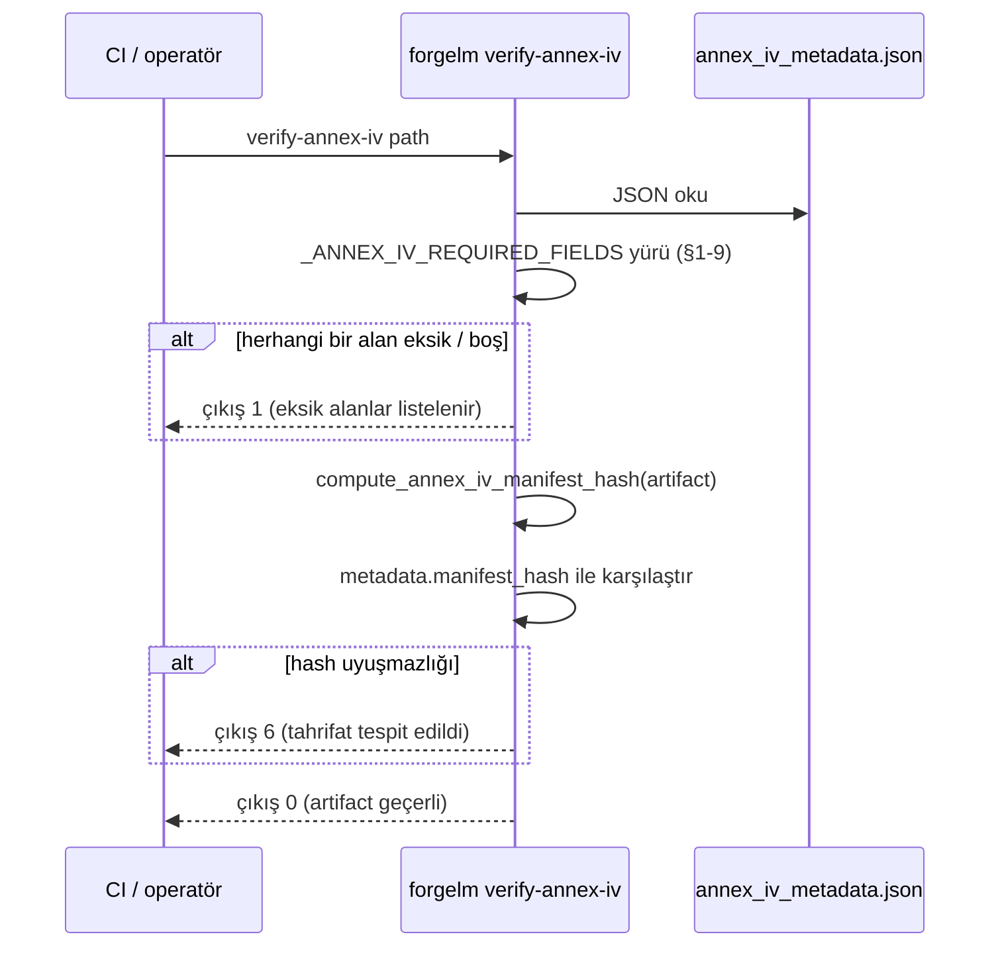

# Annex IV Doğrulama

`forgelm verify-annex-iv`, Annex IV teknik dokümantasyon artifact'ı (`compliance/annex_iv_metadata.json`) ile eşleşen salt-okunur doğrulayıcıdır. EU AI Act'in yüksek-riskli sistemler için talep ettiği dokuz üst-seviye alanı (§1-9) yürür, her gerekli kategorinin doldurulduğunu kontrol eder ve artifact üretildiğinden bu yana tahrifat olup olmadığını tespit etmek için manifest hash'ini yeniden hesaplar. Üretici taraf — `compliance:` YAML bloğunuzdan Annex IV'ün otomatik doldurulması — [Uyumluluk Genel Bakış](#/compliance/overview) sayfasında belgelenmiştir.

## Ne zaman kullanılır

- **Bir Annex IV paketini "denetlemeye hazır" saymadan önce.** Temiz bir çıkış, bir düzenleyiciye veya notified body'ye verilmesi gereken minimum şema-tamamlama sinyalidir.
- **Eğitim sonrası CI kapısında.** Annex IV emit eden her pipeline'dan sonra çalıştırın; sıfırdan farklı her çıkışta yayını başarısız sayın — `6` (artifact okundu ve manifest hash'i eşleşmiyor: tahrifat) da `1` (gerekli alanlar hiç doldurulmamış ya da dosya hiç ayrıştırılamamış) da yayını bloklamalıdır. Tam sözleşme için [Çıkış Kodları](#/reference/exit-codes) sayfasına bakın.
- **Üçüncü-taraf bir trainer'dan Annex IV alındığında.** Gönderilen ile imzalanan arasındaki sapmayı tespit etmek için manifest hash'ini yeniden hesaplayın.
- **Arşivlenmiş paketler genelinde periyodik olarak.** Geçmiş Annex IV dosyaları üzerinde gece taraması, sessiz arşiv-sonrası düzenlemeleri ortaya çıkarır.

## Nasıl çalışır



Doğrulayıcı, `forgelm.compliance.build_annex_iv_artifact` içindeki yazıcı ile aynı kanonikalleştirme rutinini (`forgelm.compliance.compute_annex_iv_manifest_hash`) kullanır — böylece geçerli bir artefakt yazıcı/doğrulayıcı bayt sapması nedeniyle kendi doğrulayıcısında asla başarısız olamaz.

## Hızlı başlangıç

```shell
$ forgelm verify-annex-iv checkpoints/run/compliance/annex_iv_metadata.json
OK: checkpoints/run/compliance/annex_iv_metadata.json
  All Annex IV §1-9 fields populated; manifest hash matches.
```

## Ayrıntılı kullanım

### CI tüketicileri için JSON çıktı

```shell
$ forgelm verify-annex-iv --output-format json \
    checkpoints/run/compliance/annex_iv_metadata.json
{
  "success": true,
  "valid": true,
  "reason": "All Annex IV §1-9 fields populated; manifest hash matches.",
  "missing_fields": [],
  "manifest_hash_actual": "sha256:abcdef…",
  "manifest_hash_expected": "sha256:abcdef…",
  "path": "/abs/path/checkpoints/run/compliance/annex_iv_metadata.json"
}
```

İnsan-okunur metin formatını ayrıştırmadan `valid` bayrağına filtrelemek için `jq`'ya boruyla bağlayın.

### "Eksik alan" ne demek

Bir alan; anahtar yoksa VEYA değer `None`, boş string, boş liste ya da boş dict ise eksik sayılır. Çıta "operatör bunu açıkça doldurdu", "anahtar teknik olarak var" değil — otomatik üretim şablonundan placeholder doldurmayı unutan operatör, doğrulayıcının hedeflediği hata modudur.

Dokuz gerekli anahtar Annex IV §1-9 ile eşleşir:

| Üst-seviye anahtar | Annex IV bölümü |
|---|---|
| `system_identification` | §1 — sistem tanıtımı (ad, sürüm, sağlayıcı, intended_purpose). |
| `intended_purpose` | §1 — amaçlanan kullanım beyanı. |
| `system_components` | §2 — yazılım / donanım bileşenleri + tedarikçi listesi. |
| `computational_resources` | §2(g) — eğitim sırasında kullanılan hesaplama kaynakları. |
| `data_governance` | §2(d) — veri kaynakları, yönetişim, doğrulama metodolojisi. |
| `technical_documentation` | §3-5 — tasarım + geliştirme metodolojisi. |
| `monitoring_and_logging` | §6 — pazara-sonrası izleme + audit-log varlığı. |
| `performance_metrics` | §7 — doğruluk / dayanıklılık / siber güvenlik metrikleri. |
| `risk_management` | §9 — risk yönetim sistemi referansı (Madde 9 hizalaması). |

### "Manifest hash uyuşmazlığı" ne demek

Artifact bir `metadata.manifest_hash` alanı taşıdığında doğrulayıcı, artifact'ın kanonik-JSON gösteriminin (metadata bloğu hariç) SHA-256'sını yeniden hesaplar ve karşılaştırır. Uyuşmazlık, dosyanın üretimden sonra düzenlendiğini gösterir — düzenleyici-yönü imza artık geçerli değildir.

`metadata.manifest_hash` taşımayan artifact'lar alan-tamamlama kontrolünü geçer; ancak doğrulayıcı bunu neden metninde işaretler:

```text
OK: …/annex_iv_metadata.json
  All Annex IV §1-9 fields populated; no manifest_hash present so tampering detection skipped.
```

### Çıkış-kodu özeti

| Kod | Anlam |
|---|---|
| `0` | Tüm §1-9 alanları doldurulmuş VE (mevcutsa) manifest hash'i eşleşiyor. |
| `1` | Hiçbir şey karşılaştırılmadı: gerekli bir §1-9 alanı eksik / boş, kök bir JSON nesnesi değil, JSON bozuk ya da geçerli UTF-8 değil veya yol yok / normal bir dosya değil. Operatörün müdahale etmesi gerekir — artifact mevcut hâliyle Annex IV açısından tam değildir. |
| `2` | Mevcut ve erişilebilir bir dosyada gerçek çalışma-zamanı I/O hatası (okuma sırasında izin reddi, okuma hatası). Yeniden denenebilir. |
| `6` | Bütünlük hatası: tüm §1-9 alanları dolu, artifact bir `metadata.manifest_hash` taşıyor ve yeniden hesaplanan hash bununla uyuşmuyor. Belge üretimden sonra düzenlenmiştir — bunu bir yapılandırma düzeltmesi değil, güvenlik olayı olarak ele alın. |

## Sık hatalar

:::warn
**ForgeLM çıktısını sertifikasyon olarak görmek.** Toolkit kanıt üretir; sertifikasyon notified-body faaliyetidir. Doğrulayıcı, artifact'ın yapısal olarak tam ve tahrifsiz olduğunu doğrular — sizin spesifik deployment bağlamınız için *doğru* olduğunu değil.
:::

:::warn
**Uygunluk beyanındaki insan inceleme adımını atlamak.** Annex IV §7 (uygunluk beyanı) yasal bir belgedir. Otomatik doldurulmuş iskelet yasal bir etki taşımaz — `verify-annex-iv` ne raporlarsa raporlasın, sunmadan önce bir insan inceleyip imzalamalıdır.
:::

:::warn
**OK çıktısındaki "manifest_hash present değil" uyarısını yok saymak.** Manifest hash olmadan doğrulayıcı üretim-sonrası tahrifatı tespit edemez. Yazıcının hash'i eklemesi için artifact'ı güncel bir `forgelm` build'i üzerinden yeniden export edin ya da depolama katmanında tamper-evidence veren bir write-once depoya geçin.
:::

:::tip
**Doğrulayıcıyı CI'da sert bir kapı olarak sabitleyin.** Annex IV üreten her pipeline'dan sonra `forgelm verify-annex-iv --output-format json`'u bağlayın; metin ayrıştırmadan yayını başarısız etmek için `jq -e '.valid'`'e boruyla bağlayın. Bunun yerine süreç çıkış koduna göre kapı kuruyorsanız sıfırdan farklı olmasına bakın — yalnızca `== 1` kontrolü, tahrif edilmiş bir artifact'ı (çıkış `6`) geçirir.
:::

## Bkz.

- [Uyumluluk Genel Bakış](#/compliance/overview) — paketin geri kalanı için bağlam (manifest, audit log, model kart).
- [Audit Log](#/compliance/audit-log) — append-only event log; `compliance.artifacts_exported` (Madde 11 + Annex IV) bu doğrulayıcının üretici tarafındaki muadilidir.
- [Audit Log Doğrulama](#/compliance/verify-audit) — audit log için kardeş doğrulayıcı.
- [GGUF Doğrulama](#/deployment/verify-gguf) — deployment-bütünlük yüzeyindeki kardeş doğrulayıcı.
- [Çıkış Kodları](#/reference/exit-codes) — `0/1/2/3/4/5/6` kamuya açık sözleşmesi; dört `verify-*` alt komutunun paylaştığı `1` ile `6` ayrımı dâhil.
- [`verify_annex_iv_subcommand.md`](https://github.com/HodeTech/ForgeLM/blob/main/docs/reference/verify_annex_iv_subcommand.md) — tam bayrak tablosu ve kütüphane-sembol atıfları içeren referans doc (GitHub kaynağı).
