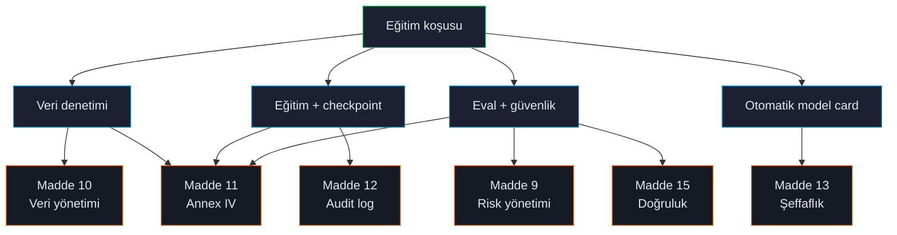

# Uyumluluk Genel Bakış

ForgeLM, eğitim hatlarını sadece bir CTO'ya değil, bir regülatöre savunması gereken ekipler için yapıldı. Her başarılı (veya başarısız) koşu, EU AI Act Madde 9-17'ye, GDPR Madde 5'e ve ISO 27001 kontrol hedeflerine temiz şekilde eşlenen yapılandırılmış bir kanıt paketi üretir.



## Üretilen şeyler

`compliance:` bloğu doldurulmuş herhangi bir koşu (özellikle `compliance.risk_classification` artı `compliance.provider_name` / `compliance.intended_purpose`) standart top-level audit log'un yanında Madde 11 teknik dokümantasyonunu yayınlar:

```text
checkpoints/run/
├── audit_log.jsonl                  ← Madde 12 — append-only event log (top-level)
├── audit_log.jsonl.manifest.json    ← genesis-pin sidecar (truncate-evidence)
├── safety_results.json              ← Madde 9 + 15 — güvenlik eval'i (`evaluation.safety.enabled` iken)
├── benchmark_results.json           ← Madde 15 — doğruluk (`evaluation.benchmark.enabled` iken)
├── final_model/
│   ├── README.md                    ← Madde 13 — HuggingFace-uyumlu model card
│   └── model_integrity.json         ← Madde 15 — SHA-256 artefakt manifesti (`forgelm verify-integrity`)
└── compliance/
    ├── compliance_report.json       ← Madde 11 — tam makine-okunabilir manifest
    ├── training_manifest.yaml       ← Madde 11 — operatör-okunabilir özet
    ├── data_provenance.json         ← Madde 10 — köken alt kümesi
    ├── risk_assessment.json         ← Madde 9 — top-level `risk_assessment:` bloğu varken yazılır
    ├── annex_iv_metadata.json       ← Madde 11 — Annex IV dizini (`forgelm verify-annex-iv` ile eşli)
    └── data_governance_report.json  ← Madde 10 — split-başına yönetişim kanıtı
```

Denetçilerin sıklıkla `compliance/` içinde aradığı iki dosya orada **değildir**:

- **`data_audit_report.json`** trainer tarafından değil, `forgelm audit --output DIR` tarafından yazılır (varsayılan `./audit/`). Trainer onu `training.output_dir`'dan *okur* ve `data_governance_report.json` içine gömer. Yollar örtüşmezse koşu yine başarılı olur ama bir `compliance.governance_section_missing` audit event'i yayar — dolayısıyla Madde 10 veri-kalite bölümünün dolması için `forgelm audit --output`'u `training.output_dir`'a yöneltin.
- **Model card (`README.md`)** uyum paketine değil, model dizinine (`final_model/`) yazılır; çünkü ağırlıklarla birlikte Hub'a gider.

`compliance.annex_iv: true` knob'ı **yoktur** — Annex IV emisyonu `compliance.risk_classification` ve doldurulmuş `compliance.provider_*` / `compliance.intended_purpose` varlığıyla sürülür. Aynı şekilde, ForgeLM `conformity_declaration.md` **üretmez** — Madde 16 uygunluk beyanı kod artifact'ı değil, deployer'ın imzaladığı teslim edilebilirdir.

:::warn
**`forgelm verify-annex-iv <yol>/annex_iv_metadata.json` audit log'a hiç dokunmaz.** Tek-artefakt modu dokuz §1-9 alanını kontrol eder ve manifest hash'ini yeniden hesaplar — başka bir şey yapmaz. İçinde hiç audit log bulunmayan bir dizinde bile exit `0` döner. Audit log çapraz kontrolü yalnızca `forgelm verify-annex-iv --pipeline <run_dir>` içinde yaşar; bkz. [Annex IV Doğrulama](#/compliance/annex-iv).
:::

## ForgeLM'in karşıladığı maddeler

| Madde | Konu | ForgeLM nasıl |
|---|---|---|
| **9** | Risk yönetimi | Otomatik geri alma + eşik kapıları + trend izleme. |
| **10** | Veri yönetimi | `forgelm audit` veri seti başına yönetişim kanıtı üretir. |
| **11** | Teknik dokümantasyon | `annex_iv_metadata.json` dolu Annex IV. |
| **12** | Kayıt tutma | Eğitim başlangıcı, eval kapıları, geri alma kararlarını kapsayan append-only `audit_log.jsonl`. |
| **13** | Şeffaflık | Otomatik üretilen model card; yetenekleri, sınırları, eğitim özetini listeler. |
| **14** | İnsan gözetimi | Opsiyonel `evaluation.require_human_approval: true` insan imzalayana kadar terfi engeller. |
| **15** | Doğruluk ve sağlamlık | Benchmark kapıları + güvenlik eval + cybersec (ingest'te PII / sırlar). |
| **16-17** | Uygunluk ve QMS | Toolkit ile birlikte gelen QMS SOP'ları (`docs/qms/`). ForgeLM uygunluk beyanını yazmaz. |

Tam kod referansları için [GitHub'daki Compliance özeti](https://github.com/HodeTech/ForgeLM/blob/main/docs/reference/compliance_summary.md).

## ForgeLM'in iddia *etmediği*

:::warn
ForgeLM Annex IV tarzı teknik dokümantasyon **üretir**. Sisteminizi AI Act kapsamında bir yüksek-riskli AI sistemi olarak **sertifikalandırmaz** — bu, herhangi bir toolkit'in kapsamı dışındaki bir notified-body veya öz-değerlendirme faaliyetidir.

Audit log konvansiyonel olarak append-only ve SHA-256-anchored. Gerçek tamper-evidence için log'u ayrı, write-once depoya (S3 Object Lock, ledger DB) göndermeniz gerekir. Toolkit artifact'ı üretebilir; chain-of-custody operasyonel sorumluluğunuzdur.

**Manifest hash'leri imza değildir.** `metadata.manifest_hash` (Annex IV, pipeline manifesti) ve `model_integrity.json`, public bir fonksiyonun hesapladığı **anahtarsız** SHA-256 özetleridir. Dosyaya yazabilen herkes içeriği düzenleyip özeti yeniden damgalayabilir ve verifier `OK` raporlar. Bunlar kazara bozulmayı, bit-rot'u ve aktarım hasarını tespit eder — yazma erişimi olan bir saldırganı değil. Sistemdeki tek anahtarlı artefakt audit log'dur: `FORGELM_AUDIT_SECRET` (16+ karakter) ayarlandığında her satır, anahtarı olmayan bir düzenleyicinin taklit edemeyeceği bir HMAC etiketi taşır. Geri kalan her şeyin gerçek tamper-evidence taşıması için ayrık bir imzaya ya da write-once bir depoya ihtiyacı vardır.

PII / sırlar regex setleri tasarım gereği muhafazakar — false-negative'ları false-positive'lara tercih eder. Yüksek riskli corpus için manuel inceleme ile birlikte kullanın.
:::

## Compliance artifact'larını etkinleştir

YAML'da:

```yaml
compliance:
  provider_name: "Acme Corp"
  provider_contact: "compliance@acme.example"
  system_name: "TR Telekom Destek Asistanı"
  intended_purpose: "Türk telekom için müşteri-destek asistanı"
  known_limitations: "Tıbbi, hukuki veya finansal tavsiye için değildir."
  system_version: "v1.0.0"
  risk_classification: "high-risk"    # şunlardan biri: unknown | minimal-risk | limited-risk | high-risk | unacceptable

evaluation:
  require_human_approval: true        # opsiyonel Madde 14 kapısı (`compliance.human_approval` DEĞİL)
  auto_revert: true                   # high-risk katmanının gerektirdiği (yokluğunda uyarı)
  safety:
    enabled: true                     # high-risk katmanının gerektirdiği (yokluğunda sert hata)
```

:::warn
**`high-risk` katmanı yalnızca metadata değildir — config'in geri kalanını da kısıtlar.** `evaluation.safety.enabled: true` olmadan koşu `--dry-run`'da exit `1` ile başarısız olur: *"Risk classification 'high-risk' requires evaluation.safety.enabled: true (EU AI Act Article 9 risk-management evidence cannot be derived from a disabled safety eval)."* Eksik `evaluation.auto_revert: true` hata değil UYARI'dır, ancak Madde 9 kanıtı onsuz daha zayıftır. Güvenlik değerlendirmesi çalıştırmayacaksanız daha esnek bir katmana inin.
:::

`compliance.annex_iv`, `compliance.data_audit_artifact`, `compliance.human_approval`, `compliance.deployment_geographies` veya `compliance.responsible_party` alanı yoktur — bunlar bu sayfanın daha önceki taslaklarının uydurduğu phantom anahtarlardır. Kanonik şema `forgelm/config.py` içindeki `ComplianceMetadataConfig`'tir ve tam olarak yedi alanı vardır: `provider_name`, `provider_contact`, `system_name`, `system_version`, `intended_purpose`, `known_limitations`, `risk_classification`. Veri-audit kanıtını pinlemek için `forgelm audit <corpus> --output <training.output_dir>` çalıştırın; böylece trainer `data_audit_report.json`'u bulup gömer.

`compliance:` bloğundan her alan `annex_iv_metadata.json`'a akar.

## Annex IV neyi içerir

Artefact, eğitim manifestinden ve `compliance:` bloğunuzdan doldurulan, Annex IV §1-9'a eşlenmiş **dokuz** üst düzey anahtar taşır:

| Üst düzey anahtar | Annex IV bölümü |
|---|---|
| `system_identification` | §1 — provider_name, system_name, system_version, provider_contact, intended_purpose, risk_classification. |
| `intended_purpose` | §1 — kullanım amacı beyanı. |
| `system_components` | §2 — model soyağacı + eğitim parametreleri. |
| `computational_resources` | §2(g) — eğitim sırasında kullanılan hesaplama kaynağı. |
| `data_governance` | §2(d) — veri kökeni ve doğrulama metodolojisi. |
| `technical_documentation` | §3-5 — ForgeLM sürümü, üretim zaman damgası, bilinen sınırlamalar. |
| `monitoring_and_logging` | §6 — pazar-sonrası izleme + audit log referansı. |
| `performance_metrics` | §7 — değerlendirme sonuçlarından doğruluk / sağlamlık metrikleri. |
| `risk_management` | §9 — top-level `risk_assessment:` bloğu ya da açık bir "no risk_assessment block configured" işareti. |

Dağıtım coğrafyası, yaşam döngüsü, standartlar listesi, uygunluk beyanı veya pazar-sonrası izleme planı bölümü yoktur — bu sayfanın eski taslakları bunları listeliyordu, hiçbiri emit edilmiyor. Bu tablonun tek doğruluk kaynağı [Annex IV](#/compliance/annex-iv) sayfasıdır.

## Operasyonel sorumluluklar (siz, ForgeLM değil)

Toolkit kanıt üretir; insanlar sertifikasyonu üretir. Ekibiniz şunlardan sorumlu:

- Üretime giden her koşunun audit paketini incelemek.
- Audit log'u tamper-evidence için write-once depoya göndermek.
- Gerektiğinde notified-body ile uygunluk değerlendirmesi yapmak.
- Model deploy edildikten sonra post-market monitoring'i sürdürmek.
- Veri sahibi taleplerini (GDPR Madde 15-22) ele almak.

`docs/qms/`'deki ForgeLM QMS SOP'ları operasyonel tarafı kapsar.

## Bkz.

- [Annex IV](#/compliance/annex-iv) — Madde 11 artifact spec.
- [Audit Log](#/compliance/audit-log) — Madde 12.
- [İnsan Gözetimi](#/compliance/human-oversight) — Madde 14.
- [Model Card](#/compliance/model-card) — Madde 13.
- [GDPR / KVKK](#/compliance/gdpr).
