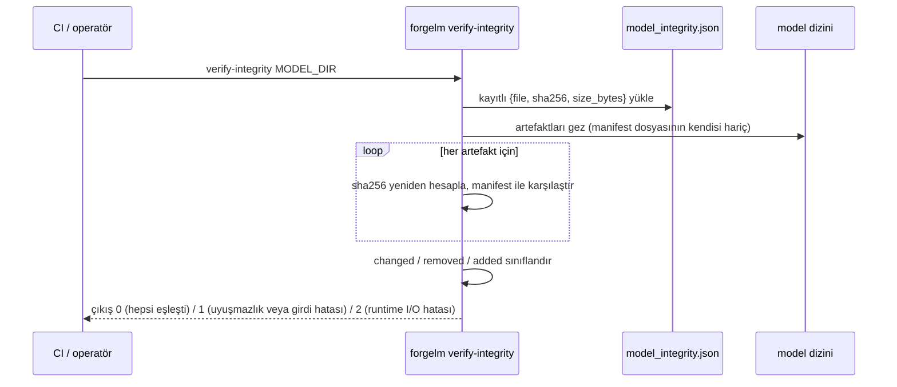

# Model Bütünlüğünü Doğrula

`forgelm verify-integrity`, Madde 15 model-bütünlük manifest'iyle eşleşen salt-okunur doğrulayıcıdır. Compliance export, eğitim sırasında final modelin yanına `model_integrity.json` yazar ve her artefaktın SHA-256'sını ve byte boyutunu kaydeder. `verify-integrity` dizini yeniden gezer, her hash'i yeniden hesaplar ve manifest oluşturulduğundan beri **değişen**, **kaldırılan** veya **eklenen** her dosyayı raporlar. Bu komut, audit *log*'unu doğrulayan [`verify-audit`](#/compliance/verify-audit)'in model *ağırlıkları* karşılığıdır.

## Ne zaman kullanılır

- **Eğitilmiş bir modeli deploy etmeden veya göndermeden önce.** Temiz bir `verify-integrity` çıkışı, sunmak üzere olduğunuz byte'ların eğittiğiniz ve kaydettiğiniz byte'lar olduğunu kanıtlar.
- **Modeli makineler veya depolama katmanları arasında taşıdıktan sonra.** Aktarım sırasındaki sessiz bozulma, değişen/kaldırılan artefakt olarak ortaya çıkar.
- **CI/CD release kapılarında.** Compliance export'tan sonra çalıştırın; sıfır-dışı çıkışta release'i başarısız kılın.
- **Periyodik bir uyumluluk taramasının parçası olarak.** Arşivlenen modellerin zamanlanmış yeniden-doğrulaması, tahrifatı veya bit-rot'u erken yakalar.

## Nasıl çalışır



## Hızlı başlangıç

```shell
$ forgelm verify-integrity ./checkpoints/final_model
OK: all 12 recorded artifact(s) present and unchanged.
```

CI için makine-okunur çıktı:

```shell
$ forgelm verify-integrity ./checkpoints/final_model --output-format json
```

```json
{
  "success": true,
  "valid": true,
  "reason": "All 12 recorded artifact(s) present and unchanged.",
  "changed": [],
  "removed": [],
  "added": [],
  "verified_count": 12,
  "path": "/work/checkpoints/final_model"
}
```

## Ayrıntılı kullanım

### Bir uyuşmazlığı okumak

Bir artefakt artık manifest ile eşleşmediğinde, diff listeleri dolar ve komut `1` ile çıkar:

```json
{
  "success": false,
  "valid": false,
  "reason": "Model artifacts do not match model_integrity.json: 1 changed, 1 removed.",
  "changed": ["adapter_model.safetensors"],
  "removed": ["tokenizer.model"],
  "added": [],
  "verified_count": 10,
  "path": "/work/checkpoints/final_model"
}
```

- `changed` — SHA-256'sı artık manifest ile eşleşmeyen artefaktlar.
- `removed` — manifest'te kayıtlı ama diskte olmayan artefaktlar.
- `added` — diskte olup manifest'te kayıtlı olmayan dosyalar (manifest dosyasının kendisi yürüyüşten her zaman hariç tutulur).

### Çıkış kodu özeti

| Kod | Anlamı |
|---|---|
| `0` | Her kayıtlı artefakt mevcut ve değişmemiş, fazladan dosya yok. |
| `1` | Bütünlük uyuşmazlığı (changed / removed / added dosya) **veya** operatör / girdi hatası — eksik yol, yolun dizin yerine dosya olması, manifest bulunamadı, malformed JSON, list olmayan `artifacts` ya da model dizininden kaçan bir manifest girdi yolu. |
| `2` | Erişilebilir bir yolda gerçek runtime I/O hatası (okuma hatası, yürüyüş sırasında izin reddi). |

Runtime-hatası zarfı (çıkış `2`) yalnızca `{"success": false, "error": "…"}` döndürür — önce `success` üzerinden dallanın, ardından `valid` ve diff listelerini inceleyin.

## Sık yapılan hatalar

:::warn
**Eksik bir `model_integrity.json`'ı zararsız saymak.** Manifest olmadan karşılaştırılacak bir şey yoktur — `verify-integrity` `0` değil `1` ile çıkar. Bu kapıya güvenmeden önce compliance export'un manifest'i yazdığını doğrulayın.
:::

:::warn
**Yeniden-quantization veya yeniden-export sonrası doğrulamak.** Bir GGUF veya merge edilmiş varyant üretmek byte'ları değiştirir; o modelin kendi taze üretilmiş manifest'ine ihtiyacı vardır. Dönüştürülmüş bir artefaktı orijinal eğitim manifest'ine karşı doğrulamayın.
:::

:::tip
**Herhangi bir deploy adımından önce doğrulayıcıyı CI'da sabitleyin.** Compliance export'tan sonra `forgelm verify-integrity --output-format json`'ı sıkı bir kapı olarak bağlayın. Sıfır-dışı çıkış release pipeline'ını başarısız kılmalıdır.
:::

## Ayrıca bakın

- [Audit Zincirini Doğrula](#/compliance/verify-audit) — Madde 12 audit *log*'u için eşlenik doğrulayıcı (bu komut model *ağırlıklarını* kapsar).
- [Annex IV](#/compliance/annex-iv) — bütünlük manifest'iyle birlikte export edilen teknik-dokümantasyon artefaktı.
- [Verify GGUF](#/deployment/verify-gguf) — export edilmiş bir GGUF model dosyası için bütünlük doğrulayıcısı.
- [`verify_integrity_subcommand-tr.md`](https://github.com/HodeTech/ForgeLM/blob/main/docs/reference/verify_integrity_subcommand-tr.md) — tam bayrak-seviyesi referans (GitHub kaynağı).
