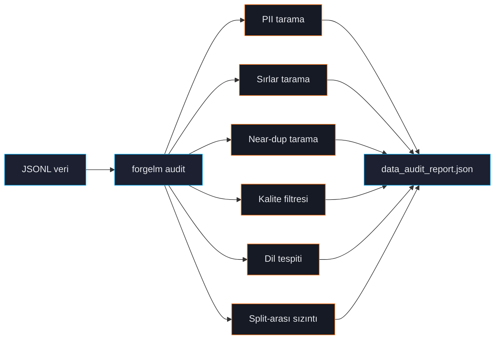

# Veri Seti Denetimi

`forgelm audit`, eğitim verinizin CPU-only, streaming ön uçuş kontrolüdür. Modeli safety review'dan geçemeyen, üretimde sırları sızdıran veya test setini ezberleyen bug'ları yakalar. Her eğitim öncesi koşturun.



## Hızlı örnek

```shell
$ forgelm audit data/ --output ./audit/ --verbose
Data audit summary
  Source        : /srv/corpora/support/data
  Total samples : 360
  Splits        : train, validation
  └─ train: n=300
     length  min=71 max=117 mean=110.2 p95=117
     near-duplicate pairs: 84
     languages (top-3): tr=280, en=20
     PII             : email=18
  └─ validation: n=60
     length  min=76 max=117 mean=110.1 p95=117
     near-duplicate pairs: 3
     languages (top-3): tr=57, en=3
     PII             : email=4
  PII severity   : worst tier = medium
     by tier      : medium=22
  Cross-split leakage (simhash):
    train__validation: leaked=284/57 rate=94.67%/95.00%

Report written to: audit/data_audit_report.json
```

`--verbose` olmadan, bulgusu olmayan split'ler tek satıra iner (`└─ (2 clean split(s): train, validation — pass verbose=True to expand)`). Toplam `Secrets` ve `Quality` satırları yalnızca ilgili kontroller bir şey işaretlediğinde yazdırılır. Çıktı yalnızca İngilizcedir.

`forgelm audit` exit kodları:

| Exit | Anlam |
|---|---|
| `0` | Audit tamamlandı ve kritik bir bulgu onu kapılamadı. |
| `1` | IO hatası (giriş yolu mevcut değil veya okunamıyor) — audit hiç çalışmadı. |
| `2` | Import hatası (gerekli bir opsiyonel extra eksik). |
| `3` | Audit çalıştı, raporunu yazdı ve **sır kapısı başarısız oldu** — en az bir credential tespit edildi. |

**Kapılayan tek bulgu sırlardır.** Tespit edilen bir credential `3` ile çıkar; çünkü eğitim verisindeki bir credential model tarafından ezberlenir ve çıkarım zamanında yeniden yayılır. Diğer her şey — PII, split-arası sızıntı, near-duplicate'ler, kalite flag'leri — ne kadar ciddi olursa olsun `0` ile raporlanır. Doğrulandı: AWS anahtarı taşıyan bir corpus `3` ile çıkar; %95 train/validation sızıntısı olan ve credential içermeyen bir corpus `0` ile çıkar.

Credential bulgularını pipeline'ı başarısız kılmadan kaydetmek için `--allow-secrets` geçin (bir `SUPPRESSED` uyarısıyla exit `0`). Bunu meşru istisnalar için kullanın — bir corpus'u `forgelm ingest --secrets-mask` ile temizlemeden *önce* denetlemek ya da bilinen dummy credential'lar taşıyan bir fixture seti.

Kapılamayan bulgulardan herhangi birine göre CI'da kapı koymak için JSON raporunu `jq` ile süzün (aşağıdaki [Rapor içeriği](#rapor-içeriği) bölümüne bakın).

## Audit'in kontrol ettikleri

### PII

E-posta, telefon, kredi kartı (Luhn doğrulamalı), IBAN ve ulusal kimlik (TR, DE, FR, US-SSN) tespit eder. Bkz. [PII Maskeleme](#/data/pii-masking).

### Sırlar

AWS anahtarları, GitHub PAT'ler, Slack token'lar, OpenAI/Google API key'leri, JWT'ler, tam PEM özel anahtar blokları, Azure storage string'leri. Bkz. [Sırların Temizlenmesi](#/data/secrets).

### Near-duplicate tespiti

İki algoritma:
- **LSH-banded simhash** (varsayılan) — kesin recall, hızlı, <50K satır için iyi.
- **MinHash LSH** — yaklaşık, milyonlara ölçeklenir.

Bkz. [Tekrar Tespiti](#/data/deduplication).

### Kalite filtresi

Gopher, C4, RefinedWeb araştırmasından heuristik. Düşük alfa, anormal kelime uzunluğu, tekrarlayan satırlar veya kısa paragraflar olan satırları flagler. Muhafazakar — sessizce satır düşürmez. Bkz. [Kalite Filtresi](#/data/quality-filter).

### Dil tespiti

Satır başına dominant dili belirlemek için `langdetect`. Bkz. [Dil Tespiti](#/data/language-detection).

### Split-arası sızıntı

Train vs validation vs test satırları arasında kesin ve near-duplicate eşleşmeleri karşılaştırır. En pahalı değerlendirme bug'ı. Audit sızıntıyı *raporlar*; sızıntı nedeniyle koşuyu durdurmaz (yukarıdaki exit kodu tablosuna bakın). Bkz. [Split-arası Sızıntı](#/data/leakage).

### Şema ve boş-değer kontrolleri

Audit her split'in `columns` bilgisini kaydeder ve metin içeriği null veya boş olan satırları sayar (`null_or_empty_count` / `null_or_empty_rate`).

:::warn
**Format-özgü kontrol yoktur.** Bu sayfanın önceki sürümleri audit'in `chosen == rejected` satırlarını, `chosen`/`rejected` uzunluk farkını, KTO sınıf dengesizliğini ve boolean olmayan label'ları işaretlediğini iddia ediyordu. Bunların hiçbiri mevcut değil — `grep -rn 'chosen' forgelm/data_audit/` hiçbir sonuç döndürmez. Audit format'tan bağımsızdır: her satırın metin alanlarını birleştirir ve sonuç üzerinde PII, sır, near-duplicate, kalite, dil ve sızıntı taramalarını çalıştırır. Format *tespiti* ayrı bir yerde, eğitim zamanında `forgelm/data.py` içinde gerçekleşir ve audit'in metin özetinde `format:` satırı yazdırılmaz.
:::

## CLI bayrakları

Yetkili kaynak: `forgelm/cli/_parser.py::_add_audit_subcommand`.

| Bayrak | Açıklama |
|---|---|
| `input_path` (pozisyonel) | JSONL dosyası ya da split JSONL'lerini içeren dizin (`train.jsonl`, `validation.jsonl`, `test.jsonl`). |
| `--output DIR` | `data_audit_report.json` çıktı dizini (varsayılan `./audit/`). |
| `--verbose` | Sıfır-bulgulu split'ler dahil her split'i text özette göster. JSON çıktıyı etkilemez. |
| `--near-dup-threshold N` | simhash near-duplicate detection için Hamming-mesafesi eşiği (varsayılan 3 ≈ %95 benzerlik). `--dedup-method=minhash` altında yok sayılır. |
| `--dedup-method {simhash,minhash}` | Near-duplicate algoritması. Varsayılan `simhash` (Phase 11.5 yolu); `minhash` opsiyonel `forgelm[ingestion-scale]` extra'sı (datasketch) üzerinden LSH-banded MinHash'e geçer. |
| `--jaccard-threshold X` | `--dedup-method=minhash` için Jaccard eşiği (varsayılan 0.85). `--dedup-method=simhash` ile yok sayılır. |
| `--quality-filter` / `--no-quality-filter` | Heuristik kalite kontrolleri (mean word length, alphabetic-character ratio, end-of-line punctuation ratio, repeated-line ratio, short-paragraph ratio). **v0.6.0'dan itibaren default-AÇIK** (Faz 15 Görev 5); öncesinde opt-in idi. Atlamak için `--no-quality-filter` geçirin. Rapora `quality_summary` ekler. Bkz. [Kalite Filtresi](#/data/quality-filter). |
| `--croissant` | Raporun `croissant` anahtarı altına bir [Google Croissant 1.0](https://mlcommons.org/croissant/) dataset card emit eder. Bkz. [Croissant 1.0 Dataset Kartı](#/data/croissant-card). |
| `--pii-ml` | Regex detector'ın üzerine Presidio'nun ML-NER PII tespitini katmanlar. Opsiyonel `forgelm[ingestion-pii-ml]` extra'sını **ve** bir spaCy NER modelini (örn. `python -m spacy download en_core_web_lg`) gerektirir. Bkz. [ML-NER PII (Presidio)](#/data/pii-ml). |
| `--pii-ml-language LANG` | `--pii-ml` için spaCy NLP dili kodu (varsayılan `en`). Türkçe corpus için örn. `tr` set edin VE eşleşen spaCy modelinin kurulu olduğundan emin olun. |
| `--workers N` | Split-düzeyi pipeline için worker process sayısı (varsayılan 1, sıralı). Multi-split corpus'larda 2-4'e set ederek near-linear hızlanma sağlanır. Audit JSON worker sayısından bağımsız byte-identical (determinism contract). |
| `--output-format {text,json}` | Stdout renderer. `json` modu makine-okunabilir bir özet, `text` varsayılan insan-okunabilir formdur. |

> **Kaldırılan flag'lar (hiç ship olmadı).** Bu sayfanın eski sürümleri `--strict`, `--dedup-algo`, `--dedup-threshold`, `--skip-pii`, `--skip-secrets`, `--skip-quality`, `--skip-leakage`, `--sample-rate`, `--remove-duplicates`, `--remove-cross-split-overlap`, `--output-clean`, `--show-leakage`, `--minhash-jaccard`, `--minhash-num-perm` ve `--add-row-ids` flag'larını belgeliyordu. Bunların hiçbiri parser'da yok. Yukarıdaki kanonik adları kullanın; "uyarıları → non-zero exit" gibi audit-as-gate davranışı istiyorsanız `--output-format json` zarfını CI'da kendi `jq` tabanlı gate'inizle sarmalayın.

## Rapor içeriği

`data_audit_report.json` hem insan okuması hem CI entegrasyonu için yapılandırılmış:

```json
{
  "generated_at": "2026-07-20T19:13:50.101922+00:00",
  "source_path": "/srv/corpora/support/data",
  "source_input": "data/",
  "total_samples": 360,
  "splits": {
    "train": {
      "sample_count": 300,
      "columns": ["instruction", "output"],
      "text_length": {"min": 71, "max": 117, "mean": 110.2, "p95": 117},
      "languages_top3": {"tr": 280, "en": 20},
      "pii_counts": {"email": 18},
      "secrets_counts": {},
      "near_duplicate_pairs": 84,
      "simhash_distinct": 216,
      "null_or_empty_count": 0,
      "null_or_empty_rate": 0.0,
      "quality_samples_evaluated": 300,
      "quality_samples_flagged": 4
    }
  },
  "pii_summary": {"email": 22},
  "pii_severity": {
    "total": 22,
    "by_tier": {"critical": 0, "high": 0, "medium": 22, "low": 0},
    "by_type": {"email": {"count": 22, "tier": "medium"}},
    "worst_tier": "medium"
  },
  "secrets_summary": {},
  "near_duplicate_summary": {
    "method": "simhash",
    "pairs_per_split": {"train": 84, "validation": 3},
    "hamming_threshold": 3
  },
  "cross_split_overlap": {
    "method": "simhash",
    "hamming_threshold": 3,
    "pairs": {
      "train__validation": {
        "leaked_rows_in_train": 284,
        "leak_rate_train": 0.9467,
        "leaked_rows_in_validation": 57,
        "leak_rate_validation": 0.95
      }
    }
  },
  "quality_summary": {
    "samples_flagged": 5,
    "samples_evaluated": 360,
    "by_check": {"low_punct_endings": 3, "short_paragraphs": 2},
    "overall_quality_score": 0.9861
  },
  "croissant": null,
  "notes": []
}
```

:::warn
**Disk'teki rapor ile `--output-format json` stdout zarfı aynı şekilde değildir.** Örtüşürler ama hem anahtar adları hem üyelik açısından farklıdırlar — CI'nızı gerçekten okuduğunuz zarfa göre sabitleyin ve alan adlarını biri diğerinden kopyalamayın.

| Disk'teki `data_audit_report.json` | stdout `--output-format json` |
|---|---|
| `cross_split_overlap` (`method` / `hamming_threshold` / `pairs` içeren nesne) | `cross_split_leakage_pairs` (liste) |
| `source_path` **ve** `source_input` | yalnızca `source_input` |
| — | `success`, `report_path`, `near_duplicate_pairs_per_split` |

Her ikisi de `total_samples`, `splits`, `pii_summary`, `pii_severity`, `secrets_summary`, `near_duplicate_summary`, `quality_summary`, `croissant`, `notes` ve `generated_at` taşır.
:::

`pii_summary` ve `secrets_summary` düz `{tür: sayı}` haritalarıdır — içlerinde `total`, `by_kind` veya `severity` anahtarı yoktur. Ciddiyet ayrı bir `pii_severity` nesnesinde bulunur ve bir kapının genellikle istediği alan `worst_tier`'dır.

CI entegrasyonları bireysel sayıları parse ederek merge'i kontrol eder. `--strict` flag'i yoktur (yukarıdaki "Kaldırılan flag'lar"a bakın) ve raporda `verdict` alanı bulunmaz — JSON zarfını `jq` ile sarın. stdout anahtar adlarına dikkat edin:

```yaml
- name: Audit data
  run: |
    forgelm audit data/ --output-format json > audit.json
    jq -e '(.cross_split_leakage_pairs | length) == 0
           and (.secrets_summary | length) == 0
           and (.pii_severity.worst_tier // "none") != "high"' audit.json
```

Gerçek bir zarfa karşı doğrulandı: temiz bir corpus'ta bu kapı geçer, sızmış bir AWS anahtarı veya high-tier bir PII türü taşıyan corpus'ta ise başarısız olur. Burada daha önce yayımlanan biçim (`.cross_split_overlap == 0 and .pii_summary.severity != "high"`) stdout zarfında bulunmayan iki anahtara atıfta bulunuyordu; dolayısıyla *temiz* girdide `false` değerlendiriliyor ve asla yeşile dönemiyordu.

Yukarıdaki `secrets_summary` yan tümcesinin bir ek güvence olduğunu unutmayın: `forgelm audit` bir credential bulgusunda zaten `3` ile çıkar; dolayısıyla `--allow-secrets` geçmediyseniz adım `jq` çalışmadan önce başarısız olur. Asıl işe yarayan yan tümce, komutun kendisinin kapılamadığı sızıntı ve PII çiftidir.

## Sık hatalar

:::warn
**"Güvenilen" veride audit'i atlamak.** Kendi üretim log'larınız bile sürpriz içerebilir — son API anahtarı rotasyonu telemetry'ye sızar, GDPR-silme isteği dangling ID yaratır. Audit kendi gelecek hatanıza karşı savunma.
:::

:::warn
**`--sample-rate` kullanmaya çalışmak.** Bu flag hiç ship olmadı (yukarıdaki "Kaldırılan flag'lar"a bakın). Audit her zaman tüm corpus üzerinde koşar; milyon-satır corpus için bunun yerine `--workers N` ile paralelleştirin. <10K satır için tam audit saniyeler alır — sampling gerekmez.
:::

:::tip
**Sürüm başına audit raporu sakla.** `data_audit_report.json`'u dataset versiyonuyla birlikte git'e commit'le. Gelecek audit'ler tarihsel rapora karşı diff alıp "geçen sefer 12 PII flag vardı, şimdi 47 — pipeline'da ne değişti?" cevabı verebilir.
:::

## Bkz.

- [PII Maskeleme](#/data/pii-masking), [Sırlar](#/data/secrets), [Tekrar](#/data/deduplication) — tek tek kontroller.
- [Annex IV](#/compliance/annex-iv) — audit raporu compliance artifact'lara akar.
- [Konfigürasyon Referansı](#/reference/configuration) — `compliance.data_audit_artifact`.
