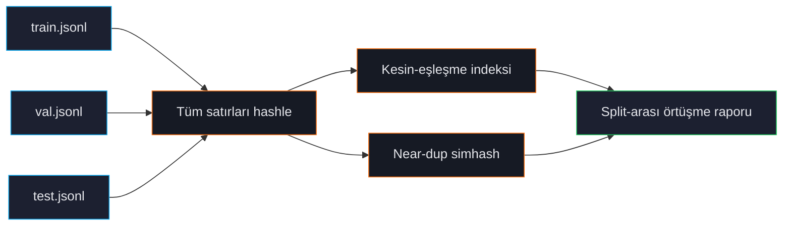

# Split-Arası Sızıntı

Validation veya test'te de görünen train satırları değerlendirme metriklerinizi yanıltıcı şekilde şişirir. Model test cevabını "biliyor" çünkü eğitim sırasında gördü. Raporlanan puanlar iyi görünür; üretim performansı hayal kırıklığı yaratır.

ForgeLM'in split-arası sızıntı kontrolü tek başına en önemli audit adımıdır. `forgelm audit` her çağrısında koşar ve sızdıran split'i onaylamayı reddeder.

## Sızıntı nasıl olur

Olağan suçlular:

1. **Gruplama olmadan rastgele karıştırma.** Satır başı rastgele bölmek tekrar satırları her iki tarafa da koyar.
2. **Bölme öncesi augmentasyon.** Mevcut satırlardan parafraz üretmek, sonra bölmek — orijinal ve parafraz farklı taraflarda biter.
3. **Aynı içeriğin birden çok kaynağı.** Eğitim corpus'unuzdaki bir FAQ ve eval setinizdeki aynı FAQ, ayrı ingest edilmiş.
4. **Web crawl'lar benchmark'larla örtüşür.** Eğitim verisi web'i taradı; benchmark yayıncısı da test setini web'e koydu.

## Kontrol ne yapar



Her train satırı için ForgeLM kontrol eder:
- Val/test'te **kesin eşleşme** (önemli her alan: `prompt`, `chosen`, `response` vb.).
- Val/test'te **near-duplicate** (Hamming eşiği 3 simhash).

Herhangi bir eşleşme raporlanır. `forgelm audit` sızıntılı bir corpus'ta yine `0` ile çıkar — sızıntı oranına göre gate **yapmaz**. (Kapılayan bulgular, tespit edilmiş bir credential ve kritik katman PII'dir — `credit_card` / `iban` — ikisi de `3` ile çıkar; girdi/config ve I/O hataları `1` ve `2` ile çıkar.) Sızıntı bulununca CI'ı başarısız kılmak için JSON raporunu `jq` ile dallandırın (bkz. [Veri Seti Denetimi](#/data/audit)).

## Hızlı örnek

```shell
$ forgelm audit data/      # train.jsonl + validation.jsonl + test.jsonl'ı denetler
Data audit summary
  Source        : /srv/corpora/support/data
  Total samples : 360
  Splits        : train, validation
  └─ (2 clean split(s): train, validation — pass verbose=True to expand)
  Cross-split leakage (simhash):
    train__validation: leaked=284/57 rate=94.67%/95.00%

Report written to: audit/data_audit_report.json
```

Exit kodu `0`'dır — sızıntı raporlanır, gate edilmez. Toplamları `jq` ile inceleyin:

```shell
$ jq '.cross_split_overlap.pairs' audit/data_audit_report.json
{
  "train__validation": {
    "leaked_rows_in_train": 284,
    "leak_rate_train": 0.9467,
    "leaked_rows_in_validation": 57,
    "leak_rate_validation": 0.95
  }
}
```

:::warn
**Satır seviyesinde sızıntı tespiti yayınlanmaz.** `cross_split_overlap.pairs` split-çiftine göre anahtarlanır (`train__validation`) ve değerleri yalnızca toplam sayılar ve oranlardır. Satır indeksleri, eşleşen metin, `type` ve `hamming` alanı yoktur — bu sayfanın önceki sürümleri audit'in hiç üretmediği satır seviyesinde bir liste (`{"train": 1240, "val": 312, "type": "exact", "text": "Aboneliği nasıl iptal..."}`) gösteriyordu. İhlal eden belirli satırları bulmak için şu an bunları kendiniz türetmeniz gerekir; ör. her split'in metin alanını hash'leyip kesişimlerini alarak.
:::

## Nasıl düzeltirsiniz

1. **Veriyi yeniden bölün**, bu sefer kaynak seviyesinde gruplayarak (parafraz'ları bölmeyin, dokümanları gruplayın). Splitter'ınızda `--group-by` bayrağı kullanın.
2. **Yeniden çıkarma** sızıntı tekrar ingest'ten geliyorsa (aynı FAQ iki kez ingest edilmiş).
3. **Kaldırma** küçük split'ten sızdıran satırları manuel olarak. Audit raporu size split-çifti başına *kaç* satırın ve hangi oranda sızdığını söyler, ama *hangilerinin* sızdığını söylemez — bunları kendiniz belirlemeniz gerekir (her split'in metin alanını hash'leyip kesişim alın veya splitter'ınızı gruplama ile yeniden koşturun). Ardından `forgelm audit`'i yeniden koşturarak `leaked_rows_*` değerlerinin sıfıra düştüğünü doğrulayın. Otomatik kaldırma CLI bayrağı yoktur.

## Konfigürasyon

> **Not:** YAML konfigürasyonunda `audit:` üst düzey bloğu yoktur (`ForgeConfig` bilinmeyen anahtarları reddeder). Sızıntı tespiti, `forgelm audit` çok-split dataset üzerinde koşturulduğunda her zaman aktiftir. Near-duplicate Hamming eşiği `forgelm audit`'deki `--near-dup-threshold` bayrağıyla kontrol edilir (varsayılan 3).

## "Near-dup" neden önemli

Kesin-eşleşme sızıntı modern pipeline'larda nadirdir; çünkü herkes deduplike eder. Ama near-dup sızıntı sessiz katildir:

```text
Train: "Aboneliği nasıl iptal ederim?"
Test:  "Aboneliği nasıl iptal ederim"
```

Bir karakter farklı — kesin-eşleşme bunu kaçırır; model her halükarda eğitim zamanında bunları aynı sayar. Near-dup yakalar.

## Sık hatalar

:::warn
**Augmentasyondan sonra bölme.** Eğitim verisinden parafraz üretip sonra rastgele bölerseniz parafraz diğer tarafta biter. Her zaman augmentasyondan *önce* bölün.
:::

:::warn
**Yukarıdan gelen split'lere güvenmek.** Dataset'iniz önceden tanımlanmış train/val/test split'leriyle yayınlandıysa, onları denetleyin. Kamuya açık dataset'lerin yıllardır yayılan bilinen sızıntıları olabilir.
:::

:::danger
**"Bugün üretime girmek için" sızıntı kontrolünü atlatmak.** Sızdıran koşunun fiyatı, iyi benchmark numaraları raporlamak, deploy etmek ve üretim performansının çok daha kötü olduğunu keşfetmektir. Güven kaybı, gecikmenin maliyetinden fazlasına mal olur.
:::

## Bkz.

- [Veri Seti Denetimi](#/data/audit) — sızıntı kontrolü varsayılan koşar.
- [Tekrar Tespiti](#/data/deduplication) — aynı simhash backend.
- [Annex IV](#/compliance/annex-iv) — sızıntı raporu compliance paketinin parçası.
