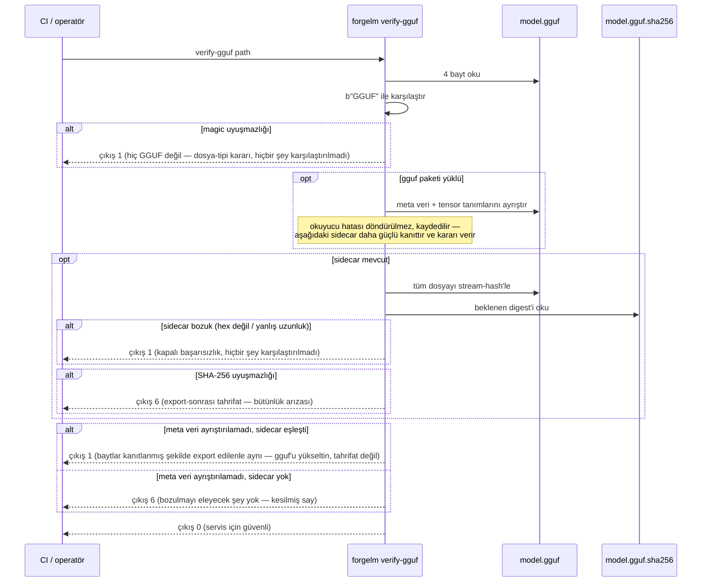

# GGUF Doğrulama

`forgelm verify-gguf`, GGUF export adımıyla eşleşen salt-okunur doğrulayıcıdır. Bir GGUF model dosyası üzerinde üç katmanlı bütünlük kontrolü yapar: 4-baytlık `GGUF` magic header, isteğe bağlı `gguf` Python paketi yüklüyse meta veri bloğu ve mevcutsa `<path>.sha256` sidecar'ına karşı SHA-256 karşılaştırması. Bozulmuş veya tahrif edilmiş bir GGUF'un asla `llama.cpp`, Ollama, vLLM ya da LM Studio'ya ulaşmaması için son ön-servis kapısı olarak kullanın.

## Ne zaman kullanılır

- **Bir GGUF'u servis runtime'ına yüklemeden önce.** Temiz bir `verify-gguf` çıkışı, dosyanın exporter'ın yazdığı şey olduğuna dair minimum sinyaldir.
- **GGUF export sonrası CI/CD yayın kapılarında.** Her `forgelm export` adımından sonra çalıştırın ve **sıfırdan farklı herhangi bir çıkış kodunda yayını başarısız sayın** (kamuya açık sözleşme `0/1/2/3/4/5/6` setidir; manuel içindeki [Çıkış Kodları](#/reference/exit-codes) referansına bakın. Bozuk bir yol veya bozuk sidecar için `1` en sık kapı tripi'dir — hiçbir şey karşılaştırılmadı ya da karşılaştırılan şey temiz çıktı — `6` ise dosyanın *gerçekten* bir GGUF olduğu ve bir karşılaştırmanın gerçekten uyuşmadığı anlamına gelir; `2` mevcut dosyalardaki gerçek I/O hatalarını kapsar, üst pipeline'lardan diğer sıfırdan farklı kodlar da iletilebilir).
- **Üçüncü-taraf bir trainer'dan veya model hub'ından GGUF alındığında.** Gönderilen ile imzalanan arasındaki sapmayı tespit etmek için magic + meta veri + SHA-256 katmanlarını yeniden hesaplayın.
- **Bir GGUF'u makineler arasında taşıdıktan sonra.** Aktarımda oluşan herhangi bir bayt-seviyesi bozulma SHA-256 uyuşmazlığı olarak ortaya çıkar.

## Nasıl çalışır



## Hızlı başlangıç

```shell
$ forgelm verify-gguf checkpoints/run/exports/model-q4_k_m.gguf
OK: checkpoints/run/exports/model-q4_k_m.gguf
  GGUF magic OK, metadata parsed, SHA-256 sidecar match
    magic_ok: True
    metadata_parsed: True
    sidecar_present: True
    sidecar_match: True
    tensor_count: 291
    sha256_actual: a4c1f2…
    sha256_expected: a4c1f2…
```

## Ayrıntılı kullanım

### CI tüketicileri için JSON çıktı

```shell
$ forgelm verify-gguf --output-format json \
    checkpoints/run/exports/model-q4_k_m.gguf
{
  "success": true,
  "valid": true,
  "reason": "GGUF magic OK, metadata parsed, SHA-256 sidecar match",
  "checks": {
    "magic_ok": true,
    "metadata_parsed": true,
    "sidecar_present": true,
    "sidecar_match": true,
    "tensor_count": 291,
    "sha256_actual": "a4c1f2…",
    "sha256_expected": "a4c1f2…"
  },
  "path": "/abs/path/checkpoints/run/exports/model-q4_k_m.gguf"
}
```

İnsan-okunur metin formatını ayrıştırmadan `valid` bayrağına filtrelemek için `jq`'ya boruyla bağlayın.

### Üç katman

| Katman | Ne zaman çalışır | Başarısızlık ne anlama gelir | Çıkış kodu |
|---|---|---|---|
| **Magic header** | Her zaman. | Dosya GGUF değil (operatör yanlış yol verdi ya da indirme bayt 0'da bozuk) — tahrifat değil dosya-tipi kararı, bu yüzden girdi-hatası kodunda kalır. | `1` |
| **Meta veri bloğu** | İsteğe bağlı `gguf` Python paketi yüklüyse. | Okuyucu ayrıştırma sırasında istisna fırlattı. Bu tek başına, kesilmiş bir dosyayı bu dosyanın format revizyonunu okuyamayacak kadar eski bir `gguf` paketinden ayırt edemez; dolayısıyla kararı sidecar'ın kanıtladığı şey belirler — aşağıdaki [üç meta veri sonucuna](#meta-veri-ayrıştırma-hatası-sidecara-bağlıdır) bakın. | `6` (sidecar yok) / `1` (eşleşen sidecar) / `6` (uyuşmayan sidecar) |
| **SHA-256 sidecar** | Dosyanın yanında `<path>.sha256` mevcutsa. | Ya dosya export sonrası değiştirildi (uyuşmayan iyi-biçimli bir digest — bütünlük arızası) YA DA sidecar'ın kendisi bozuk (hex değil / yanlış uzunluk / `TODO` placeholder — hiçbir şey karşılaştırılmadı). Doğrulayıcı bozuk sidecar'da kapalı başarısız olur; böylece bozuk bir manifest asla "doğrulanmış" gibi sessizce maskelenemez. | `6` (değiştirilmiş) / `1` (bozuk sidecar) |

Exporter sidecar'ı varsayılan olarak yazar. Üçüncü taraftan bir GGUF aldığınızda yanında sidecar'ı da talep edin; sidecar olmazsa yalnızca magic + meta veri katmanları çalışır.

### Meta veri ayrıştırma hatası sidecar'a bağlıdır

Meta veri ayrıştırma hatası tek başına belirsizdir: ya dosya gerçekten kesilmiş veya bozulmuştur **ya da** yüklü `gguf` paketi bu dosyanın format revizyonunu okuyamayacak kadar eskidir. Bu yüzden doğrulayıcı ayrıştırma hatasında durmaz — sidecar karşılaştırmasını yine de çalıştırır; çünkü checksum daha güçlü kanıttır ve ikisinden hangisinde olduğunuzu belirleyebilir. Üç ayrı sonuç:

| Dosyanın yanındaki sidecar | Karar | Çıkış kodu |
|---|---|---|
| **Yok** | Bozulmayı eleyecek hiçbir şey yok; artefakt kesilmiş ya da hasarlı sayılmalıdır. | `6` |
| **Var ve eşleşiyor** | Baytların, exporter'ın yazdığı şeyle bayt-bayt aynı olduğu kanıtlanmıştır; hiçbir şey tahrif edilmemiştir. `gguf`'u yükseltip yeniden çalıştırın. | `1` |
| **Var ve uyuşmuyor** | Dosya export sonrası değişmiştir. Ayrıştırma hatası olarak değil, sidecar uyuşmazlığı olarak raporlanır — checksum baskın gelir. | `6` |

CI'da içselleştirilmesi gereken satır ortadaki: çıkış `6` "artefakt sahibi her kimse onu çağır" demektir ve bir `gguf` kütüphane-sürümü uyuşmazlığı bunu asla tetiklememelidir. Her GGUF ile birlikte sidecar'ı da gönderin; bu belirsizlik kendiliğinden çözülür.

### İsteğe bağlı bağımlılık: `gguf` paketi

Meta veri ayrıştırması üst kaynak `gguf` Python paketini kullanır. Paket yüklü değilse katman sessizce atlanır — magic + sidecar kontrolleri yük taşımaya devam eder:

```shell
$ pip uninstall -y gguf
$ forgelm verify-gguf checkpoints/run/exports/model-q4_k_m.gguf
OK: checkpoints/run/exports/model-q4_k_m.gguf
  GGUF magic OK, SHA-256 sidecar match
    magic_ok: True
    metadata_parsed: False
    sidecar_present: True
    sidecar_match: True
```

Meta veri katmanını geri eklemek için `pip install gguf` ile yükleyin. Bu, projenin isteğe bağlı bağımlılık politikasıyla uyumludur: `gguf` çekirdek bir ForgeLM bağımlılığı değildir.

### Hata çıktısını okuma

| Hata | Sebep | Çıkış kodu |
|---|---|---|
| `Magic header mismatch: expected b'GGUF', got b'PK\x03\x04'` | Dosya ZIP, GGUF değil. | `1` |
| `GGUF metadata block could not be parsed: … No SHA-256 sidecar was available to rule out corruption` | Dosya kesilmiş ya da yazıcı export ortasında çökmüş ve aksini kanıtlayacak bir sidecar yok. | `6` |
| `GGUF metadata block could not be parsed: … The SHA-256 sidecar matches, so the file is byte-identical to what was exported` | Yüklü `gguf` paketiniz bu dosyanın format revizyonunu okuyamıyor. Tahrifat değil — `gguf`'u yükseltip yeniden çalıştırın. | `1` |
| `SHA-256 sidecar mismatch — file modified after export` | Exporter sidecar'ı yazdıktan sonra biri dosyayı düzenlemiş. | `6` |
| `Malformed SHA-256 sidecar: expected a 64-character hex digest, got …` | Sidecar hex olmayan bir placeholder içeriyor, kesilmiş ya da farklı bir algoritma kullanılmış. | `1` |

### Çıkış-kodu özeti

| Kod | Anlam |
|---|---|
| `0` | Magic tamam VE (`gguf` yüklüyse) meta veri ayrıştırılıyor VE (sidecar mevcutsa) SHA-256 eşleşiyor. |
| `1` | Magic uyuşmazlığı (hiç GGUF değil), bozuk sidecar, VEYA regular file olmayan bir path (operatör yanlış argüman geçirdi) — hiçbir şey karşılaştırılmadı. Ayrıca sidecar'ı **eşleşen** bir dosyada ayrıştırılamayan meta veri bloğu: karşılaştırılan şey temiz çıktığı için bu tahrifat değil, `gguf` sürüm sorunudur. |
| `2` | Gerçek bir dosyayı okurken I/O hatası (permission denied, okuma sırasında disk hatası). |
| `6` | Bütünlük arızası: dosya *gerçekten* bir GGUF (magic OK) ve ya SHA-256 sidecar'ı uyuşmuyor ya da bozulmayı eleyecek eşleşen bir sidecar olmadan meta veri bloğu ayrıştırılamadı. |

## Sık hatalar

:::warn
**"Sidecar yok"u zararsız saymak.** SHA-256 sidecar olmadan doğrulayıcı export-sonrası değişiklikleri tespit edemez. Her zaman sidecar ile export edin (varsayılan) ve transfer ederken sidecar'ı GGUF'un yanında gönderin.
:::

:::warn
**Farklı bir dosyaya ait sidecar'ı yeniden kullanmak.** Sidecar GGUF'a içerik ile değil, isim (`<path>.sha256`) ile bağlıdır. Başka bir modele ait sidecar'ı yanlış dizine kopyalamak, mükemmel sağlam bir dosyada kafa karıştırıcı bir SHA-256 uyuşmazlığına yol açar. Şüpheniz varsa `sha256sum model.gguf > model.gguf.sha256` ile yeniden oluşturun.
:::

:::warn
**`gguf`'u yüklememekle CI'da meta veri katmanını atlamak.** Orijinal tam GGUF dosyasından üretilmiş bir SHA-256 sidecar, sonradan kesilmiş bir kopyayı doğrulayamaz — herhangi bir bayt-seviyesi değişiklik (kesilme dahil) digest'i değiştirir, dolayısıyla sidecar doğru şekilde başarısız olur. Asıl bypass şekli: tahrifattan sonra `.sha256` sidecar'ını silen veya yeniden üreten saldırgandır; sidecar gittiğinde veya yeniden imzalandığında geriye yalnızca magic-header kontrolü kalır ve magic header tek başına kesilmeyi yakalamaz. Sidecar manipülasyonundan bağımsız olarak meta veri okuyucu bozuk/kesilmiş dosyaları reddedebilsin diye CI imajınıza `gguf`'u kurun — sidecar yerine geçen bir şey değil, derinlemesine savunma.
:::

:::tip
**Doğrulayıcıyı CI'da sert bir kapı olarak sabitleyin.** Her `forgelm export`'tan sonra `forgelm verify-gguf --output-format json`'u bağlayın; metin ayrıştırmadan yayını başarısız etmek için `jq -e '.valid'`'e boruyla bağlayın.
:::

## Bkz.

- [GGUF Export](#/deployment/gguf-export) — bu doğrulayıcının tükettiği sidecar'ı yazan üretim tarafı.
- [Audit Log Doğrulama](#/compliance/verify-audit) — uyumluluk yüzeyindeki kardeş doğrulayıcı.
- [Annex IV Doğrulama](#/compliance/annex-iv) — teknik dokümantasyon artifact'ı için kardeş doğrulayıcı.
- [`verify_gguf_subcommand-tr.md`](https://github.com/HodeTech/ForgeLM/blob/main/docs/reference/verify_gguf_subcommand-tr.md) — tam bayrak tablosu ve kütüphane-sembol atıfları içeren referans doc (GitHub kaynağı).
