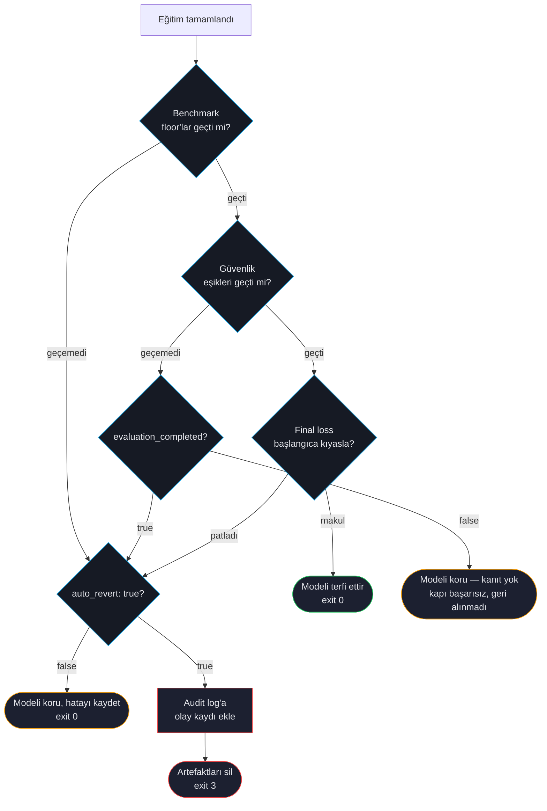

# Otomatik Geri Alma

Başlangıç noktasından daha kötü güvenlik veya kalite skoru alan bir fine-tuned model, hiç fine-tune etmemekten beterdir. Otomatik geri alma ForgeLM'in güvenlik ağıdır: konfigüre edilmiş bir eşik eğitimden sonra başarısız olursa koşu **az önce ürettiği artefaktları siler**, yapılandırılmış bir olay kaydı bırakır ve exit 3 ile çıkar.

:::warn
**Otomatik geri alma siler; geri döndürmez.** `_revert_model`, final model dizini üzerinde `shutil.rmtree` çağırır (`forgelm/trainer.py`) ve `Auto-revert enabled. Deleting generated artifacts at %s...` log'unu yazar. Hiçbir şey geri yüklenmez — geri alma yolunun hiçbir yerinde son-iyi checkpoint terfisi yoktur ve bir geri almadan sonra diskte fine-tuned model **kalmaz**; yalnızca dokunulmamış temel model ve olay kaydı kalır.

Kurtarma planınızı buna göre yapın: **önemsediğiniz her checkpoint'in kendi yedeğini alın** ve ForgeLM'in geride kullanılabilir bir eski artefakt bırakacağına güvenmeyin. Bu sayfanın önceki sürümleri hiç var olmamış bir geri yükleme adımını tarif ediyordu.
:::

Baştan ayırmaya değer iki nokta var; çünkü bunlar en sık yaşanan iki sürpriz:

1. **Gönderilen varsayılan `evaluation.auto_revert: false` ile hiç silme olmaz.** Başarısız bir kapı audit log'una ve JSON zarfına kaydedilir, model yine de terfi ettirilir ve koşu `0` ile çıkar. Bu sayfanın anlattığı exit-3 davranışını almak için `auto_revert: true` yapmanız gerekir.
2. **Kullanılabilir kanıt üretmemiş bir güvenlik hatası asla geri alınmaz**, `auto_revert` ne olursa olsun. Bkz. [Geri alma ne zaman uygulanmaz](#geri-alma-ne-zaman-uygulanmaz).

## Karar akışı



## Hangi sinyal geri almayı tetikler

| Sinyal | Eşik | Konfigüre edilen alan |
|---|---|---|
| Benchmark ortalaması alt sınırın altında | Ortalama-skor alt sınırı (tek scalar) | `evaluation.benchmark.min_score` |
| Güvenlik gerilemesi (binary mode) | Unsafe-ratio tavanı | `evaluation.safety.max_safety_regression` |
| Güvenlik gerilemesi (per-severity) | Severity-başı unsafe-ratio dict | `evaluation.safety.severity_thresholds` |
| Judge ortalaması alt sınırın altında | Ortalama 1-10 puan alt sınırı | `evaluation.llm_judge.min_score` |
| Eval loss tavanın üstünde | eval_loss üzerinde sıkı tavan | `evaluation.max_acceptable_loss` |

Bunlardan herhangi biri kapıyı başarısız kılar. Bu başarısızlığın modeli *ayrıca* silip silmeyeceği `evaluation.auto_revert` değerine ve güvenlik kapısı için değerlendirmenin kullanılabilir kanıt üretip üretmediğine bağlıdır.

## Geri alma ne zaman uygulanmaz

Güvenlik değerlendirmesi `evaluation_completed: false` bildirdiğinde bir güvenlik kapısı hatası **geri alınmaz** — `evaluation.auto_revert` ne olursa olsun. Trainer, `auto_revert` kontrolünden önce kısa devre yapar (`forgelm/trainer.py::_apply_safety_result`), modeli korur, hatayı kaydeder ve pipeline'ın devam etmesine izin verir.

`evaluation_completed`, koşu *model hakkında* kullanılabilir kanıt üretmediğinde `false` olur:

- Sınıflandırıcı hiç yüklenemedi ya da probe dosyası eksik veya okunamaz durumdaydı.
- Probe'ların en az yarısı kullanılabilir bir yargı olmadan döndü (`forgelm/safety/_gates.py`).
- Kapı hatası tamamen, sınıflandırıcının hiç yanıtlamadığı probe çiftlerine atfedilebiliyordu.

Gerekçe bilinçli olarak asimetriktir: okunmamış bir yargı üzerine koşuyu başarısız kılmak doğrudur, çünkü okunmamış bir yargı güvenlik kanıtı değildir. Modeli silmek ise doğru değildir, çünkü silme geri döndürülemez, gözetimsiz çalışır ve güvenlik kanıtının yokluğunu değil, *zarar* kanıtını gerektirir.

Operasyonel sonuç: guard'da bir CUDA OOM'da veya yanlış yapılandırılmış bir `classifier` durumunda, `auto_revert: true` olsa bile **modeliniz hayatta kalır**. Yeni bir eğitim koşusu başlatmadan önce onu arayın. Tersine, "güvenlik hatası exit 3 demektir" varsayımıyla yazılmış bir CI pipeline'ı koşunun devam ettiğini görecektir — yalnızca exit koduna değil, JSON zarfına göre dallanın. Tam `evaluation_completed` semantiği için bkz. [Güvenlik Değerlendirmesi](#/evaluation/safety).

## Geri alma sırasında ne olur

1. ForgeLM, yıkıcı adımdan **önce** `audit_log.jsonl`'a bir olay kaydı yazar; böylece silme başarısız olsa bile kayıt hayatta kalır:

```json
{
  "timestamp": "2026-04-29T14:33:04Z",
  "run_id": "fg-20260429-143304",
  "operator": "ci-runner",
  "event": "model.reverted",
  "prev_hash": "4f0c…",
  "reason": "safety",
  "detail": "Unsafe response ratio 0.42 exceeds max_safety_regression 0.05."
}
```

Olay adı `model.reverted`'dır. Standart zincir alanlarının üzerine tam olarak iki payload alanı taşır — `reason` (tetiklenen kapı: `evaluation`, `benchmark`, `safety`, `judge`, `nan_inf`, `threshold`) ve `detail` (insan-okunur hata sebebi). `restored_from`, `regressed_categories`, `baseline_safety` veya `exit_code` alanı yoktur.

2. Final model dizinini `shutil.rmtree` ile siler. Silmenin kendisi başarısız olursa hata log'lanır ve elle temizlik gerekebilir.
3. Sonuç nesnesindeki `final_model_path` ve `staging_path` alanlarını temizler, çünkü diskteki model artık yoktur.
4. `training.reverted` webhook yaşam döngüsü olayını `"… Artifacts discarded."` sebebiyle fırlatır — bkz. [Webhook'lar](#/operations/webhooks).
5. Exit kodu 3 ile çıkar.

## Konfigürasyon

```yaml
evaluation:
  auto_revert: true                     # boolean — revert pipeline'ını aç/kapat
  max_acceptable_loss: 1.5              # eval-loss tavanı (aşılırsa revert)
  baseline_loss: null                   # null = pre-training loss'tan otomatik hesapla
  benchmark:
    enabled: true
    tasks: [arc_easy, hellaswag]
    min_score: 0.45                     # ortalama task accuracy alt sınırı
  safety:
    enabled: true
    classifier: "meta-llama/Llama-Guard-3-8B"
    max_safety_regression: 0.05         # binary-mode unsafe-ratio tavanı
  llm_judge:
    enabled: true
    judge_model: "gpt-4o"
    judge_api_key_env: OPENAI_API_KEY
    min_score: 6.5
```

`evaluation.auto_revert` bir **boolean**'dır (gerçek şema:
`forgelm/config.py` `EvaluationConfig.auto_revert: bool`) ve
**varsayılanı `false`'tur**. Şemada veya kodda "last-good
checkpoint" diye bir kavram yoktur: ne bir `last_good_checkpoint`
yolu, ne de daha eski bir artefaktı terfi ettiren bir mekanizma.
Bir geri alma, mevcut koşunun çıktısını kaldırır ve yerine
hiçbir şey bırakmaz. Revert pipeline'ı
dört guard ailesinden herhangi birinin başarısız olmasıyla
tetiklenir — eval-loss tavanı, benchmark alt sınırı, safety
regression veya judge minimum — ayrı bir `notify_on_revert`
toggle'ı yoktur (mevcut `webhook.notify_on_failure` bildirim
fan-out'unu karşılar).

`evaluation.guards.<name>:` plug-in registry'si yoktur — özel
guard fonksiyonları şemada değil. Marka-sesi veya domain-özel
bir kontrol uygulamak için, CI workflow'unuzda trainer'ın çıktı
dizininden `train_result.metrics`'i tüketen ve başarısızlıkta
non-zero exit veren ayrı bir pre-merge adım çalıştırın.

## CI/CD entegrasyonu

Otomatik geri alma CI exit kodlarıyla doğal eşleşir:

```yaml
# .github/workflows/train.yml
# configs/run.yaml içinde evaluation.auto_revert: true gerektirir —
# varsayılanla (false) başarısız bir kapı yine 0 ile çıkar.
- name: Eğit ve değerlendir
  run: forgelm --config configs/run.yaml
  # exit 0 = başarı, exit 3 = otomatik geri alma tetiklendi (artefaktlar silindi)
```

Exit 3'ten gelen CI başarısızlıkları *beklenen* — kapı bir gerilemeyi yakalamış demektir. Bastırmayın; araştırın.

## Sık hatalar

:::warn
**"Bugün üretime girmek için" otomatik geri almayı kapatmak.** Neredeyse her zaman yanlış karar. Gerçekten göndermeniz gerekiyorsa floor'u tek koşu için açık bir yorumla ve takip issue'sıyla düşürün. Audit log override'ı kaydeder.
:::

:::warn
**Geri almadan sonra hayatta kalan bir checkpoint beklemek.** Böyle bir şey yoktur. Geri alma model dizinini siler ve geri dönülecek hiçbir şey bırakmaz. Kurtarılabilir bir artefakt istiyorsanız modeli çıktı dizininden kendiniz kopyalayın — ya da varsayılan `auto_revert: false` ile çalışın; bu, modeli korur ve bunun yerine kapı hatasını kaydeder.
:::

:::warn
**Başarısız bir kapının exit 3 anlamına geldiğini varsaymak.** Gönderilen varsayılan `auto_revert: false` ile bu sayfadaki her kapı hatası yine `0` ile çıkar ve model terfi ettirilir. Yalnızca `$?` değerine değil, JSON zarfındaki `passed` alanına bakın; ya da hatanın ölümcül olmasını istiyorsanız `auto_revert: true` yapın.
:::

:::tip
**Otomatik geri almayı sabote ederek test edin.** CI kurulumunda bilerek bir floor'u modelinizin geçemeyeceğini bildiğiniz değere düşürün. Otomatik geri almanın tetiklendiğini, webhook'un postaladığını ve olay kaydının yazıldığını teyit edin. Güvenlik ağını test ederken sorunları keşfetmek, gerçek bir gerilemede keşfetmekten daha iyidir.
:::

## Bkz.

- [Benchmark Entegrasyonu](#/evaluation/benchmarks) — floor eşiklerini tanımlar.
- [Llama Guard Güvenliği](#/evaluation/safety) — güvenlik eşiklerini tanımlar.
- [Webhook'lar](#/operations/webhooks) — geri almada bildir.
- [Audit Log](#/compliance/audit-log) — geri alma olaylarının kaydedildiği yer.
