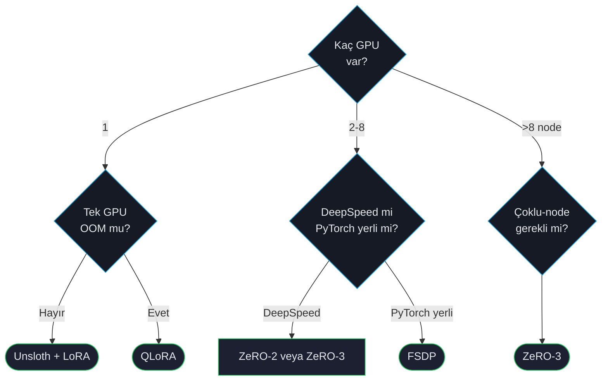

# Dağıtık Eğitim

Modeliniz tek GPU belleğinden büyüdüğünde — ya da sadece daha hızlı eğitmek istediğinizde — dağıtık eğitim devreye girer. ForgeLM DeepSpeed ZeRO-2/3, PyTorch FSDP ve Unsloth tek-GPU hızlandırma backend'ini destekler.

## Karar ağacı



## Backend özeti

| Backend | Çoklu-GPU? | Çoklu-node? | Notlar |
|---|---|---|---|
| **Tek GPU + Unsloth** | Hayır | Hayır | Llama/Qwen/Mistral'da vanilla'dan hızlı (upstream 2-5× bildiriyor; ForgeLM kendi ölçümünü yayımlamıyor). Tek GPU'daysanız önce bunu deneyin. |
| **DeepSpeed ZeRO-2** | Evet | Evet | Optimizer state'i sharder. İyi hız, her modelde çalışır. |
| **DeepSpeed ZeRO-3** | Evet | Evet | Optimizer + gradient + parametre sharder. Çok büyük modeller için şart. |
| **DeepSpeed ZeRO-3 Offload** | Evet | Evet | CPU/NVMe'ye boşaltır. Devasa modelleri sığdırmak için hızdan ödün verir. |
| **FSDP** | Evet | Evet | PyTorch yerli. Aynı konfigürasyonda ZeRO-3'ten biraz hızlı; ekosistemi daha az olgun. |

## Unsloth (tek GPU)

Unsloth, Llama, Qwen, Mistral ve birkaç model için drop-in optimizasyondur. Attention ve MLP katmanlarını Triton'da yeniden yazar. Upstream 2-5× hızlanma ve kalite kaybı olmadığını bildiriyor; ForgeLM bunların ikisini de ölçmüyor, dolayısıyla her ikisi de üreticinin iddiasıdır.

```yaml
model:
  name_or_path: "Qwen/Qwen2.5-7B-Instruct"
  backend: "unsloth"                    # ihtiyacınız olan tek bayrak

training:
  trainer_type: "sft"
  # ... eğitim config'i değişmez
```

:::tip
Unsloth model-özgü kernel'lere sahiptir. Mimariniz desteklenmiyorsa ForgeLM uyarı bırakır ve standart backend'e döner. Desteklenen aileler [Konfigürasyon Referansı](#/reference/configuration)'nda listelenmiştir.
:::

## DeepSpeed ZeRO-2

ZeRO-2 optimizer state'i sharder (Adam gibi adaptif optimizer'larda en ağır VRAM bileşeni). 4-8 GPU'da 13B-30B modeller için etkili.

```yaml
distributed:
  strategy: "deepspeed"
  deepspeed_config: "zero2"             # preset adı (veya bir DeepSpeed JSON dosya yolu)

training:
  gradient_accumulation_steps: 4
```

`DistributedConfig`'te `zero_stage` veya `cpu_offload` alanı yoktur — ZeRO aşaması (ve CPU/NVMe offload) `deepspeed_config` üzerinden seçilir; `gradient_accumulation_steps` ise `distributed:` değil `training:` alanıdır.

Başlatma:

```shell
$ accelerate launch --num_processes 4 -m forgelm --config configs/run.yaml
# veya
$ deepspeed --num_gpus 4 -m forgelm --config configs/run.yaml
```

## DeepSpeed ZeRO-3

ZeRO-3 ek olarak gradient ve parametreleri de GPU'lar arası sharder. Her GPU modelin sadece `1/N`'ini tutar. 70B+ modeller için şart.

```yaml
distributed:
  strategy: "deepspeed"
  deepspeed_config: "zero3_offload"     # "zero3" (offload yok) | "zero3_offload" (CPU offload) | NVMe için özel DeepSpeed JSON yolu

training:
  gradient_accumulation_steps: 8
```

`zero3_offload` preset'i, optimizer state ve parametreleri CPU'ya boşaltarak 70B'i 8×24 GB'a sığdırır. ZeRO-Infinity'nin NVMe offload'u hazır bir preset değildir — bunun için `deepspeed_config`'i, `offload_param`/`offload_optimizer` alanları `device: nvme` olarak ayarlanmış özel bir DeepSpeed JSON dosyasına yönlendirin.

| Model | GPU | ZeRO-3 + offload? |
|---|---|---|
| 30B | 4× A100 40 GB | Opsiyonel |
| 70B | 8× A100 40 GB | CPU offload gerekli |
| 70B | 4× A100 80 GB | Offload gerekmez |
| 405B | 8× H100 80 GB | NVMe offload |

## FSDP (PyTorch yerli)

FSDP, ZeRO-3 gibi sharder ama PyTorch'un yerli FullyShardedDataParallel'ini kullanır. Aynı kurulumda biraz hızlı; ekosistem desteği biraz daha az (ör. bazı HF entegrasyonları DeepSpeed bekler).

```yaml
distributed:
  strategy: "fsdp"
  fsdp_strategy: "full_shard"             # full_shard | shard_grad_op | no_shard | hybrid_shard
  fsdp_auto_wrap: true                    # transformer katmanlarını otomatik sar (önerilir)
  fsdp_offload: false                     # forward/backward arasında parametreleri CPU'ya boşalt
  fsdp_state_dict_type: "FULL_STATE_DICT" # FULL_STATE_DICT | SHARDED_STATE_DICT
```

`DistributedConfig`'te `fsdp_auto_wrap_policy` veya `fsdp_offload_params` alanı yoktur — auto-wrap düz bir `fsdp_auto_wrap` boolean'ıdır, CPU offload ise `fsdp_offload`'dur (`_params` eki yoktur).

## Gradient accumulation

Hangi backend'i kullanırsanız kullanın, gradient accumulation VRAM'in izin verdiğinden büyük etkili batch size'a izin verir:

```yaml
training:
  per_device_train_batch_size: 1        # cihaz başına
  gradient_accumulation_steps: 32       # etkili batch = 1 × 32 × num_gpus
```

8 GPU × 1 batch × 32 accumulation = 256 etkili batch size — büyük eğitim koşularının çoğunun hedefi.

## Sık hatalar

:::warn
**ZeRO-3 başlatma sırası.** ZeRO-3, her rank'te eğitilmeyen parametreler için özel işleme gerektirir — DeepSpeed'in parametre-bölme sarmalayıcısı model yüklenmeden önce başlatılsın diye her zaman `accelerate launch` üzerinden başlatın (raw `python -m forgelm` değil).
:::

:::warn
**DeepSpeed ve FSDP alanlarını karıştırmak.** `distributed.strategy` tam olarak tek bir backend seçer (`deepspeed` veya `fsdp`) — yalnızca etkin stratejinin alanları dikkate alınır. `distributed.zero_stage` diye bir alan yoktur; DeepSpeed'in ZeRO aşaması `deepspeed_config` üzerinden (bir preset adı veya bir DeepSpeed JSON yolu) seçilir.
:::

:::warn
**Node'lar arası tutarsız batch boyutları.** Tüm node'lar batch size ve accumulation üzerinde anlaşmalı. ForgeLM uyumsuzlukta erkenden hata verir; her node'dan doğrulamayı unutmayın — başlatma node'undan `--dry-run` yeterli.
:::

:::tip
Çoklu-node için node'lar arası SSH erişimi yapılandırın ve node listesini kaydetmek için `accelerate config` kullanın. ForgeLM ortaya çıkan config'i otomatik alır.
:::

## Bkz.

- [GaLore](#/training/galore) — daha az VRAM'le full-parametre eğitim, ZeRO-3 alternatifi.
- [VRAM Fit-Check](#/operations/vram-fit-check) — çoklu-GPU iş başlatmadan önce doğrula.
- [CI/CD Hatları](#/operations/cicd) — otomatik hatlarda çoklu-GPU eğitim.
