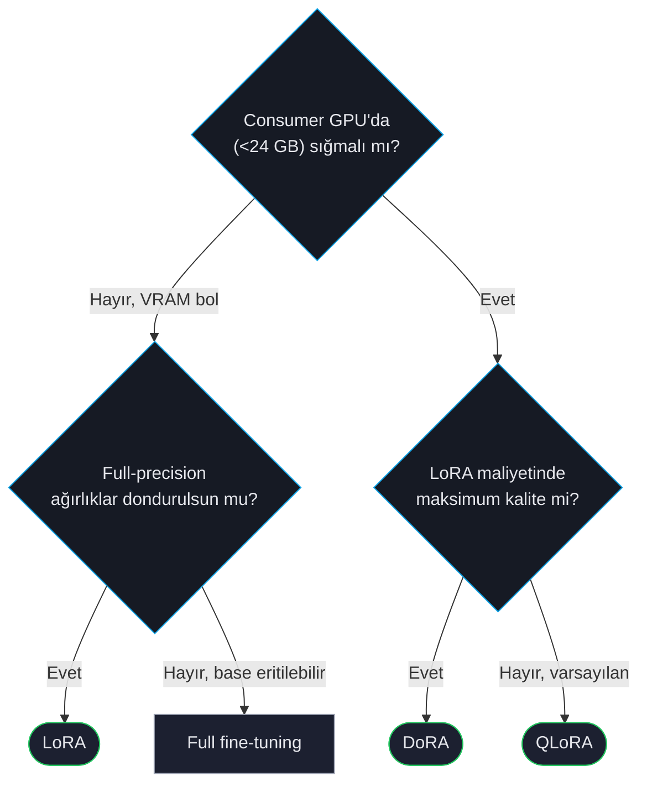

# LoRA, QLoRA, DoRA

Low-Rank Adaptation (LoRA) ve varyantları büyük modelleri küçük GPU'larda fine-tune etmenize olanak tanır. Tüm ağırlıkları güncellemek yerine donmuş base modelin yanında düşük-rank "adapter" matrisleri eğitirsiniz — tipik olarak parametrelerin ~%1'i, VRAM'in ~%10'u, full fine-tuning'in ~%90-95 kalitesi.

ForgeLM LoRA / QLoRA / DoRA'yı *her* trainer'a uygular (SFT, DPO, SimPO, KTO, ORPO, GRPO) — algoritmanın değil optimizer'ın özelliğidir.

## Hangi varyantı



## Hızlı referans

| Varyant | Ne değişir | VRAM (full'a göre) | Kullan |
|---|---|---|---|
| **LoRA** | Attention/MLP yanına düşük-rank matrisler | %30-40 | Full-precision base'lerde varsayılan. |
| **QLoRA** | LoRA + base'in 4-bit NF4 quantizasyonu | %10-15 | Consumer GPU varsayılanı. |
| **DoRA** | LoRA = magnitude × direction | %35-45 | LoRA maliyetinde en yüksek kalite; ~%5-10 yavaş. |
| **PiSSA** | Principal singular bileşenlerden başlatılan LoRA | %30-40 | Küçük dataset'te LoRA'dan hızlı yakınsama. |
| **rsLoRA** | Rank-stabilised scaling ile LoRA | %30-40 | Yüksek rank'larda (r ≥ 64) daha kararlı. |

## Hızlı örnek

```yaml
model:
  name_or_path: "Qwen/Qwen2.5-7B-Instruct"
  load_in_4bit: true                    # QLoRA
  bnb_4bit_quant_type: "nf4"
  bnb_4bit_compute_dtype: "bfloat16"

lora:
  r: 16
  alpha: 32
  dropout: 0.05
  method: "lora"                        # lora | dora | pissa | rslora
  target_modules: ["q_proj", "k_proj", "v_proj", "o_proj"]

training:
  trainer_type: "sft"
  learning_rate: 2.0e-4                 # LoRA full FT'den yüksek LR tolere eder
```

## PEFT yöntemi seçimi

`lora.method`, hangi PEFT varyantının kullanılacağını seçen güncel alandır: `lora` (standart), `dora` (weight-decomposed, aşağıya bakın), `pissa` (principal singular bileşenlerden başlatılan LoRA — küçük dataset'lerde daha hızlı yakınsama) veya `rslora` (rank-stabilised scaling — `r ≥ 64`'te daha kararlı).

`use_dora` ve `use_rslora`, `method: "dora"` / `method: "rslora"` için deprecated boolean kısayollardır — hâlâ kabul edilir, ancak **v1.0.0**'da kaldırılması planlanmıştır. Deprecated bir bayrağı çelişen açık bir `method:` ile birlikte ayarlamak (ör. `method: "rslora"` ile `use_dora: true`) bir config hatasıdır; `use_dora: true` ve `use_rslora: true`'yu birlikte ayarlamak da reddedilir — tek bir yol seçin. PiSSA'nın boolean karşılığı yoktur; yalnızca `method: "pissa"` ile seçilir.

## `r` rank seçimi

Rank LoRA kalitesi için en önemli hyperparam.

| Rank | Eğitilebilir param (7B) | Kullan |
|---|---|---|
| 4 | %0.05 | Stil transferi, sadece format. Ucuz. |
| 8 | %0.1 | Domain adaptation; küçük dataset (<5K). |
| 16 | %0.2 | **Varsayılan.** Çoğu kullanım. |
| 32 | %0.4 | Daha büyük dataset (50K+); zor görevler. |
| 64 | %0.8 | Full FT kalitesine yaklaşır. |
| 128 | %1.5 | Verim azalan; genelde full FT daha iyi. |

`alpha` genelde rank'le ölçeklenir — `alpha = 2 × r` yaygın kural.

## Target modules

```yaml
lora:
  target_modules: "all-linear"          # en geniş — her Linear
  # veya:
  target_modules: ["q_proj", "k_proj", "v_proj", "o_proj", "gate_proj", "up_proj", "down_proj"]
  # veya sadece attention:
  target_modules: ["q_proj", "v_proj"]
```

Geniş = daha çok kapasite ama daha çok VRAM. Varsayılan (Q/K/V/O) çoğu görev için doğru denge.

## DoRA — ne zaman değer

DoRA her ağırlığı magnitude vektörü ve direction matrisine ayırır. Empirik: DoRA LoRA ile full fine-tuning arasındaki farkı daraltır, sıklıkla full FT kalitesini eşler.

```yaml
lora:
  r: 16
  alpha: 32
  method: "dora"
```

Ödünleşim: ~%5-10 yavaş eğitim ve ~%10 fazla VRAM. Kullan:
- Aksi halde full fine-tuning'e yükselmek gerekiyorsa.
- Zor görevde LoRA underfitting görüyorsanız.

## Sık hatalar

:::warn
**`r`'yi çok yüksek ayarlamak.** Rank 128 LoRA compute ve kalite olarak kısmi full fine-tune'a yakın — ve genelde daha küçük model + full FT daha iyi. `method: "rslora"` olmadan `r > 64` bir kararlılık uyarısı loglar; rank'ı bu kadar yükseltiyorsanız `method: "rslora"`'ya geçin ya da yaklaşımı yeniden düşünün.
:::

:::warn
**`modules_to_save` bir ForgeLM alanı değildir.** Native PEFT, LoRA adapter'ının yanında modülleri (ör. `embed_tokens` / `lm_head`) full precision'da eğitmek için `modules_to_save`'i sunar, ama `LoraConfigModel` bunu yüzeylemez — `extra="forbid"`, `--dry-run`'da bunu reddeder. Tokenizer'a yeni token eklerseniz embedding'i `target_modules`'e adını ekleyerek yine de LoRA-adapte edebilirsiniz (ör. `["q_proj", "v_proj", "embed_tokens"]`), ama bu full-precision eğitim değil, düşük-rank bir güncellemedir.
:::

:::warn
**Inference için yanlış base yüklemek.** QLoRA eğittiğinizde adapter full precision saklanır ama base 4-bit kalır. Inference'ta:
- Base'i 4-bit yükleyip adapter uygula, veya
- Servis için adapter'ı full-precision base'e merge edin.

ForgeLM'in `forgelm export`'u doğru yapar.
:::

:::tip
**Sadece adapter kaydet.** Varsayılan davranış: ForgeLM sadece adapter ağırlıklarını kaydeder (~50-200 MB) + base'i işaret eden model card. Deployment için merge: `forgelm export ./checkpoints/run --merge`.
:::

## Bkz.

- [GaLore](#/training/galore) — LoRA seviyesi bellekte full-parametre eğitim.
- [Konfigürasyon Referansı](#/reference/configuration) — her LoRA/quantization alanı.
- [Model Birleştirme](#/deployment/model-merging) — birden çok adapter birleştirmek.
